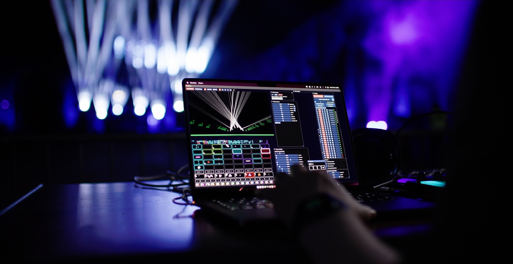

# ✅ Welcome to Liberation - the next generation of laser show software

<figure><figcaption></figcaption></figure>

Liberation opens up a new way of working with lasers - **modern**, **efficient**, for **Mac and PC**, and designed around the real-world needs of contemporary event production. It brings together fast, expressive creative tools with built-in safety and a workflow that feels fluid, intuitive and genuinely built for the future, bringing laser software into the 21st century.

Liberation is part of a growing ecosystem of laser control software that all use the same family of open-protocol controllers. Whether you’re working in TouchDesigner, MadLaser, LaserShowGen or Liberation, you’re never tied to a single manufacturer. You can choose the hardware that suits your rig, your budget and your ideas.

Above all, Liberation is made to be an expressive creative instrument. It’s easy to learn, genuinely fun to use, and powerful enough to handle the most demanding festivals, installations and arena tours with rock-solid reliability, all from a single computer.

This guide will help you get comfortable with Liberation - from installation and safety basics to building clips, mapping zones and running full shows. It focuses on the concepts and workflows that matter, and Liberation is designed to stay out of your way so you can spend more time creating and less time wrestling with your software.

## Who this guide is for

* New users who want a clear starting path without skipping safety.
* Show operators who need a reliable reference while setting up venues or rehearsing.
* Curious tinkerers exploring advanced features like the Clip Editor, MIDI, DMX, and canvas tools.

## How to use the guide

* Begin with [**Important! Read this first**](<README (1).md>) to review critical safety and licensing notes before connecting hardware.
* Follow the [**Quick start guide**](basics/getting-started.md) if you want to get output running fast, then dive into [**Hardware**](hardware/) and [**Setting up**](setting-up/) for deeper configuration.
* Use section headers to jump directly to topics (e.g., [**Clips & Clip deck**](clips/), [**Output view**](output-view/), **etc**) and return to [**Reference**](reference/) or [**Troubleshooting**](troubleshooting/) when you need precise answers.

## Conventions and tips

* Status emojis show completeness: ✅ finished, 🟧 partial, 🟩 needs images, ◼️ placeholder.
* Links are scoped to the current release; screenshots and menus may differ slightly if you’re on an older build.
* Hardware steps call out safety-first defaults - never bypass interlocks and keep beams away from people.

If you get stuck, check the [**FAQ**](faq.md), then the [**Troubleshooting**](troubleshooting/) section for targeted fixes before reaching out for support.
