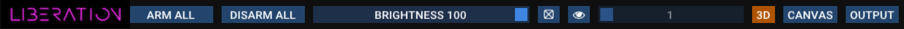
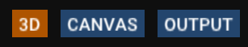
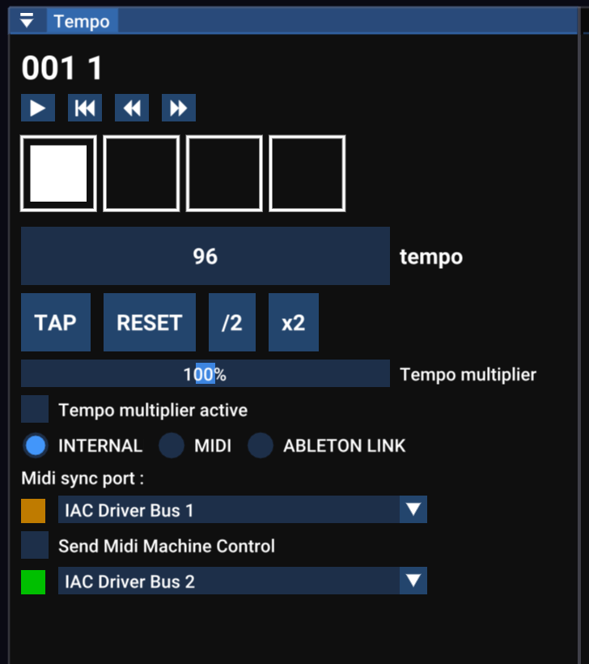

# ✅ 快速入门指南

## 介绍

欢迎使用 **Liberation** ——用于现场的激光演出软件。

Liberation 功能强大且结构复杂，但以易用性与可靠性为核心，便于稳定创作与演出。软件运行快速高效、体验流畅。本《快速入门指南》将帮助你尽快上手。

### 管理激光

Liberation 足够灵活，即使没有连接任何真实激光，你也可以完成设置并进行可视化。当你准备好后，再把每个输出分配给激光控制器即可。


你可以在 Liberation 中设置并可视化任意数量的激光，许可证档位（Hobbyist、Pro 等）只限制你能 _arm_ 的激光数量。这意味着即使是免费许可证，你也能用 100 台激光设计演出。只有真正要输出到实际激光时才需要升级。


默认有 8 台激光横向排列，但你可以自定义为任何布局。建议在熟悉软件之前先保留默认设置，之后再根据硬件实际情况调整。（见 [setting-up-your-project.md](../setting-up/setting-up-your-project.md "mention")）&#x20;


重要：在 arm 任何激光之前，请确保理解相关风险，并仔细阅读 [setting-up-lasers.md](../setting-up/setting-up-lasers.md "mention") 章节。


## 软件概览

### 安全关闭

运行激光时，必须配备**硬件急停按钮**（见 [emergency-stop-interlocks.md](../hardware/emergency-stop-interlocks.md "mention")）。如果只是想非紧急地 disarm，可以使用 _**DISARM ALL**_ 按钮，或 _**ESC**_ 键（或 APC40 上的 _**SESSION**_ 键）。你也可以用屏幕上的滑块或 APC40 主推子降低全局亮度。

### 滑块控件

Liberation 中有各种滑块与控制项。


在滑块上 CMD/CTRL 点击可直接输入数值，获得更精细的控制。


### 键盘快捷键

完整快捷键列表见：[keyboard-shortcuts.md](../reference/keyboard-shortcuts.md "mention")。

### 屏幕布局

<figure><figcaption></figcaption></figure>


不确定按钮作用？把鼠标悬停在按钮上即可看到说明！


#### 菜单

<figure><figcaption></figcaption></figure>

菜单中包含文件导入/导出选项，以及打开各类面板的入口。你也可以在这里完成订阅授权（_Liberation -> Authorise/Deauthorise this computer_）。

#### 图标栏

<figure><figcaption></figcaption></figure>

常用任务都在这里，比如 arm/disarm 所有激光、全局亮度、测试图案，以及在 3D、Canvas 和 Output 视图之间切换。

### 视图

屏幕左上方的大区域会显示 3 个主要视图之一：**3D**、**CANVAS** 和 **OUTPUT**。使用图标栏按钮切换（或按 _TAB_ 键在 3D 与 OUTPUT 间切换，然后继续按 Tab 在各激光输出间循环）。

<figure><figcaption></figcaption></figure>

#### 3D 视图

<figure><figcaption></figcaption></figure>

3D 视图显示激光效果，并可配置为匹配你的实际激光设置。点击并拖动以旋转相机，用滚轮前后移动。更多选项在 _3D Visualiser settings_ 面板中（_View -> 3D Visualiser Settings_）。见 [3d-visualiser.md](../setting-up/3d-visualiser.md "mention")。

#### Output 视图

<figure><figcaption></figcaption></figure>

Output 视图用于配置每台激光的 Zones 与 Masks。（注意左上角的大数字，便于确认当前编辑的是哪台激光！）

该视图表示这台激光的完整输出范围，以及各个 Zone 在其中的位置。默认每台激光只有一个 Zone，但你可以按需添加多个 Zones，它们都会显示在此视图中。


**什么是 Zone？**

Zone 是激光输出中的一个区域，你可以把内容定向到该区域。一台激光可以有多个 Zones。最简单的是 _beam_ zone，此外还有 _canvas_ zones 和 _DMX_ zones。本指南主要讲 beam zones，它通常用于空气中的光束效果。


你可以用以下方式选择要编辑的激光：

* 顶部栏的编号按钮
* 按键盘上的激光编号键（_1-9_）
* 按 **TAB** 键从一台切换到下一台

点击 _+_ 按钮可添加新激光。（_Laser Overview_ 面板中也有 _ADD LASER_ 按钮）

在 _Laser Overview_ 面板中点击红色 ⊖ 按钮可删除激光。

用鼠标滚轮缩放，在没有 Zone 的区域点击并拖动即可移动视图。

点击 Zone 选中后可拖动角点调整。拖拽角点时按住 ALT 可进行非均匀调整。右键点击 Zone 可查看更多选项，包括更改 Zone 类型。

左侧是一列图标按钮，鼠标悬停可查看说明。按钮可用于添加 beam zones、canvas zones 与 masks；也可设置该激光专用测试图案，以及网格/吸附设置。

更多细节见 [output-view](../output-view/ "mention")。

#### Canvas

Canvas 系统主要用于图形与建筑映射。你可以将复杂图像分配到多台激光，并对每个部分进行透视校正。见 [graphics-and-the-canvas-system](../graphics-and-the-canvas-system/ "mention")。

### APC40 MIDI 控制器

<figure><figcaption></figcaption></figure>

虽然可以用鼠标和键盘控制 Liberation，但使用 APC40 MIDI 控制器更高效（Mark 2 更推荐，但 Mark 1 也可用）。

另见：[apc40-reference.md](../reference/apc40-reference.md "mention")。

我们也已经支持 APC Mini Mark 2 和 MIDI Fighter Twister，更多设备正在开发中。但对大多数情况来说，APC40 Mark 2 仍是更稳妥的选择。&#x20;

### Clips 与 Effects


**什么是 Clip？**

Clip 是 Liberation 中激光内容的容器。Clip 可以包含光束或图形动画，通常以循环方式播放。它们可以发送到任意 Zone（或 _Canvas target area_），并通过 Clip Deck 中的按钮触发。


#### Clip Deck 概览

<figure><figcaption></figcaption></figure>

这个网格称为 _Clip Deck_，所有激光 Clips 都存储在这里。它与 APC40 的 8 x 5 按钮网格一一对应。

**浏览 Clip Deck**

你可以左右滚动 Clip Deck：

* 左右方向键。加 CMD/CTL 可整页滚动。
* 触控板：滑动
* 鼠标：支持横向滚动的鼠标可在悬停 Clip Deck 时横向滚动
* APC40 滚轮
* APC40 _<- DEVICE ->_ 按钮

为方便定位，顶部有 Clip Deck 的 mini visualiser。另见 [clips](../clips/ "mention")。

#### 启动与停止 Clips

按下 Clip 按钮（鼠标或 APC40）启动 Clip，再按一次停止。启动 Clip 时，同色组内其他 Clips 会自动停止，除非你按住 _shift_。

部分 Clips 处于 _Flash mode_（默认红色组），松开按钮即停止。

**STOP** 按钮可停止所有正在运行的 Clips。

#### 为 Clip 设置输出 Zones

在 Clip 按钮下方是 Zone 按钮，默认 beam zones 为 1 到 8（_BEAM 1_、_BEAM 2_ 等）。按钮点亮表示该 Zone 已分配给当前选中的 Clip。

<figure><figcaption></figcaption></figure>

Zone 按钮下方两行是 X/Y flip 按钮，用于水平/垂直翻转 Clip 输出。


注意：这些 Zone 分配与 X/Y flip 设置与 Clip 绑定；下次运行该 Clip 时仍会保留。它们不是全局设置。


右键点击 Clip 可编辑更多设置。另见 [clip-settings.md](../clips/clip-settings.md "mention")。

### Groups

每个 Clip 都有颜色轮廓，代表它所属的 _group_。APC40 的 Clip 按钮也会以该颜色点亮。

<table data-header-hidden><thead><tr><th width="108"></th><th></th></tr></thead><tbody><tr><td>Group 1</td><td>青色</td></tr><tr><td>Group 2</td><td>橙色</td></tr><tr><td>Group 3</td><td>红色</td></tr><tr><td>Group 4</td><td>靛色</td></tr><tr><td>Group 5</td><td>绿色</td></tr></tbody></table>

Group 系统非常灵活，可用于：

* 让某个 Group 的 Clips 持续运行，同时切换另一个 Group
* 快速为该 Group 的所有 Clips 分配 Zones 与 X/Y flip
* 为 Clip 设置 _Flash mode_（默认 Group 3 为 _Flash mode_）

Groups 还有淡入/淡出设置，Clip 可以继承或覆盖。

你可以在右键菜单中分配 Clip 的 Group，或使用 APC40 按住 group 按钮并在保持按下时点选 Clip。

**为 Group 内所有 Clips 统一修改 Zone 设置**

在 APC40 上按住 group 按钮，然后在保持按下时使用 Zone 与 X/Y 按钮为该 Group 的所有 Clips 切换 Zone 设置。

另见 [groups.md](../clips/groups.md "mention")。

### Effects

Liberation 的 Effects 系统是实时改变 Clip 输出的常用工具。默认 Effects 1-8 按钮在 Zone 按钮下方。

#### 应用 Effect

按下 effect 按钮切换效果；更好的方法是使用 APC40 的 1-8 号推子淡入/淡出 effects。

#### Effect 参数

使用旋钮 1-8\* 调整每个 effect 的 _parameter_。（也可右键用鼠标调整 level 与 parameter。）参数具体作用取决于 effect 的设置。默认 effects 列表见下文。


effect 按钮上的小数字表示 _level_ 与 _parameter_。_level_ 由 APC40 推子或点击拖动按钮控制；parameter 由 APC40 旋钮控制，或右键用鼠标调整。


_\*Rotary controllers 1-8 位于 APC40 Mk2 顶部，Mk1 在右上角。另见：_ [apc40-reference.md](../reference/apc40-reference.md "mention")。

#### 默认 Effects

<figure><figcaption></figcaption></figure>

1. **Randomiser** :\
   对 Clip 输出施加混沌运动。参数调节混沌程度/速度。
2. **Sine wave** :\
   将所有内容沿移动的正弦波形扭曲。参数调节波长。
3. **Rotation** :\
   让所有内容旋转。参数调节旋转速度。
4. **Horizontal flip** :\
   水平方向挤压和拉伸所有内容。参数调节速度。
5. **Scale** :\
   将所有内容从满幅到 0 反复缩放。参数调节速度。
6. **Hue** :\
   改变所有内容的色相，但不改变饱和度（即白色仍是白色）。参数调节色相。
7. **Saturation and hue** :\
   改变所有内容的色相，并将颜色完全饱和（即白色也会变为颜色）。参数调节色相。
8. **Flash** :\
   将所有内容的亮度从满到 0 反复闪烁。参数调节闪烁速度。

<figure><figcaption></figcaption></figure>

底部一排还有 16 个颜色 effects，用于应用预设的 hue 与 saturation。

注意：以上是默认 effects，你可以按需编辑。

#### 什么是 _"currently selected clip"_？

启动 Clip 后，它会点亮表示激活，同时有白色轮廓表示它是 _selected_ clip。你切换 Zone 按钮或调整 Clip 设置时，这些操作都会应用到 _currently selected clip_。


如果想在不触发 Clip 的情况下选中它，按住 ALT 再按 Clip 按钮。这样可以在不运行的情况下调整 Zones 与设置。


### Clip settings 面板

使用 _Clip Settings_ 面板编辑缩放、X/Y 位置，并访问 zone delay 系统。

<figure><figcaption></figcaption></figure>

### Global settings 面板

在 _Global Settings_ 面板中调整会影响所有 Zones 输出的全局设置。

<figure><figcaption></figcaption></figure>

开启 AUTO RESET 后，在没有 Clips 运行时会自动重置所有 _Global settings_。&#x20;

### Timing

几乎所有激光演出都会配合音乐，因此 Liberation 的时间系统围绕 BPM（每分钟节拍数）进行。在 _Tempo Panel_ 中可以看到时间表示；每个方块代表一个拍点，并会按节拍闪烁。

<figure><figcaption></figcaption></figure>
