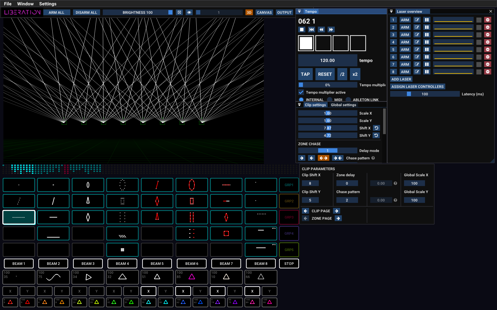
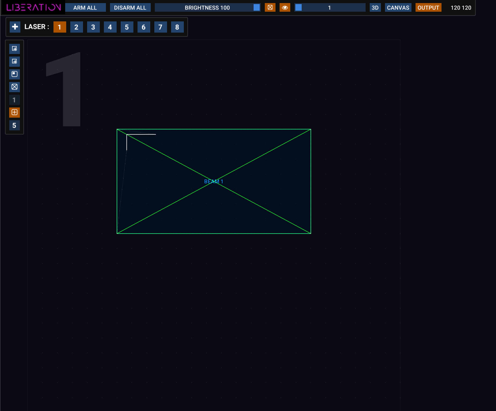
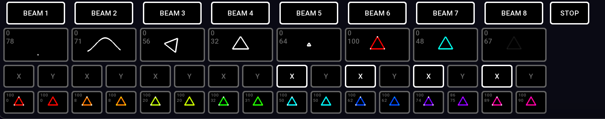
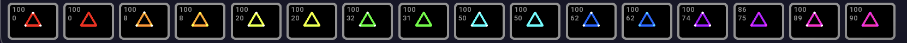

# ✅ Quick start guide

## Introduction

Welcome to **Liberation** - the next generation of laser show software.

Liberation is powerful and complex modern software; it's built on fundamentals of usability and reliability to give you the freedom to express your creativity. It's fast, efficient and seamless; follow this _Quick start guide_ to get you up and running in no time!

### Managing lasers

Liberation is flexible enough that you can set up lasers and visualise them without any actual lasers connected at all. And then when you're ready to go you can seamlessly assign each output to a laser controller.


You can set up and visualise as many lasers as you want within Liberation, the tiers (Hobbyist, Pro, etc) only limit the number of lasers you can _arm._ This means that you can design and practice a show with 100 lasers on the lowest tiers. You only need to upgrade when it comes to actually running it on real lasers.


The default has 8 lasers spread out horizontally but you can customise this to whatever you want. It's probably best to keep this default while you're getting to know the software, and then later on you can adjust it to match your hardware set up.


Important : Before you arm any lasers make sure understand the risks involved and carefully go through the [setting-up-lasers.md](../setting-up/setting-up-lasers.md "mention") chapter.


## Overview of the software

### Safety shut-off

Any time you're running lasers you must have a **hardware emergency stop button** on hand (see [emergency-stop-interlocks.md](emergency-stop-interlocks.md "mention")), but if you want to disarm everything less urgently you can use the _**DISARM ALL**_ button, or the _**ESC**_ key (or the _**SESSION**_ key on the APC40). You can also reduce the global brightness using the on-screen slider or the main fader on the APC40.

### Slider elements

Throughout Liberation there are various sliders and controls.&#x20;


CMD/CTRL-click into a slider to type a new value if you need greater control than the slider can give you.


### Keyboard shortcuts

A full list of keyboard shortcuts can be found here : [Keyboard shortcuts](../reference/keyboard-shortcuts.md)

### Screen layout

<figure><figcaption></figcaption></figure>


Not sure what a particular button does? Hover over it with your mouse to get a description!


#### Menu

<figure><figcaption></figcaption></figure>

The menu is where you will find all file import / export options, and to open panels. You'll also find the option to authorise the computer with your subscription here (in _Settings->Authorise/Deauthorise this computer_) .

#### Icon bar

<figure><figcaption></figcaption></figure>

Common tasks can be found here, such as arming/disarming all the lasers, the global brightness, test pattern, and switching between the 3D, Canvas and Output views

### Views

The large area in the top left of the screen can be one of 3 main views; **3D**, **CANVAS** and **OUTPUT.** Switch between them using the icon bar buttons (or use the _TAB_ key to switch between the 3D and OUTPUT views, and then continue to tab through each laser output in turn).

<figure><figcaption></figcaption></figure>

#### 3D View

<figure><figcaption></figcaption></figure>

The 3D view shows you what your lasers will look like and can be configured to match your own laser set up. Click and drag to rotate the camera, use the mouse wheel to track forward and back. You can find many other options in the _3D Visualiser settings_ panel (_Menu->Window->3D Visualiser Settings)_.

#### Output View

<figure><figcaption></figcaption></figure>

The output view is used to configure zones and masks for each laser. (Note the massive number in the top left corner so you can easily see which laser you are on!)

This view is a representation of the entire output of this laser, and where each zone sits within it. By default there is only one zone per laser but you can add as many zones as reasonably practical, and you will see them all in this view.


**What is a zone?**

A zone is a space within a laser's output window that you can direct laser content into. And you can have more than one zone per laser. The simplest type of zone is a _beam_ zone, but there are also _canvas_ zones and _DMX_ zones. For this guide we'll mostly focus on beam zones, which are usually used to create atmospheric beam effects through the air.


You can select the laser you want to edit using either :

* the numbered buttons in the bar at the top
* pressing the number key for the laser you want _(1-9_ keys\_)\_
* the **TAB** key to cycle through from one to the next

Add a new laser to the set up by pressing the _+_ button. (There is also an _ADD LASER_ button in the _Laser Overview_ panel)

Delete a laser from the set up by hitting the red ⊖ button in the _Laser Overview_ panel.

You can zoom in and out using the mouse scroll wheel, and click and drag anywhere there isn't a zone to move the view.

Click on a zone to select it and then adjust its corner points with the mouse. Use the ALT key while you are dragging a corner to make it non-uniform. Right-click on the zone to see more options, including changing the type of zone.

Along the left is a bar with a series of icon buttons, hover over any button to get a description of what it does. Buttons here let you add beam zones, canvas zones, and masks. There are also options to set a test pattern for this laser only, along with grid and snapping settings.

#### Canvas

The Canvas system is used mostly for graphics and architectural mapping. You can distribute complex images across multiple lasers, and perspective-correct each section. See [graphics-and-the-canvas-system](../graphics-and-the-canvas-system/ "mention").

### APC40 MIDI controller

<figure><figcaption></figcaption></figure>

Although it is possible to control Liberation using the mouse and keyboard, it's way better to use an APC40 MIDI control interface (Mark 2 is best but Mark 1 also works).

See also : [apc40-reference.md](../reference/apc40-reference.md "mention")

### Clips and effects


**What is a clip?**

A clip is a container for any laser content within Liberation. Clips can contain beams or graphical animations and they are usually a looping cycle. They can be directed into any zone (or Canvas Target Area) and are triggered using the clip buttons inside the clipdeck.


#### Clipdeck overview

<figure><figcaption></figcaption></figure>

This grid is known as the _clipdeck_ and it is where all of the laser clips are stored. It is designed to map directly to the 8 x 5 grid of buttons on your APC40.

**Navigating the clipdeck.**

You can scroll the clipdeck left and right using :

* Left and right cursor keys. Add CMD/CTL to scroll one full page at a time.
* Trackpad : Swipe
* Mouse : if your mouse has a sideways scroll you can use that while hovered over the clip deck
* APC40 scroll knob
* APC40 _<- DEVICE ->_ buttons

To help you get your bearings, there is a mini visualiser of the clipdeck along the top.

#### Starting and stopping clips

Press a clip button (either with the mouse or with the APC40) to start a clip. Press it again to stop it. When you start a clip, all other clips of the same colour will automatically stop unless you hold _shift_.

Some clips will be in _Flash mode_ (by default, the red ones), in which case they will stop as soon as you release the clip button.

The _STOP_ button stops all currently running clips.

#### Setting output zones for the clip

Underneath the clip buttons, you'll see the zone buttons, beam zones 1 to 8 by default (_BEAM 1_, _BEAM 2_, etc). The zone buttons light up to indicate which zones are assigned to the currently selected clip.

<figure><figcaption></figcaption></figure>

Two rows below the zone buttons, you'll see the X/Y flip buttons, toggle these to flip the clip horizontally and vertically.


Note that these zone allocations and X/Y flip settings are connected to the clip itself; they are retained next time you run that clip. They are not a global setting.


Right click on a clip to edit more settings for the clip.

### Groups

You'll notice that each clip has a coloured outline, and this colour represents which _group_ it's in.

<table data-header-hidden><thead><tr><th width="139">Group 1</th><th>Cyan</th></tr></thead><tbody><tr><td>Group 1</td><td>Cyan</td></tr><tr><td>Group 2</td><td>Orange</td></tr><tr><td>Group 3</td><td>Red</td></tr><tr><td>Group 4</td><td>Blue</td></tr><tr><td>Group 5</td><td>Green</td></tr></tbody></table>

The group system is very flexible and it allows you to :

* Keep clips in one group going, while you toggle groups in another one
* Quickly assign zones and X/Y flips to all clips within a group
* Set _Flash mode_ for a clip (Group 3 is set to _Flash mode_ by default)

Groups also have settings for transition in/out that can be inherited by its clips, or over-ridden.

You can assign the clip's group using the buttons in the right-click menu, or using the APC40 you can press the group button and _while it is still held down,_ press the clip buttons.

Change zone settings for all clips within a group

Using the APC40, press the group button, then _while it is still held,_ use the zone and X/Y buttons to toggle zone settings for all clips within that group.

### Effects

The effects system in Liberation is a powerful and versatile way of changing the clip output in real-time. The default effects buttons 1-8 are under the zone buttons.

#### Applying an effect

Press an effect button to toggle the effect, or even better, using the APC40 sliders 1-8 to fade effects in and out.

#### Effect parameters

Use the rotary controllers 1-8\* to adjust the _parameter_ for each effect. (Or you can right-click with the mouse to adjust the level and parameter). The parameter change does differnet things dependent on how the effect is set up. See the list below for the default effects.

_\*Rotary controllers 1-8 are along the top of an APC40 Mk2 and on the top right on the Mk1. See also:_ [apc40-reference.md](../reference/apc40-reference.md "mention")

#### The default effects

<figure><figcaption></figcaption></figure>

1. **Randomiser** :\
   Applies a chaotic movement to the clip output. The parameter adjusts the amount/speed of chaos.
2. **Sine wave** :\
   Warps all the content across a moving sine wave. The parameter adjusts the wavelength.
3. **Rotation** :\
   Spins everything around. The parameter adjusts the spin speed.
4. **Horizontal flip** :\
   Squishes and stretches everything horizontally. The parameter adjusts the speed.
5. **Scale** :\
   Repeatedly scales everything from full to zero. The parameter adjusts the speed.
6. **Hue** :\
   Changes the hue of everything, but doesn't change the saturation (ie anything white stays white). The parameter adjusts the hue.
7. **Saturation and hue** :\
   Changes the hue of everything and also fully saturates the colour (ie anything white changes to the colour). The parameter adjusts the hue.
8. **Flash** :\
   Repeatedly flashes the brightness of everything from full to zero. The parameter adjusts the flash speed.

<figure><figcaption></figcaption></figure>

There are a further 16 colour effects along the bottom row to apply pre-set hue and saturation values.

Note that these are the default effects but they can be edited to do almost whatever you want!

#### What is the "_currently selected clip"_?

When you start a clip, it lights up to show that it is active. It also has a white outline around it which indicates that this is the currently _selected_ clip. Whenever you toggle zone buttons or adjust the clip settings, these are applied to the _currently selected clip._


To select a clip without triggering it, press the ALT key before pressing the clip button. This is a good way to adjust its zones and other settings withouth running it.


### Clip settings panel

Use the _Clip Settings_ panel to edit scaling, X/Y position, and access the powerful zone delay system.

<figure><figcaption></figcaption></figure>

### Global settings panel

Find the _Global Settings_ panel to adjust global output settings that affect all output across all zones.

<figure><figcaption></figcaption></figure>

### Timing

Almost all laser displays have some kind of musical soundtrack, so the timing system in Liberation is based around a tempo in beats per minute. In the _Tempo Panel_ you can see a representation of the time; each square represents a beat and you can see them flash in time.

<figure><figcaption></figcaption></figure>

There are multiple synchronisation options, including MIDI clock and Ableton Link. If you know the tempo of the music you can manually adjust it using the on-screen slider or the APC40 Tempo knob, but you can also keep in time with the music using the _Tap Tempo_ system\_.\_

#### Tap Tempo

_Tap Tempo_ is a term commonly used in music apps, and it lets you tap in time with the beat to set the tempo while the music is playing. You can use the button on screen, although it's recommended to use the _T_ key or the _Tap Tempo_ button on the APC40 (or even a foot switch if you prefer).

Press the _R_ key or the _Metronome_ button (APC40) to reset the tempo to the beginning of the bar.

Press the _Y_ key or turn the _Tempo_ knob(APC40) to round the tempo to a whole number. This can be useful for electronic music which tends to have a round number of beats per minute.

### Organising your clip deck

To move a clip on your clip deck, click and drag it to a new position. While dragging you can use the cursor keys (or the scroll wheel/buttons on your APC40) to scroll left and right.

Press the ALT key while you're dragging to make a copy.

ALT click a clip to select it without starting it.

ALT + SHIFT click a clip to multi-select.

Click and drag will drag ALL selected effects.

To delete a clip either drag it off the clip deck or right click and press the DELETE button.

### Laser overview panel

<figure><figcaption></figcaption></figure>

The _Laser overview panel_ gives you a quick look into the status of your currently running lasers. The green square on the right shows you that the laser controller is happy. If it goes orange, you have occasional drop-outs, and if it's red it has disconnected.

The graph in the middle is a history of frame lengths, and the number on the right is the current frame rate. The more complicated the content, the slower the frame rate will be (ie more flickery).

### Connecting to lasers - Controller Assignment panel

Click on the _Assign Laser Controllers_ button to open the _Controller Assignment_ panel. (This panel can also be accessed via _Window->Controller Assignment_ in the menu bar).

You can choose which laser outputs go to which laser controllers here. Drag and drop controllers from the list on the right into slots on the left. You can rename your controllers to match which laser they are paired with (use the pen icon button).

Read the [controller-assignment.md](../setting-up/controller-assignment.md "mention") chapter for more details.


Before you arm any lasers make sure to go through the [setting-up-lasers.md](../setting-up/setting-up-lasers.md "mention")chapter.


### Laser output panel

<figure><figcaption></figcaption></figure>

This panel shows you the settings for the _currently selected laser_ (represented by the number at the top). Change which laser is currently selected using the _tab_ key, hitting a number key, clicking a laser number in the _Laser Overview_ panel or in the _output view._

* **Number button** arm and disarm the laser, if it's red then the laser is armed.
* **Brightness** adjust laser brightness independent of the other lasers (and it's combined with the _global brightness_ setting - ie, if they're both at 50%, you're laser will be at 25%).
* **Test Pattern** turns on a test pattern for this laser only (overrides the global test pattern setting)
* **Orientation** corrects for lasers rigged sideways or upside-down.
* **Flip Horizontal and Flip Vertical** reverses the output of the laser. Useful for output correction on inconsistently wired lasers.
* **Copy Laser Settings** opens a panel that lets you copy various settings from this laser to others.

### Scanner settings

Clips are converted to a point stream in real time as they are sent to the laser and there are many adjustments for how that point stream is calculated. This may be confusing for you if you are used to older laser software that deals with pre-calculated point streams, but this is a much more flexible and efficient system.

The basic scanner settings are:

* **Speed** is the scanner speed, ie how fast the laser moves around to draw shapes. This is equivalent to adjusting the point rate on traditional laser software but on Liberation you can change how fast the laser moves _independent of the point rate._ You shouldn't need to adjust this.
* **Colour shift** (sometimes known as _blank shift_) The scanners move the laser around really fast but usually the change of brightness and colour is out of synch with the movement. This shows up as little flickering "tails" of light on the edge of beams and lines. Use this adjustment to get the movement and colour in synch with each other.

The other advanced scanner settings that are covered in the [advanced](../advanced/ "mention")chapter.

### Zoning

For a full guide to setting up and zoning lasers see : [setting-up-lasers.md](../setting-up/setting-up-lasers.md "mention")

[Jump to the start!](https://github.com/sebleedelisle/LiberationLaser/wiki/Quick-Start#hello-world)
