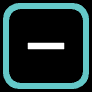
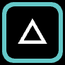

# 🟩 Creators

###  Point Creator

Makes a single dot / beam.&#x20;

* **Render profile** - see [render-profile.md](fundamentals/render-profile.md "mention")
* **Colour** - the colour of the dot. See [colour-settings-and-hsb.md](fundamentals/colour-settings-and-hsb.md "mention")
* **x** and **y** position - see [co-ordinate-system.md](fundamentals/co-ordinate-system.md "mention")
* _MOVE TO FRONT / MOVE TO BACK_ - see [fills-masks-and-depth-sorting.md](fundamentals/fills-masks-and-depth-sorting.md "mention")

###  Line Creator

Makes a line / sheet.&#x20;

* **Render profile** - see [render-profile.md](fundamentals/render-profile.md "mention")
* **Size** - the length of the line
* **Colour** - the colour of the line. See [colour-settings-and-hsb.md](fundamentals/colour-settings-and-hsb.md "mention")
* **x** and **y** position - see [co-ordinate-system.md](fundamentals/co-ordinate-system.md "mention")
* **rotation** - the angle of the line, in degrees
* **resolution** - see [resolution.md](fundamentals/resolution.md "mention")
* **alignment** - _LEFT / CENTRE / RIGHT -_ determines the start point and centre of rotation of the line
* _MOVE TO FRONT / MOVE TO BACK_ - see [fills-masks-and-depth-sorting.md](fundamentals/fills-masks-and-depth-sorting.md "mention")

###  Circle Creator

Makes a circle /cone.&#x20;

* **Render profile** - see [render-profile.md](fundamentals/render-profile.md "mention")
* **radius** - the radius of the circle
* **Colour** - the colour of the circle. See [colour-settings-and-hsb.md](fundamentals/colour-settings-and-hsb.md "mention")
* **x** and **y** position - see [co-ordinate-system.md](fundamentals/co-ordinate-system.md "mention")
* **resolution** - see [resolution.md](fundamentals/resolution.md "mention")
* **Fill state** - see [fills-masks-and-depth-sorting.md](fundamentals/fills-masks-and-depth-sorting.md "mention")
* _MOVE TO FRONT / MOVE TO BACK_ - see [fills-masks-and-depth-sorting.md](fundamentals/fills-masks-and-depth-sorting.md "mention")

###  Polygon Creator

Makes an equilateral polygon, triangle, square, pentagon etc.&#x20;

* **Render profile** - see [render-profile.md](fundamentals/render-profile.md "mention")
* **size** - the distance from the centre to each of the corners
* **Colour** - the colour of the polygon. See [colour-settings-and-hsb.md](fundamentals/colour-settings-and-hsb.md "mention")
* **x** and **y** position - see [co-ordinate-system.md](fundamentals/co-ordinate-system.md "mention")
* **rotation** - the rotated angle of the shape, in degrees
* **resolution** - see [resolution.md](fundamentals/resolution.md "mention")
* **Fill state** - see [fills-masks-and-depth-sorting.md](fundamentals/fills-masks-and-depth-sorting.md "mention")
* _MOVE TO FRONT / MOVE TO BACK_ - see [fills-masks-and-depth-sorting.md](fundamentals/fills-masks-and-depth-sorting.md "mention")

###  Shape Creator

Loads an SVG file for custom shapes.&#x20;


Liberation is compatible with the _SVGTiny_ format. InkScape is recommended but most vector graphics apps can export in this format. Make sure to convert any text to shapes before exporting. Liberation will render strokes, and optionally use fills as masks. Make sure your lines are not black or they won't show up without a colour modifier!&#x20;


* **Import SVG** - load an SVG file from disk.&#x20;


Once an SVG is loaded, the content is converted and saved within the clip, so you don't need to maintain a reference to the file, unless you later want to change the mask settings.&#x20;


* **Use fills as masks** - will process any filled shape as a mask, ie filled in with black. This will be set automatically if your SVG has any filled shapes. If it has no filled shapes, it will be disabled. See [fills-masks-and-depth-sorting.md](fundamentals/fills-masks-and-depth-sorting.md "mention")
* **Add outlines to filled shapes** - if the shapes in your SVG don't have an outline, then we can't draw them! This option adds an outline (or _stroke_) to any filled shape. If your SVG doesn't have any stroked shapes, It is set automatically. If it doesn't have any filled shapes, it's disabled.&#x20;
* **Invert black lines** - if all of the lines in your SVG are black then you can't see them! This option turns them white. It's set automatically if your SVG only has black shapes, but it's disabled if you don't have any.&#x20;
* **Render profile** - see [render-profile.md](fundamentals/render-profile.md "mention")
* **scale** - adjusts the size of the SVG. This is automatically calculated when the SVG is loaded (to make sure that the image is visible) but can be subsequently edited manually.
* **x** and **y** position - see [co-ordinate-system.md](fundamentals/co-ordinate-system.md "mention")
* **rotation** - the rotated angle of the image, in degrees
* **resolution** - see [resolution.md](fundamentals/resolution.md "mention")
* _MOVE TO FRONT / MOVE TO BACK_ - see [fills-masks-and-depth-sorting.md](fundamentals/fills-masks-and-depth-sorting.md "mention")

###  Anim Creator

Creates an animation from a sequence of SVG files.&#x20;

* **Import SVG Sequence** - choose which folder that has all the SVG files in. Note that they are loaded in alphanumeric order.&#x20;


Once the SVG sequence is loaded, the content is converted and saved within the clip, so you don't need to maintain a reference to the files, unless you later want to change the mask settings.&#x20;


* **Use fills as masks** - will process any filled shape as a mask, ie filled in with black. This will be set automatically if any of your SVGs have filled shapes. If none have any filled shapes, it will be disabled. See [fills-masks-and-depth-sorting.md](fundamentals/fills-masks-and-depth-sorting.md "mention")
* **Add outlines to filled shapes** -  if the shapes in your SVGs don't have any outlines, then we can't draw them! This option adds an outline (or _stroke_) to any filled shape. If your SVGs don't have any stroked shapes, It is set automatically. If none have any filled shapes, it's disabled.&#x20;
* **Invert black lines** -  if all of the lines in your SVGs are black then you can't see them! This option turns them white. It's set automatically if your SVGs only have black shapes, but it's disabled if you don't have any.&#x20;
* **Render profile** - see [render-profile.md](fundamentals/render-profile.md "mention")
* **scale** - adjusts the size of the image.
* **x** and **y** position - see [co-ordinate-system.md](fundamentals/co-ordinate-system.md "mention")
* **rotation** - the rotated angle of the image, in degrees
* **resolution** - see [resolution.md](fundamentals/resolution.md "mention")
* **speed** - the duration of the entire animation, in bars.&#x20;
* **time per frame** - if this is set then the duration is per frame rather than for the full length of the animation. So if the _speed_ is set to ¼ then every frame will be 1 beat.&#x20;
* **animation direction** -&#x20;
  * _FORWARDS_ - animation runs forwards and then loops back to the beginning
  * _BACKWARDS_ - animation runs backwards and then loops back to the end
  * _PINGPONG_ - animation runs forwards and then backwards in a loop
  * _MANUAL_ - the current frame is set with the _position manual_ setting
* **position manual** - set the current frame, 0% is the first frame, 100% is the last frame. This can be set  manually or with an external oscillator.&#x20;
* _MOVE TO FRONT / MOVE TO BACK_ - see [fills-masks-and-depth-sorting.md](fundamentals/fills-masks-and-depth-sorting.md "mention")

###  Text Creator

Creates text using a TrueType or OpenType font.&#x20;

* **Text** - type the text that you want here
* **Font** - choose the font that you want


To add more fonts to Liberation copy the .ttf or .otf files into the data/resources/fonts folder.


* **Render profile** - see [render-profile.md](fundamentals/render-profile.md "mention")
* **horizontal alignment** - choose _LEFT_, _CENTRE_, or _RIGHT_ to select the text alignment.
* **Fill state** - see [fills-masks-and-depth-sorting.md](fundamentals/fills-masks-and-depth-sorting.md "mention")
* **size** - the text size
* **colour -** see [colour-settings-and-hsb.md](fundamentals/colour-settings-and-hsb.md "mention")
* **x** and **y** position - see [co-ordinate-system.md](fundamentals/co-ordinate-system.md "mention")
* **rotation** - the rotated angle of the image, in degrees
* **resolution** - see [resolution.md](fundamentals/resolution.md "mention")
* **reveal** - use this to gradually reveal the text, one character at a time. When this is between 0 and 50% the text will gradually appear from left to right. When between 50% and 100% the text will disappear from left to right. You can connect an oscillator to this socket to make animations.&#x20;
* **reveal by word** - when set, the _reveal_ will work on a word by word basis rather than by character. &#x20;
* **countdown** - a (hurriedly implemented!) countdown system. Will change every 2 beats so if you want seconds make sure you're at 120bpm.&#x20;
* **countdown start** - the number that you want the countdown to start from
* _MOVE TO FRONT / MOVE TO BACK_ - see [fills-masks-and-depth-sorting.md](fundamentals/fills-masks-and-depth-sorting.md "mention")
