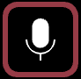

# ✅ Sound input oscillator

##   Sound input

将声音输入电平转换为属性值。


Sound input oscillator 使用默认音频接口，但你可以在 _Preferences_ 中更改。打开菜单 _Liberation -> Preferences_。

在 _Sound Input_ 设置中选择你想使用的音频接口，并可调整音量相关设置。


* **range min / range max** - 波形映射到的最小与最大值
* **channel** - 如果你的音频接口有多个输入通道，可在此选择要使用的通道。


从调音台获取多路音频是很有趣的做法，这样不同 Clips 可以响应不同乐器。



所有 _Sound Inputs_ 只能使用一个音频接口（在 _App Settings_ 面板中选择）。如果你想使用多个接口，在 MacOS 上可以[创建 Aggregate Device](https://support.apple.com/en-gb/HT202000) 将多个输入合并为一个虚拟音源。（Windows 上也有很多应用可做到这一点，但我未亲测）。


* **clamp min / clamp max** - 用于选择希望响应的电平范围。如果 _App Settings_ 面板中的 gate 与 limit 设置正确，通常无需调整，但也可用于一些创意效果。


当 Clip 含有 _Sound Input_ oscillator 时，你会在 Clip 按钮上看到一个小麦克风图标。


