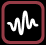

# ✅ Wave oscillators

## 本页包含：

*   [Sawtooth wave](wave-oscillators.md#sawtooth-wave-1)
*   [Triangle wave](wave-oscillators.md#triangle-wave-1)
*   [Sine wave](wave-oscillators.md#sine-wave)
*   [Square wave](wave-oscillators.md#square-wave-1)
*   [Noise](wave-oscillators.md#noise)
*   [Custom Oscillator](wave-oscillators.md#custom-oscillator-1)

## Wave oscillator 设置

所有 Wave oscillators 都有以下设置：

* **range min / range max** - 决定该 oscillator 控制的属性范围。波形位于最低点时取 _range min_，位于最高点时取 _range max_。


例如，你想让一个点在 -100 到 100 之间左右移动，可将 oscillator 连接到 _x property socket_，并将 _min range_ 设为 -100、_max range_ 设为 100。


* **duration** - 完成一个完整周期（或 _loop_）的时间长度，以小节为单位。¼ 表示 1 拍，1 表示 1 小节，以此类推。
* **duration multiplier** - 按指定因子缩放基础时长。例如 duration 为四分音符、multiplier 为 3，则 oscillator 持续三个四分音符（附点二分音符）。支持小数 multiplier——拖动滑块时按住 _SHIFT_ 可设置非整数值，适合做相位错开或细微的时间偏移。
* **offset** - 波形起点偏移（以 duration 百分比）。若想从周期的 1/4 处开始，将其设为 25%。
* **repeat count** - loop 的重复次数。默认 _FOREVER_，如不希望无限运行可修改。停止后，属性会保持为波形结束时的数值。
* **delay count** - oscillator 启动前的延迟（以拍数计）。启动前，属性会保持波形起点的值。


合理使用 _repeat count_ 和 _delay count_ 可以实现非常复杂的动画，几乎像一个独立的 Timeline！


## 通用设置

* **steps** - 将运动分成若干离散步骤。适合让属性“跳变”而非平滑移动。


注意 steps 是按时间而非按数值划分。例如将波形分成 4 个 steps、duration 为 1 小节，则属性会每一拍瞬间改变。


* **clamp min / clamp max -** 将波形超出最小/最大值的部分截断并固定在边界。


_clamp_ 概念比较难解释：可以想象波形超过图表上下边界，然后被“夹住”贴在边缘。我建议亲自试试！它对让 sawtooth 提前开始或提前结束非常有用。


* **ease function** - Sawtooth 和 Triangle waves 还带 easing，可微调动画曲线，让动作更有表现力！
  * **LINEAR** - 默认，无缓动，线性移动。
  * **EASE OUT** - 起步快，尾部减速。适合模拟逐渐停止的物理运动。
  * **EASE IN** - 起步慢，逐渐加速。适合模拟动量建立。
  * **EASE IN/OUT** - 两者结合，动作更自然。


**Easing -** 除非你需要机械感，否则尽量避免默认的线性动画。Easing 能让动画更流畅、更有机！


##   Sawtooth wave

也称 _ramp waveform_，波形向上爬升并在周期末尾骤然下落。它是最常用的 oscillator 之一，因为适合循环 _hue_ 或 _rotation_ 等属性。

相关设置见上文：

* **range min / range max**
* **duration**
* **offset**
* **steps**
* **clamp min**
* **clamp max**
* **repeat count**
* **delay count**
* **ease function**

Sawtooth 特有：

* **cycle range compensation** - 当 **steps** 开启时可用，适合循环数值（如 0 到 360 的旋转）。未开启时，起点和终点数值相同（0 与 360 同角度），可能导致起点“卡住”。开启后会减少最大范围以修正步进位置。

##   Triangle wave

与 _sawtooth wave_ 每周期回到起点不同，_triangle wave_ 会线性来回往返。

相关设置见上文：

* **range min / range max**
* **duration**
* **offset**
* **steps**
* **clamp min**
* **clamp max**
* **repeat count**
* **delay count**
* **ease function**

##   Sine wave

最平滑的波形！像钟摆一样在两个值之间来回摆动。

相关设置见上文：

* **range min / range max**
* **duration**
* **offset**
* **steps**
* **clamp min**
* **clamp max**
* **repeat count**
* **delay count**

##   Square wave

最简单的波形——只在两个值之间来回切换！

相关设置见上文：

* **range min / range max**
* **duration**
* **offset**
* **repeat count**
* **delay count**

Square wave 特有：

* **pulse width** - 波形处于最大值的持续时间占比。默认 50%，即一半时间为最大、一半时间为最小。若只想“亮”四分之一时间，可设为 25%。可通过 _offset_ 调整脉冲出现时间。

##   Noise

Liberation 的强项之一是生成随机但可重复的效果。_noise_ oscillator 可生成有机、循环的随机运动，细节/抖动可自定义。

相关设置见上文：

* **range min / range max**
* **duration**
* **offset**
* **steps**
* **clamp min**
* **clamp max**
* **repeat count**
* **delay count**

Noise 特有：

* **noise type** - 生成噪声的算法。
  * **SIMPLEX** - 默认，起伏变化并在循环中重复。
  * **RANDOM** - 传统随机算法，更混乱更不可预测。


**Simplex noise** 由 Ken Perlin 于 2001 年提出，是他 1983 年开发的 “Perlin noise” 的改进（用于电影 _Tron_，因此获得奥斯卡奖！）

这种所谓的“梯度噪声”源自他对早期“机器感”计算机图像的不满。在 CGI 领域，它特别适合生成云、水面，甚至真实地形高度图。

在 Liberation 中，它适合做看似不可预测但仍平滑、有机的运动。&#x20;


* **seed** - 用于生成噪声的种子值。如果不喜欢当前效果，尝试改变它。


极客小知识！为了让 simplex noise 完美循环，我在 2D 噪声平面上沿着一个圆进行迭代，改变 seed 会让这个平面在第 3 个维度中移动！


* **simplex detail** - 调整噪声细节与抖动程度。如果你觉得重复性太明显，可增加 duration 并提高此值。

##   Custom Oscillator

创建完全自定义的波形，非常适合复杂动画。

相关设置见上文：

* **range min / range max**
* **duration**
* **offset**
* **steps**
* **repeat count**
* **delay count**

下方列出位置和值。duration 被分为 64 步，你可以在任意步设置数值。

每一步包含：

* **Step** - 时间步，0 为开始，64 为结束。
* **Level** - 该步的波形值，范围 0 到 1。
* **Animation type** - 下拉菜单用于选择从上一步过渡到本步的方式。
  * **None** - 无过渡，直接跳变。
  * **Linear** - 线性过渡。
  * **Ease in / Ease out / Ease in/out** - 缓动过渡，见上文 _ease function_ 说明。

***

##
