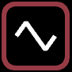
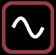
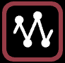

# ✅ Wave oscillators

## On this page  :&#x20;

### [  Sawtooth wave](wave-oscillators.md#sawtooth-wave-1)

### [  Triangle wave](wave-oscillators.md#triangle-wave-1)

### [  Sine wave ](wave-oscillators.md#sine-wave)

### [   Square wave](wave-oscillators.md#square-wave-1)&#x20;

### [  Noise](wave-oscillators.md#noise)&#x20;

### [  Custom Oscillator](wave-oscillators.md#custom-oscillator-1)

## Wave oscillator settings

All Wave oscillators have the following settings :&#x20;

* **range min / range max** - determines the range of values for the property the oscillator is controlling. The property is set to _range min_ when the waveform is at the bottom, and it's set to _range max_ when the waveform is at the top.&#x20;


For example, if you wanted a dot to move left and right between -100 and 100, you would connect the oscillator to the _x property socket_, set the _min range_ to -100 and the _max range_ to 100.&#x20;


* **duration** - the length of time one full cycle (or _loop_) takes to complete. This is relative to the tempo in bars. So ¼ is a single beat. 1 is a full bar, etc.&#x20;
* **offset** - the starting offset for the wave as a percentage of the duration. If you want the wave to start a quarter of the way through then set this to 25%.&#x20;
* **repeat count** - the number of times the loop runs before it stops. The default is _FOREVER_ but you can change it if you don't want the oscillator to run indefinitely. After it stops, the property will be set to the value at the end of the wave.&#x20;
* **delay count** - the delay in beats before the oscillator starts running. Before it starts running, the property will be set to the value at the start of the wave.&#x20;


With careful use of _repeat count_ and _delay count_ you can create very complicated animations, kind of like its own timeline!&#x20;


## Common settings

* **steps** - divides the motion into a number of discrete steps. Good for when you want properties to "jump" to values rather than moving smoothly.&#x20;


Note that the steps are divided by time rather than value. So for a wave split into 4 steps with a duration of 1 bar the property will instantly change every beat.&#x20;


* **clamp min / clamp max -** increases the scale of the wave beyond its minimum or maximum values and clamps the result.&#x20;


The clamp settings are quite hard to explain, but imagine the waveform going off the top or bottom of the graph, and then getting clamped to the edges. I recommend that you experiment with them! But they're very useful if you want a sawtooth to start late or end early.&#x20;


* **ease function** - the Sawtooth and Triangle waves also have an ease function which subtly changes the animation curve, and can make your animations really expressive!&#x20;
  * **LINEAR** - the default, no easing, just moves in a linear fashion between the min and max values.&#x20;
  * **EASE OUT** - starts quickly and then slows down as it gets to the end. Very good for simulating physics, ie slowing down to a halt.&#x20;
  * **EASE IN** - starts slowly and gradually speeds up. Good for simulating momentum building.&#x20;
  * **EASE IN/OUT** - a combination of both, and a very organic movement.&#x20;


**Easing -** I would avoid the default linear animation whenever you can unless you specifically want something that looks robotic. Easing can make your animations so much more flowing and organic!


##   Sawtooth wave

Also sometimes known as a _ramp waveform_ as it ramps upward and then sharply drops at the end of its cycle. It's probably the most common wave oscillator because it creates a loop for cycling properties like _hue_ or _rotation._&#x20;

See the sections above for :&#x20;

* **range min / range max**
* **duration**
* **offset**&#x20;
* **steps**
* **clamp min**
* **clamp max**
* **repeat count**
* **delay count** &#x20;
* **ease function**

Sawtooth specific  :&#x20;

* **cycle range compensation** - available when **steps** is set, and is good for cycling values, say a rotation from 0 to 360. When this is not set, the beginning and end values will be the same which can cause sticking at the start point (because 0 and 360 are the same angle). Turn this on and the maximum range will be reduced to correct the step positions.&#x20;

##   Triangle wave

Unlike the _sawtooth wave_ which jumps back to the beginning every cycle, the _triangle wave_ moves linearly forwards and then backwards.&#x20;

See the sections above for :&#x20;

* **range min / range max**
* **duration**
* **offset**&#x20;
* **steps**
* **clamp min**
* **clamp max**
* **repeat count**
* **delay count** &#x20;
* **ease function**

##   Sine wave&#x20;

The smoothest waveform! Oscillates gently between two values like a pendulum.&#x20;

See the sections above for :&#x20;

* **range min / range max**
* **duration**
* **offset**&#x20;
* **steps**
* **clamp min**
* **clamp max**
* **repeat count**
* **delay count** &#x20;

##    Square wave&#x20;

The simplest waveform - it just rocks between two values, back and forth!

See the sections above for :&#x20;

* **range min / range max**
* **duration**
* **offset**
* **repeat count**
* **delay count** &#x20;

Square wave specific :&#x20;

* **pulse width** - the length of time the wave is at its maximum value relative to the overall duration. 50% is the default, which is exactly half and half. If you only want it "on" for a quarter of the time, set it to 25%. You can adjust when this pulse happens using the _offset_ value.&#x20;

##   Noise&#x20;

One of Liberation's strengths is that it can generate random, but repeatable effects. The _noise_ oscillator can be used to create an organic looping random motion with as much detail/jitter as you like.&#x20;

See the sections above for :&#x20;

* **range min / range max**
* **duration**
* **offset**&#x20;
* **steps**
* **clamp min**
* **clamp max**
* **repeat count**
* **delay count** &#x20;

Noise specific :&#x20;

* **noise type** - the algorithm used to generate the noise.&#x20;
  * **SIMPLEX** - the default, an undulating value that ebbs and flows, and repeats on a loop.&#x20;
  * **RANDOM** - uses a more traditional random number algorithm, totally noisy and chaotic.&#x20;


**Simplex noise** was designed was designed by Ken Perlin in 2001 as an improvement of his "Perlin noise" algorithm, which he developed in 1983 as part of his work on the movie _Tron_ (which he won an Oscar for!)

This so-called "gradient" noise was born out of his frustration with previously "machine-like" computer generated imagery. It's particularly good for rendering clouds, water surfaces, or even height-maps for realisitc terrain.&#x20;


* **seed** - the value used to create the noise. If you don't like the look of the noise wave you have try changing the value.&#x20;


Fun fact! In order to get a perfectly looping simplex noise, I'm iterating around a circle on a 2D noise plane. And the seed value moves this plane through a 3rd dimension!&#x20;


* **simplex detail** - changes how detailed or jittery the noise is. If you want the repeating pattern to be less obvious, take the duration up and increase this value.&#x20;

##   Custom Oscillator

Creates a completely custom waveforms. This is very useful for creating complex animations.

See the sections above for :&#x20;

* **range min / range max**
* **duration**
* **offset**&#x20;
* **steps**
* **repeat count**
* **delay count** &#x20;

Below this are a list of positions and values. The duration is split into 64 steps and you can place a value at any of these points.&#x20;

Each step has the following settings :&#x20;

* **Step** - the time step within the duration. 0 is the at the beginning and 64 is at the end.&#x20;
* **Level** - the level of the wave at that time step. The level ranges between 0 and 1.
* **Animation type** - the drop down menu lets you choose how you want to move towards this level from the previous step.&#x20;
  * **None** - no transition, just jump straight to this level at the given time.&#x20;
  * **Linear** - a completely linear movement from the previous level to this one.  &#x20;
  * **Ease in / Ease out / Ease in/out** - eases between the previous level to this one. See _ease function_ above for a description of the animation types.&#x20;

***

##
