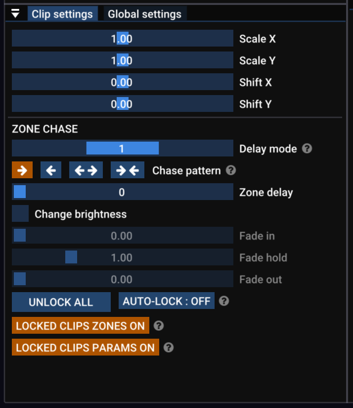

# ✅ Clip settings

### Clip settings panel

<figure><figcaption>
The clip settings panel
</figcaption></figure>

Change the output size of the clip using _Scale X_ and _Scale Y_. They are locked together unless you press the _SHIFT_ key.&#x20;

Change the horizontal and vertical position of the clip using _Shift X_ and _Shift Y_.

_Zone Delay/Chase_ is such an fun feature it gets its own section. [zone-delay-chase.md](zone-delay-chase.md "mention")

### Locking clips

If a clip is locked, it can't be moved or deleted. To lock a clip, use the _Locked_ checkbox in the right-click menu. In the Clip settings panel you get some more options.

* _UNLOCK ALL -_ unlocks every clip in the clip deck.&#x20;
* _AUTO-LOCK_ - when _Auto-Lock_ is on, any clip that is played automatically (either with the timeline or MIDI record/playback system) will be locked. This is useful if you've programmed a show in Logic Pro (or similar) and do not want to accidentally edit the clips used in the show.&#x20;
* _LOCKED CLIPS ZONES_ - if this is on then you can't change the zones for any locked clip
* _LOCKED CLIPS PARAMS_ - if this is on then you can't change the parameters (scale, shift etc) for any locked clip.&#x20;

### Right click menu

If you right click on a clip, a menu appears with some of the options for that clip. See [clip-editor-intro.md](../clip-editor/clip-editor-intro.md "mention"), [Broken link](broken-reference "mention") and [groups.md](groups.md "mention")for more about the first few items in this menu.&#x20;

<figure><figcaption>
The clip settings right click menu
</figcaption></figure>

### Retrigger

Clips by default are set to _retrigger_. This means that no matter when you press it, the clip will start running from that moment. So if you start it late, the clip's animation will be slightly late and out of time. &#x20;


If you _Tap Tempo_ while a retriggered clip is running, the system will "quantise" the clip to be in time, even if you didn't start it exactly on the beat.&#x20;


If _Retrigger_ is not enabled, the clip will always be in time - it's as though the clip was started at the very beginning of the clock. It's good for when you are synchronised perfectly with the music via an external clock signal. &#x20;


Clips are often designed to loop forever but you can design them in such a way that they only run once or a few times around. Make sure to keep those set to _retrigger_, or they won't restart!


### Transition in/out time (fade)

Clips can be set to fade in and out with a duration measured in seconds. By default the fade time will be inherited by its group settings (and can be changed by right clicking on the group button).&#x20;

If you want a different fade duration from the clip's group, first toggle off the _USE GROUP DEFAULT_ button, then adjust the clip's _In time_ and _Out time_ sliders.&#x20;

