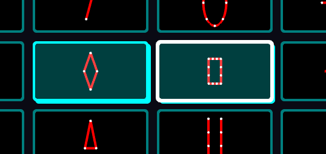
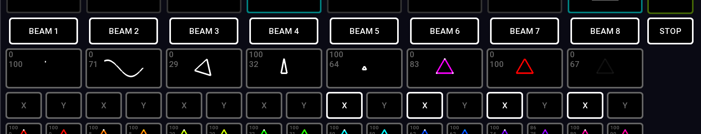

# ✅ Starting / stopping clips


You can use the on screen buttons to start and stop clips, but it's much better to use the APC40 midi controller. Liberation has been optimised to work well with this hardware and should be considered an important part of your investment into lasers.&#x20;


### Starting and stopping clips

To start a clip, press the button for that clip (either on screen or on your MIDI controller).

To stop the clip, press it again.

If you start a new clip (in the same group) the first clip will automatically stop.

To start a new clip without stopping other clips you can either

* Press the shift key (or APC40 shift button) while starting the new clip; or
* Re-press the currently running clip(s) while you start the new clip.

The clip groups are independent of each other so starting a clip in one group will not affect clips in any of the others. See [groups.md](groups.md "mention")

### Flash mode

If a clip is within a group that is set to _flash mode_, then it behaves slightly differently; the clip will only continue running as long as you have the clip button pressed. As soon as you let go it stops. (By default clip group 3 - the red one - is set to _flash mode.)_

### Stop all clips

To **stop all the clips running** press the **STOP** button.&#x20;

To stop all the clips running in a particular group, press its group button, then press the **STOP** button.&#x20;

To stop all clips except one, press the running clip you wish to keep, then while it is down, also press the **STOP** button. Then release the clip button. (This also works with multiple clips, as many as you can hold down at once!)

### The currently selected clip

<figure><figcaption>
Two clips that are currently running. The white outline denotes that the clip on the right is the <em>currently selected clip.</em>
</figcaption></figure>

That the clip lights up on screen when it is currently running (and its mini clip visualiser representation flashes). You will also notice that the last clip you pressed also has a white outline around it. This indicates that it is the _currently selected clip._

ALT/OPTION click on a clip to select it without activating it. Use ALT/OPTION + SHIFT click to select multiple clips.&#x20;


You can also click/drag a lasso to select multiple clips


### Assigning zones

<figure><figcaption>
The zone buttons at the top, and the Flip X / Flip Y buttons at the bottom.
</figcaption></figure>

Underneath the clips, you can see a row of zone buttons (both on-screen and reflected on the APC40), marked _BEAM 1_ to _BEAM 8_ by default. Use these buttons to toggle zones for the _currently selected clip_.

#### Scrolling through the zones

If there are more than 8 zones you can scroll left and right using :

* SHIFT plus the <- and -> cursor keys
* The _DEV ON/OFF_ and _DEV LOCK_ buttons on the APC40

### Flip X and Y

Underneath each zone button you can see buttons marked _X_ and _Y._ These flip the output to each zone horizontally and vertically, respectively.


You don't need to make a new zone to have different mirror settings. The X and Y flip settings apply to this clip only, they're not a setting of the zone.


