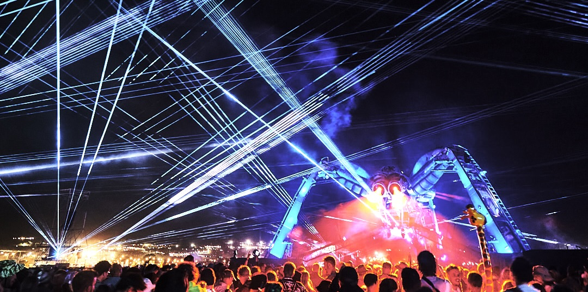

# 🟧 Introduction

Liberation includes a flexible and powerful DMX system that lets you create lighting effects and control DMX-compatible lasers over Art-Net. It’s designed to make it easy to keep your lighting in sync with your laser show - no need for a separate lighting desk.


**What is Art-Net, and how does it relate to DMX?**

**DMX** is a system that’s been used for years to control lights, lasers, smoke machines and other stage effects. It sends control signals over special cables (usually with XLR connectors), and each fixture listens to a specific set of channels to know what to do.

**Art-Net** is a newer way of sending that same DMX data over a regular computer network. Instead of using special cables, it sends everything over Ethernet, just like internet or local network traffic.

In Liberation, all DMX output is sent using Art-Net. You can use it to control Art-Net-compatible devices directly, or you can plug in an **Art-Net node** – a small box that converts Art-Net back into standard DMX. This means you can still control traditional DMX lights and effects, even if they don’t support Art-Net themselves.


You can also use it to control all kinds of different stage equipment like smoke machines, hazers, CO₂ jets, cold spark machines and more. If it supports DMX, you can set it up as a DMX zone and trigger it straight from Liberation, right alongside your laser content.

DMX fixtures are added as **DMX zones**, which appear in the zone list alongside your laser beam zones and canvas target areas. Each DMX zone uses a **DMX preset**, which tells Liberation how to map properties from your laser clips - like position, colour and brightness - to DMX channel values.

When you send a clip to a DMX zone, Liberation looks at the first element in the clip and converts its properties based on the preset. This makes it simple to drive lights and DMX effects directly from the same clips you're already using for lasers.

#### Liberation at Glastonbury

<figure><figcaption></figcaption></figure>

The first real test of the Liberation DMX system was at Glastonbury 2023 where Reach Lasers installed a total of 90 beam sources as part of the Arcadia "spider" stage.&#x20;

18 lasers were controlled with internal Ether Dreams, and a further 12 6-head beam bars were controlled via Art net and DMX.&#x20;

