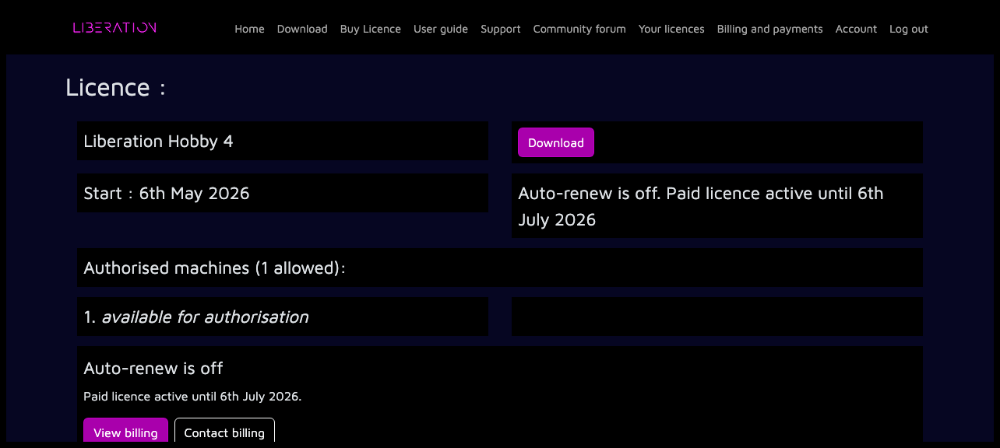

---
metaLinks:
  alternates:
    - >-
      https://app.gitbook.com/s/MdbbIbIwHdJwkEREnJyv/installation/cancel-your-subscription
---

# ✅ Pause or cancel payments

Recurring paid licences auto-renew each month, but you can pause or cancel future payments from your account.

If you pause payments, your licence stays active until the end of the current paid period. When the pause starts, paid access stops until the licence restarts. If you cancel payments permanently, your licence stays active until the end of the current paid period, then returns to Free mode and no further payments will be taken.

Log in to the website, open the [_Your licences_](https://liberationlaser.com/account/my-products) page, then choose the licence you want to manage.

<figure><figcaption></figcaption></figure>

## Pause payments

If payment pausing is available for your licence, click _PAUSE OR CANCEL PAYMENTS_.

Under _Pause payments_, choose when payments should restart:

* _Next month_
* _On a date I choose_
* _Only when I restart manually_

Then click _PAUSE PAYMENTS_.

Your licence page will show _Payments paused from_ and the paid period end date. Your licence will stay active until that date.

Before the pause starts, you can click _REACTIVATE PAYMENTS_ to cancel the scheduled pause. Payments will then continue as normal.

After the pause starts, your licence page will show _Licence paused_. From there you can restart the licence now, change the restart date, pause until you restart manually, or cancel payments permanently.

When a paused licence restarts, Paddle will take payment using your saved payment method.

## Cancel payments permanently

To stop future payments without scheduling a restart, use _Cancel payments permanently_ and click _CANCEL PAYMENTS_.

<figure><figcaption></figcaption></figure>

After cancellation, the licence page will show _Auto-renew is off_ and the date your paid licence remains active until. To use paid features again after that, you'll need to start over with a new licence.

<figure><figcaption></figcaption></figure>
