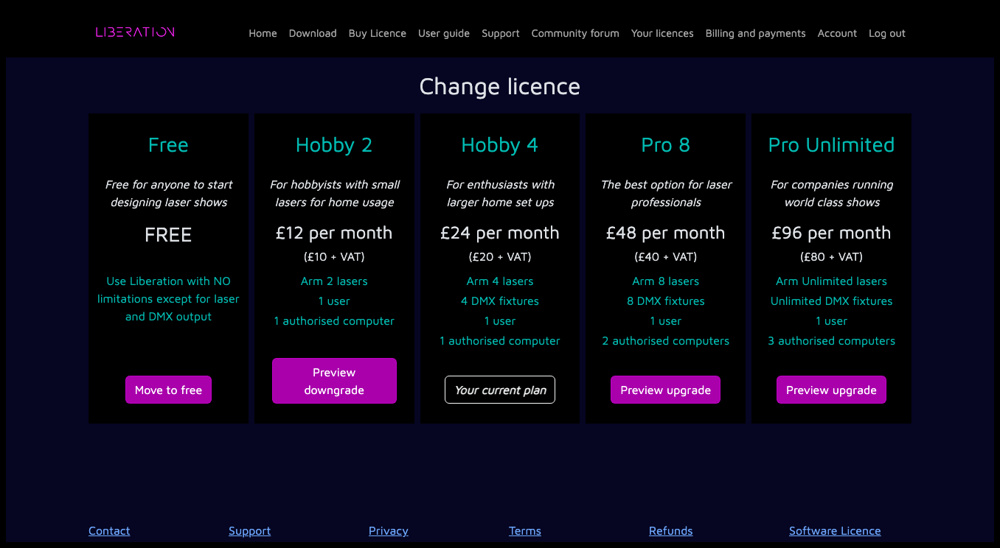

---
metaLinks:
  alternates:
    - >-
      https://app.gitbook.com/s/MdbbIbIwHdJwkEREnJyv/installation/upgrade-downgrade-your-license
---

# ✅ Upgrade / downgrade your licence

You can upgrade to a higher tier at any time. You will get a partial refund for the remaining time in your current paid period, and your new licence tier will start immediately.

You can also downgrade at any time but it will not take effect until the end of your current paid period.

Log in to the website, open the [_Your licences_](https://liberationlaser.com/account/my-products) page, select the licence you want to change, then click _UPGRADE / DOWNGRADE_. You will then see the available options for your licence.

<figure><figcaption></figcaption></figure>

Click the relevant _PREVIEW_ button to see how the changes would affect your payments. If you're happy with the change, click _Confirm licence change_ to complete the process.
