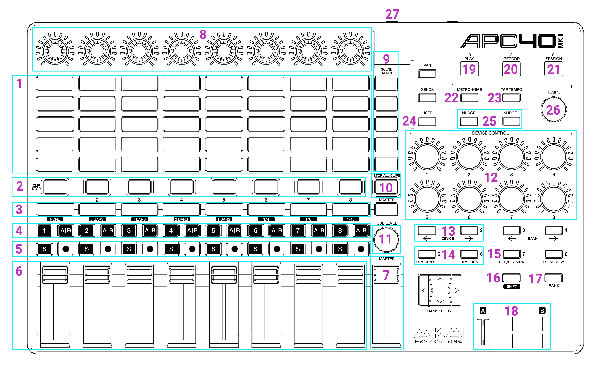

---
metaLinks:
  alternates:
    - https://app.gitbook.com/s/MdbbIbIwHdJwkEREnJyv/reference/apc40-reference
---

# ✅ APC40 reference

<figure><figcaption></figcaption></figure>

1. 8x5 Clip deck
2. Zone On/Off
3. Effects 1-8 On/Off
4. Zone X/Y Flip
5. Effects 9-24 On/Off
6. Effect Faders 1-8
7. Global Brightness
8. Effect 1-8 Parameter Adjustment
9. Group Buttons
10. Stop All Clips (Press twice to immediately stop all clips without their fade settings)
11. Clip deck Scroll
12. Contextual Parameters panel controls
13. Clip Page Left/Right
14. Zone Page Left/Right
15. Alt button (allows for clip selection)
16. Shift button (allows for multi-select and other options)
17. Tempo Multiplier Enable/Disable
18. Tempo Multiplier Fader (0% - 200%)
19. Play / Pause
20. Toggle Record Timeline
21. Arm / Disarm (you must press Shift to arm)
22. Tempo bar reset
23. Tap Tempo
24. Toggle Zone Delay (use with Shift to cycle through Delay/Chase, or with Alt to toggle Retrigger)
25. Nudge tempo + and -
26. Tempo Scroll
27. Foot Pedal, Tap Tempo

The Device Control knobs follow the same contextual parameters shown in the on-screen Parameters panel. With a clip selected they control clip shift, zone delay, global spin and global scale. If a group button is held, the first controls switch to that group's fade in and fade out times.
