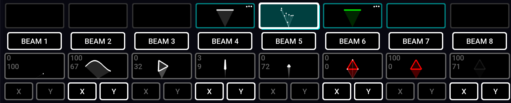

---
metaLinks:
  alternates:
    - >-
      https://app.gitbook.com/s/MdbbIbIwHdJwkEREnJyv/setting-up/setting-up-your-project
---

# ✅ Setting up your project

When you open Liberation for the first time, it will be set up with its default configuration. But you'll likely want to adjust this to more closely match your own setup.

Here is an overview of the process :

1.  **Change the number of lasers in your project :**

    In the _Laser Overview_ panel, click the red button on the right to delete a laser. Add a laser with the _ADD LASER_ button at the bottom. See also [adding-removing-lasers.md](adding-removing-lasers.md "mention")

    <figure><figcaption></figcaption></figure>
2.  **Update the 3D visualiser view :**

    Adjust the position and orientation of each laser using the _3D Visualiser Settings_ panel. See [3d-visualiser.md](3d-visualiser.md "mention").

    <figure><figcaption></figcaption></figure>
3.  **Adjust the zones :**\
    In the _OUTPUT_ view you can check the zones. Tab through each laser or click one of the numbered buttons at the top of the view. Adjust each zone as you require, or even add new zones. See [output-view](../output-view/ "mention").

    <figure><figcaption></figcaption></figure>
4.  **Change each clip's zones :**\
    Trigger each clip by clicking its button, and then toggle the zones and the X and Y flip using the on-screen buttons. See [clips](../clips/ "mention").

    \\

    <figure><figcaption></figcaption></figure>
5.  **Connect to your controllers :** when you're ready to plug your lasers in and go, open the _Controller Assignment_ panel. See [controller-assignment.md](controller-assignment.md "mention").

    \\

    <figure><figcaption></figcaption></figure>
6. **Activate and zone your lasers :** Carefully follow the [setting-up-lasers.md](setting-up-lasers.md "mention")
