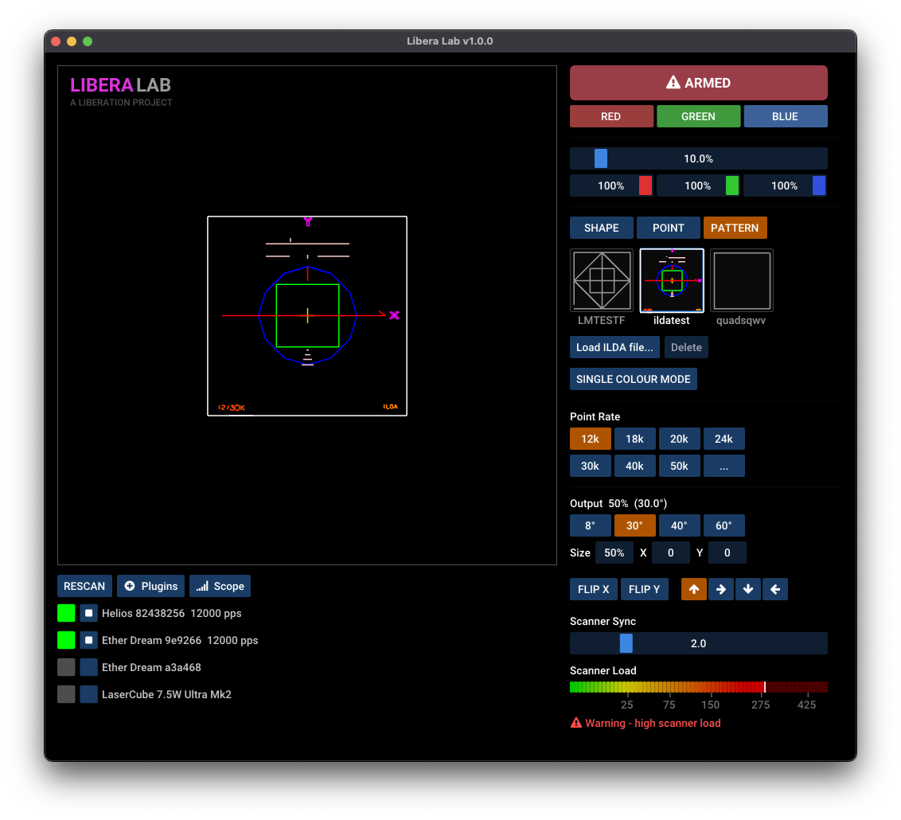

---
metaLinks:
  alternates:
    - >-
      https://app.gitbook.com/s/MdbbIbIwHdJwkEREnJyv/appendix-articles/scanner-specifications-and-liberation
---

# 🟩 Scanner specifications and Liberation

### The messy reality of scanner specifications

Point rates and scanner specifications can be a bit confusing. You’ll often see specs like 30kpps @ 8º or 50kpps @ 4º, but what those numbers actually represent isn’t always obvious.


Disclaimer - I’m not a scanner hardware specialist, but I do have years of practical experience getting scanners of all different qualities to look good through software and point stream generation rather than hardware tuning. This is based on that experience.


#### **Where these numbers come from**

Terms like “30K” and “50K” are shorthand based on how scanners are evaluated using the ILDA test pattern at those point rates under specific conditions.

When a scanner is quoted as something like: _30Kpps @ 8°_ it really means:

> “This scanner can reproduce the ILDA test pattern at 30,000 points/sec at an 8° scan angle, when properly tuned.”

It’s not a comprehensive or fully standardised measurement of real-world performance. In fact it wasn’t originally designed as a benchmark at all - it was used for a **tuning procedure**. You run a known pattern at a fixed point rate (e.g. 30,000 points/sec), and adjust damping and gain until it looks correct.

But it’s still the most widely used reference we have, and it can give you a good idea of the quality of the scanners, at least with reputable manufacturers. With _less reputable_ ones though...

#### Testing scanners with Libera Lab


**This is an advanced technique and you can damage your scanners if you're not careful. Not recommended unless you know what you're doing.**


If you want to experiment with scanner behavior outside a show project, use [Libera Lab](https://github.com/sebleedelisle/libera-lab/releases). It's a desktop tool for Libera-compatible laser controllers, designed for discovering, testing, previewing and inspecting laser output.

<figure><figcaption>
Libera Lab can output known patterns, stream ILDA files and show a scanner-load estimate for the current point stream.
</figcaption></figure>

Libera Lab is useful because it lets you:

* output known test patterns, including the ILDA test pattern
* load and stream ILDA files
* preview the point stream before or while outputting it
* inspect output with scope and scanner-load tools
* compare how different patterns, point rates and output sizes affect the scanners

To test scanners against a published rating, set Libera Lab to the [ILDA Test Pattern](https://ilda.com/technical.htm?r=7950), choose the rated point rate and adjust the output size to match the specified scan angle (e.g. 8°). See the ILDA documentation for advice on how to analyse the output.

#### Why it might not be a good benchmark

Well first of all, your test pattern could show incorrectly even if your scanners are good because they're not tuned in a way that is optimized for it.

It can be a useful general guide for "good" versus "bad" scanners, but manufacturers can sometimes play fast and loose with these specifications.

#### So how do I choose a good scanner?

I think just make sure they're made by a reputable manufacturer. Expensive high-end scanner manufacturers like Cambridge Technology (CT), Eye Magic (EMS) and ScannerMAX (a subsidiary of Pangolin) are always good and you can't go wrong. But when a pair of scanners comes in at around $1000, for a lot of us starting out that’s more expensive than our lasers!

So mostly I’ve used Chinese manufacturers. Dragon Tiger (DT) scanners are decent and affordable, and I think LightSpace uses them. Many other manufacturers (including OPT and Able in some models) also use DT-based systems.

Phenix Technology (PT) are generally a lower tier, but honestly they’re probably fine for most things.

**If your scanners are unbranded, that’s probably when you want to worry about quality!**

#### How Liberation helps

Well first of all, for most things you do not need really expensive scanners! Affordable 30kpps DT or even PT will be fine. The default scanner settings are deliberately conservative and for the most part _you should not need to adjust them_ (aside from _Scanner sync_).

If you want to understand what the scanner settings are really doing, Libera Lab is a better place to experiment than your show project. You can change the point rate, output angle and test pattern while watching the preview, scope and scanner-load information.

Even if you have better scanners there’s no point in driving them harder than you need to. This will significantly prolong their life.

#### What is a "point stream"?

You’ve probably heard this term before - it’s how we control the path of the scanners.

A point stream is a list of X/Y positions, each with a color. To draw something like a white line, you send a sequence of points along that line, all set to white. The scanners then move from point to point at a fixed rate - the points per second rate (PPS) - and the beam traces out the shape.

#### How this works in traditional laser software

Traditional laser software stores a point stream for every cue. For animated cues, that usually means a separate point stream for every frame. The key point is that everything is completely predetermined. As a result, increasing the point rate makes the scanners move faster through the same predefined data.


For older software this approach was necessary - computers simply weren’t fast enough to generate point streams in real time. That’s why there’s usually a separate cue editor, used to pre-generate the data for each frame of animation.

It also explains why content can take up gigabytes of space. You’re effectively storing large, uncompressed waveforms at pretty high sample rates.


#### Why "point rate" is less meaningful in Liberation

Liberation generates the point stream in real time, which gives us a huge amount of flexibility. Notice the "Scanner speed" setting in the Laser Settings panel. This allows us to speed up and slow down the scanners, but importantly it **does not** change the underlying point rate (PPS).

#### Wait, what? How?

I know, it sounds weird at first.

Because Liberation generates the point stream in real time, it can adjust that point stream. The more spread out the points are, the faster the scanners move. The closer together they are, the slower the scanners move.


In recent versions of Liberation, the actual _point rate_ (in advanced settings) doesn’t affect scanner speed at all. Instead, the renderer adjusts the point distribution to match the selected point rate, while keeping the motion of the scanners unchanged.

This does have an effect on the "resolution" of the point path, but that mainly makes a difference for graphics (and can help with finer adjustment of the _scanner sync_ setting).


#### Great! So what does this all actually mean?

Good question. Here are my tips:

* Avoid unbranded scanners. If you can get faster scanners, do it - minimum 30KPPS.
* For most cases, DT30 scanners are fine, and PT30 scanners are probably OK in cheaper lasers.
* If you're doing graphics, in most cases more lasers will be better than faster scanners.
* Once you get to higher-end setups, any of the established high-end brands will be fine.
* If you can only get the cheapest unbranded scanners, Liberation’s default settings are quite conservative and you’ll probably get OK results for basic beam work. If it struggles, reduce the **Speed** setting (but don’t change the point rate!).
* If you want to test or compare settings, do it in Libera Lab first rather than experimenting inside a show file.

#### And the ILDA Test Pattern?

…is still very useful as a calibration and reference tool, and Libera Lab makes it easier to output and inspect. But it was never designed as a comprehensive benchmark and can be misused or interpreted loosely by manufacturers.
