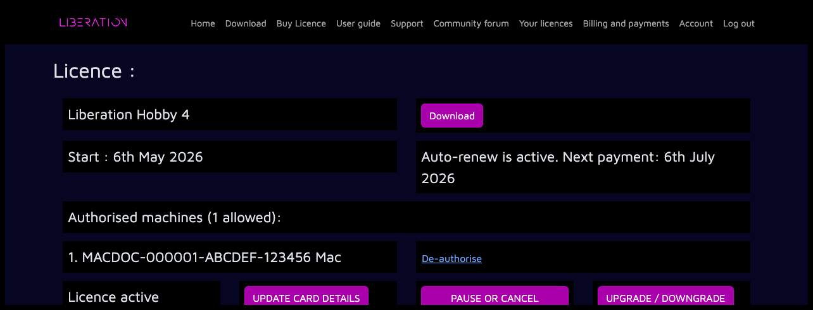

---
metaLinks:
  alternates:
    - >-
      https://app.gitbook.com/s/MdbbIbIwHdJwkEREnJyv/installation/authorising-and-de-authorising
---

# ✅ Authorizing and de-authorizing

### Authorizing Liberation

When you open Liberation for the first time, it'll run in _free mode_ and you'll see the _About panel:_

<figure><figcaption></figcaption></figure>

Click on the _AUTHORIZE ONLINE_ button and your web browser will open. If you are not already logged in, you will be prompted to do so now.

The system will now automatically authorize your installation with your license, and you'll see a confirmation message.

When you return to Liberation you'll see the _About panel_ has updated (you may have to wait a few seconds).

<figure><figcaption></figcaption></figure>


If you have already authorized the maximum number of computers for your license, you will need to deauthorize one of your other machines or upgrade your license.



If you have multiple licenses, you will be prompted to choose the license that you want to assign the computer to.


Congratulations! Your Liberation install has now been authorized and you can output to lasers! But please read the [Quick start guide](../getting-started.md "mention") and [Laser setup process overview](../setting-up/setting-up-lasers.md "mention") before arming your lasers.


You can open the _About panel_ at any time via the menu _Liberation -> About Liberation_ or _Liberation -> Authorize/Deauthorize this computer_


### De-authorizing Liberation

**From within Liberation** - Open the menu _Liberation -> Authorize / De-authorize this Computer_ and click the _DEAUTHORIZE COMPUTER_ button. That's it! You need to be online for this to work.

<figure><figcaption></figcaption></figure>

Alternatively you can do this from the website. Select _Your licenses_ from the menu, then click _MANAGE_ for the relevant license. If your account only has one license, _Your licenses_ will take you straight to that license page. You should see information about your license and a list of the computers you have authorized.

<figure><figcaption></figcaption></figure>

Click the _De-authorize_ link next to the machine you want to de-authorize

If your machine hasn't been online since your last license refresh it will be deauthorized immediately. If not, then the machine is _queued_ for deauthorization. This means that deauthorization will automatically happen next time the machine is connected to the internet, or on the next license refresh date, whichever happens first.
