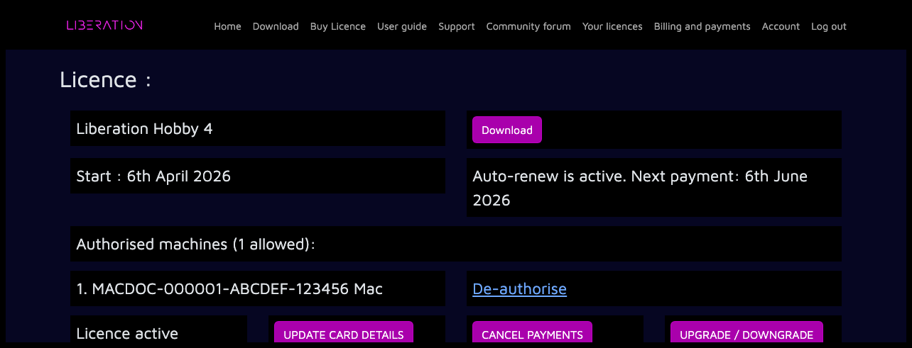
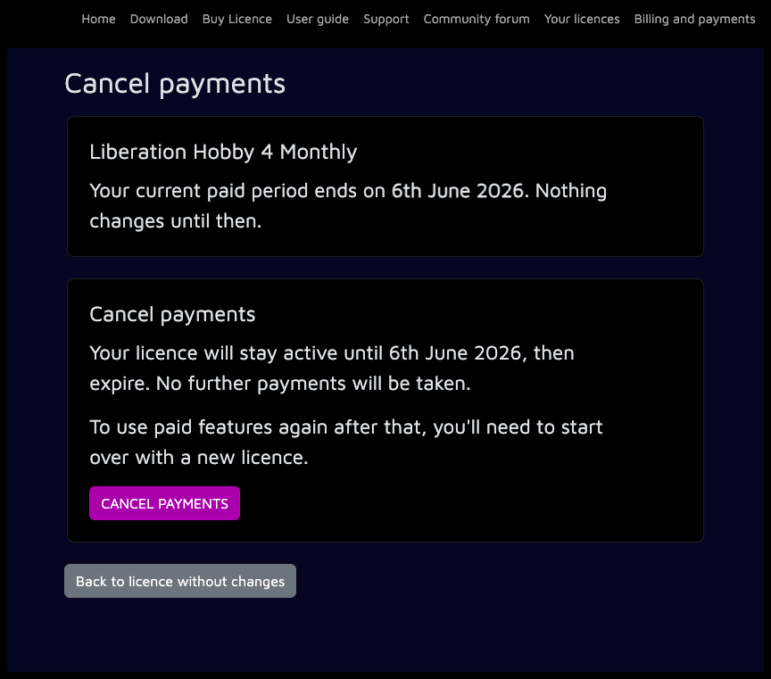

---
metaLinks:
  alternates:
    - >-
      https://app.gitbook.com/s/MdbbIbIwHdJwkEREnJyv/installation/cancel-your-subscription
---

# ✅ Cancel your license

Your license auto-renews each month, but you can turn this off at any time. You’ll keep access to paid features until the end of your current license period. After that, your account will return to Free mode and you won’t be charged again.

Log in to the website, open the [_Your licenses_](https://liberationlaser.com/account/my-products) page, choose the license you want to manage, then click _CANCEL PAYMENTS_.

<figure><figcaption></figcaption></figure>

On the confirmation page, check the paid period end date and click _CANCEL PAYMENTS_ again.

<figure><figcaption></figcaption></figure>

After cancellation, the license page will show _Auto-renew is off_ and the date your paid license remains active until.

<figure><figcaption></figcaption></figure>
