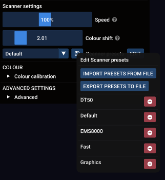

---
metaLinks:
  alternates:
    - https://app.gitbook.com/s/MdbbIbIwHdJwkEREnJyv/reference/the-preset-system
---

# ✅ The Preset system

The Preset system is throughout various places in Liberation whenever there is a requirement to store multiple selectable settings from a list of _presets_.

This system is currently used for :

* Scanner settings
* Color calibration settings
* 3D visualizer camera settings
* 3D visualizer laser settings
* DMX profiles

So if you tune scanner settings for your fancy new CT6210 scanners, you can store that as a preset, call it "CT6210" and it will then be available in the preset list whenever you need it in the future and available in the drop-down menu.

All of the presets are saved along with your project (or laser settings) whether you are using them or not. So any time you load one of these files, all of the presets inside will be added to your existing presets. If one of the loaded presets has the same name as one of your existing presets, it will overwrite the existing preset.

You can additionally import and export preset files using the load/save button (a floppy disk icon) next to the preset drop-down list. This opens a pop-up that has import/export buttons and also the option to delete one or more of your presets.

<figure><figcaption>
The pop-up menu that opens when you click the load/save icon
</figcaption></figure>

If you edit a preset, let's say the scanner setting called _Default_, note that the other lasers won't be automatically updated. Instead each of their scanner settings will now be labeled _Default(edited)_. To update this to the new _Default_ preset, re-select it from the drop-down list.


If you have a lot of lasers and want to update all of their scanner settings, use the _COPY LASER SETTINGS_ system. See [Copy settings between lasers](../setting-up/copy-laser-settings.md "mention")


If you delete a preset that is used elsewhere, you will not lose the setting, but instead see it labeled as _(deleted)._
