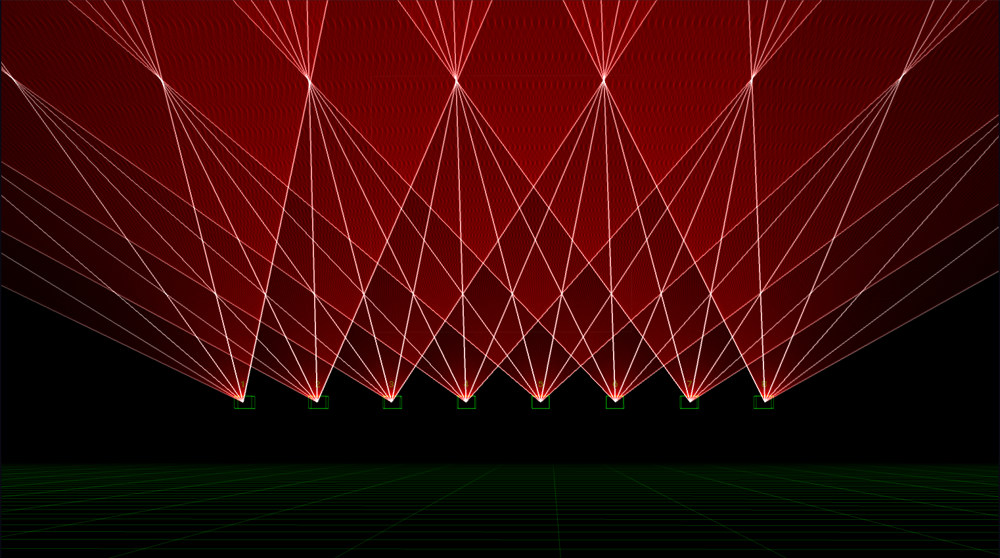

---
metaLinks:
  alternates:
    - https://app.gitbook.com/s/MdbbIbIwHdJwkEREnJyv/setting-up/3d-visualiser
---

# ✅ 3D Visualizer

### Introduction

Liberation's 3D visualizer is an incredibly useful feature - you can design and refine your shows without needing any lasers at all! It's proved an invaluable tool for me, especially when there are particularly complex setups with large numbers of lasers.

### Navigating around the 3D space

<figure><figcaption>
The 3D Visualizer view
</figcaption></figure>

* Click and drag to rotate the view around the orbit point
* Mouse wheel to move backwards and forwards towards the orbit point
* Click and drag while keeping the shift key pressed to move the camera around laterally (strafe) left, right, up and down along the XY plane
* Double-click anywhere on the visualizer to reset the camera position

### Settings

Open the _3D Visualizer Settings_ panel via the _Window_ menu.

<figure><figcaption>
The 3D Visualizer Settings panel
</figcaption></figure>

* **Visualizer size** - changes the size of the visualizer relative to the rest of the app
* **Brightness Adjustment** - changes how bright the lasers appear
* **Show laser numbers** - renders the relevant number above each laser
* **Show zone names** - renders the relevant zone names below each laser

### Camera settings

These settings mostly relate to the virtual camera in 3D space. You can see a drop-down with presets for these settings that you can save and reload.

* **Camera distance -** The camera is always pointed at its _Orbit point_. The camera distance is how far away it is from this point. You can also adjust this setting using the mouse scroll wheel.
* **FOV -** Field of view - determines how wide angle / zoomed in the camera is.
* **Orbit position** - describes the current rotation around the orbit point. The first value is the rotation around the X axis (pitch) and the second value is the rotation around the Y axis (yaw).
* **Orbit center point** - the position of the orbit point in 3D space, x, y, z.
* **Grid height** - the height of the grid from the "ground" (i.e. where y = 0).

### Content settings

These settings determine where the lasers (and canvas) are placed within the 3D environment. You can see a drop-down with presets for these settings that you can save and reload.

#### Lasers

Each laser has its own group of settings that you can expand using the small white triangle.

<figure><figcaption>
3D visualizer laser settings
</figcaption></figure>

* **3D Position** - the laser's x, y and z position.
* **3D Orientation** - the laser's rotation around each of the x, y and z axes.
* **Flip X / Flip Y** - flips the virtual output of the laser - NOTE that this shouldn't be necessary - it's better to use the laser flip / orientation settings to correct any inconsistencies with your hardware.
* **Output Range horizontal / vertical** - relates to the max / min angle of your laser's scanners. 60º is standard but you can adjust this if your lasers are different.

#### Canvas

If you are using the canvas system, you can also choose to include the canvas image within the 3D view. Activate the checkbox to render the canvas within and use the position, orientation and scale settings to determine how it looks within your 3D view.

<figure><figcaption>
3D visualizer canvas settings
</figcaption></figure>


Seeing "ghost" lasers? The 3D Visualizer is somewhat independent of the laser setup and it's possible to have more lasers within the visualizer than you do in Liberation. When you add a laser to your project, a new laser object inside the visualizer will also be added. But if you delete a laser, there will still remain a "ghost" laser object in the visualizer.

To get rid of all the ghost lasers, click the _Remove extra 3D laser objects_ button (at the bottom of the 3D Visualizer settings panel).


