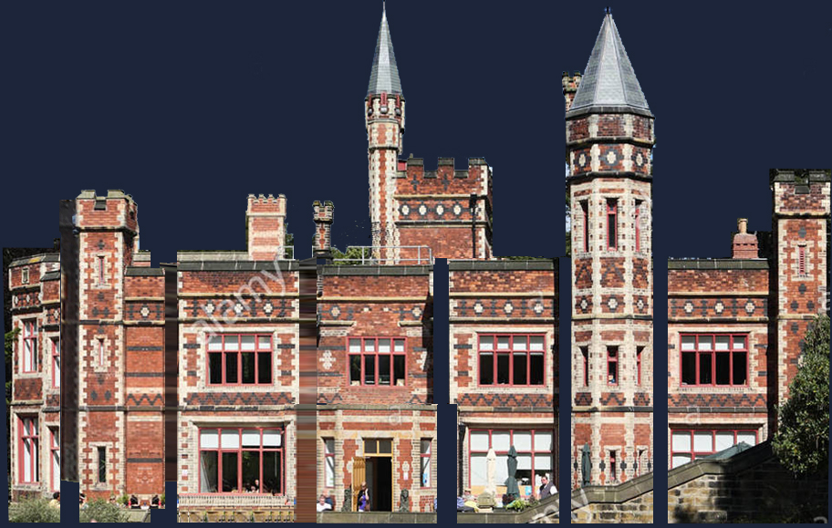
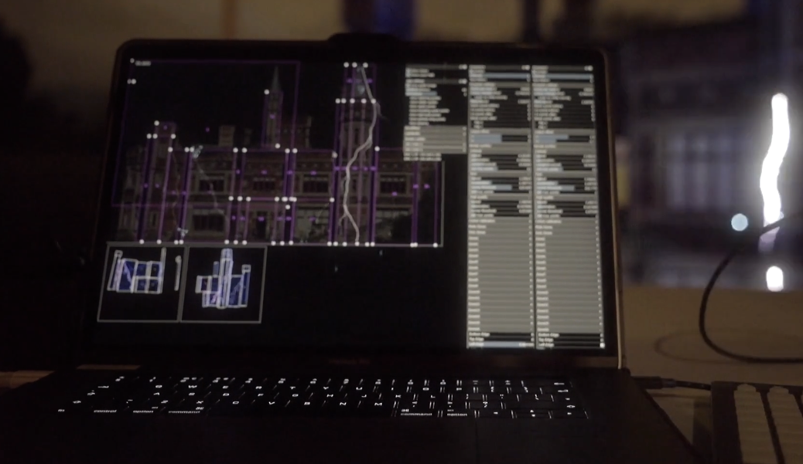

# 🟦 Overview

The Liberation Canvas system is relatively simple, but it can be confusing at first. Here's a conceptual overview to get you started.&#x20;


### Wait, do I need the canvas system?

Maybe not! If you're just projecting a single graphic onto a single laser, you can easily do that with a beam zone (although by default beam zone content is flipped horizontally, so you'll need to X flip the clip).&#x20;

But if you want to spread graphical content among more than one laser, or break it up into different sections to map onto architecture, then the canvas system has got you covered!&#x20;


### Canvas

First of all, there's the canvas itself. This is what you see in the _CANVAS_ view and represents a large, well, canvas, and you can draw content anywhere within this space.&#x20;

### Canvas target areas

These are shown as blue outline rectangles in the canvas view, and these are areas to which you can send content. You send a clip's content to a canvas target area, in the same way that you would send a clip to a beam zone. You'll see the canvas target area buttons to the right of the beam zone buttons in the clip deck.&#x20;


If you can't see the canvas buttons in the clip deck, try scrolling the beam zone buttons - use SHIFT and the left and right cursor keys. You should see a button for every canvas target area labelled _CANVAS 1, CANVAS 2_ etc.&#x20;


### Canvas zones

Canvas zones are areas within the canvas that you choose to send to a laser. They are represented as pink outline rectangles in the canvas view. You can right click on each zone and select the lasers you want it to be assigned to. If you now switch to the _OUTPUT_ view for that laser you'll see a new zone has appeared. &#x20;


WARNING - if the laser is armed you could suddenly start projecting content in a default canvas zone. It's best to disarm the laser before assigning canvas zones to it.&#x20;



You can also assign a canvas zone to a laser by clicking the _add canvas zone_ button in the _OUTPUT_ view. See [zones.md](../output-view/zones.md "mention").


### Guide images

You can add a guide image into the canvas, and use this as a template for your graphics. It's advisable to adjust the colour tint on the guide image (right click menu) and darken it down to more easily see your content over it.&#x20;


For architectural mapping I've found it helpful to produce an 'unwrapped' visual of the building that represents all surfaces on the building as a flat undistorted image. The perspective correction for the various sections can be done using the canvas zone in the _OUTPUT_ view.&#x20;


<figure><figcaption>
A 'flattened' guide image for Saltwell Hall in Gateshead UK
</figcaption></figure>

<figure><figcaption>
The canvas zones in an embryonic version of Liberation (c2017!) Note the pink rectangles choose which part of the canvas to show, and then the output views below show which part of each laser those zones go to. 
</figcaption></figure>

### Canvas in the 3D visualiser

It would probably be fiddly (to say the least) to recreate your complicated multi laser projection system in the 3D visualiser! So instead, you have the option to place your canvas within the 3D space. Activate the _Show canvas_ checkbox in the _3D visualiser settings_ panel. (Any guide images you have in the canvas will also show up in the visualiser.)


Note that the visualiser will still show the canvas projections as atmospheric effects coming from the lasers. You can either just move them out the view or, if you're fancy, you can line them up with the canvas!


<figure><figcaption>
It can be extremely satisfying when you line up the beams from the laser with the canvas image in the 3D visualiser! 
</figcaption></figure>

