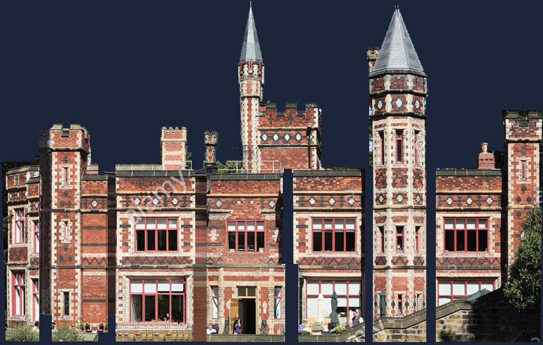
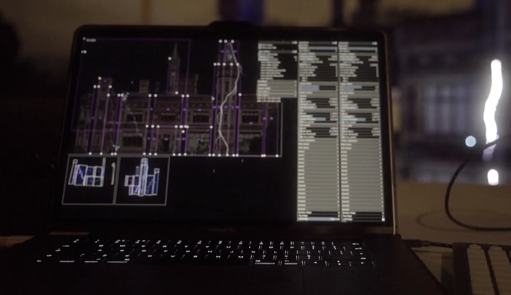

# 🟩 Canvas 概览

Liberation 的 Canvas 系统相对简单，但一开始可能有些绕。以下是一个概念性的入门概览。


#### 等等，我需要 Canvas 系统吗？

可能不需要！如果你只是把一个图形投射到一台激光上，用 beam zone 就可以（不过 beam zone 内容默认水平翻转，所以需要对 Clip 做 X flip）。

但如果你想把图形内容分配到多台激光，或拆分成不同区域映射到建筑上，那么 Canvas 系统就派上用场了！


### Canvas

首先是 Canvas 本体。它在 _CANVAS_ 视图中呈现，是一张大的画布，你可以在这个空间里任意绘制内容。

### Canvas target areas

在 Canvas 视图中，Canvas target areas 以蓝色轮廓矩形显示，表示可以接收内容的区域。你可以把 Clip 的内容发送到某个 Canvas target area，就像发送到 beam zone 一样。Clip Deck 中的 Canvas target area 按钮位于 beam zone 按钮的右侧。


如果在 Clip Deck 中看不到 Canvas 按钮，尝试用 `Shift + Left / Right Arrow` 滚动 beam zone 按钮。你会看到 _CANVAS 1、CANVAS 2_ 等按钮。


### Canvas zones

Canvas zones 是 Canvas 内的区域，用来发送到激光。它们在 Canvas 视图中以粉色轮廓矩形显示。你可以右键每个 zone，并选择要分配的激光。切换到该激光的 _OUTPUT_ 视图后，会看到新 zone 出现。


警告 - 如果激光已 arm，默认 canvas zone 可能会突然开始投射内容。最好在将 canvas zones 分配给激光之前先 disarm。



你也可以在 _OUTPUT_ 视图中点击 _add canvas zone_ 按钮，将 canvas zone 分配给激光。见 [zones.md](../output-view/zones.md "mention")。


### Guide images

你可以在 Canvas 中添加 guide image 作为图形模板。建议在 guide image 上调整颜色 tint（右键菜单）并降低亮度，便于看清你的内容。


进行建筑映射时，我通常先制作一张建筑的“展开图”，把所有表面作为平面图像表示。各部分的透视校正可在 _OUTPUT_ 视图中的 canvas zone 里完成。


<figure><figcaption>
英国 Gateshead 的 Saltwell Hall “展开式” guide image
</figcaption></figure>

<figure><figcaption>
早期版本 Liberation（约 2017）的 canvas zones。粉色矩形选择 Canvas 的哪部分显示，下面的输出视图展示这些 zones 对应到各台激光的位置。
</figcaption></figure>

### 3D visualiser 中的 Canvas

要在 3D visualiser 中重建复杂的多激光投影系统可能非常繁琐。所以，你可以选择把 Canvas 放入 3D 空间：在 _3D visualiser settings_ 面板中勾选 _Show canvas_。（Canvas 中的 guide images 也会显示在 visualiser 中。）


注意：visualiser 仍会把 Canvas 投影显示为从激光发出的空气光束效果。你可以把它们移出视图，或者如果你愿意，也可以把它们与 Canvas 对齐。


<figure><figcaption>
当你把激光光束与 3D visualiser 中的 Canvas 图像对齐时，会非常有成就感！
</figcaption></figure>
