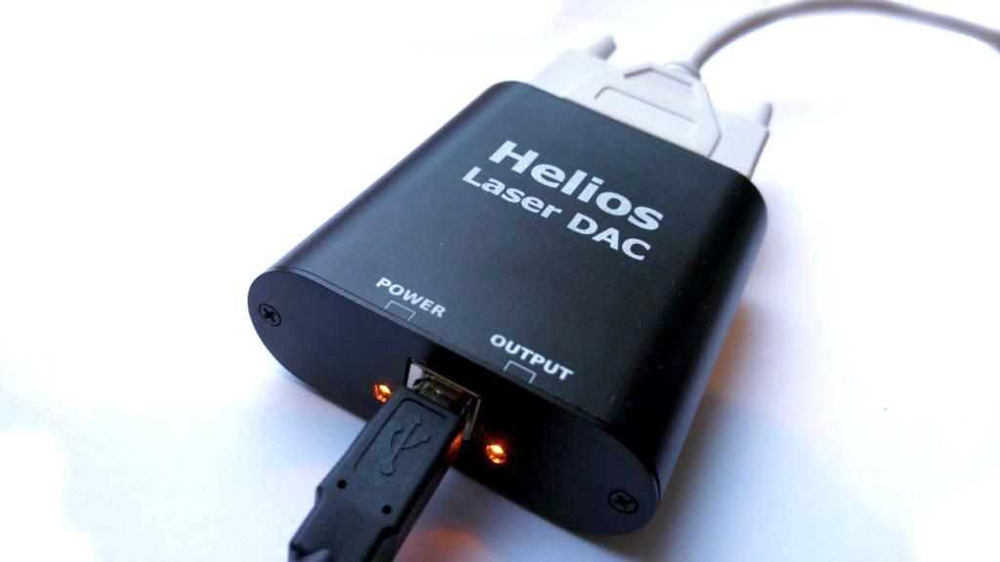
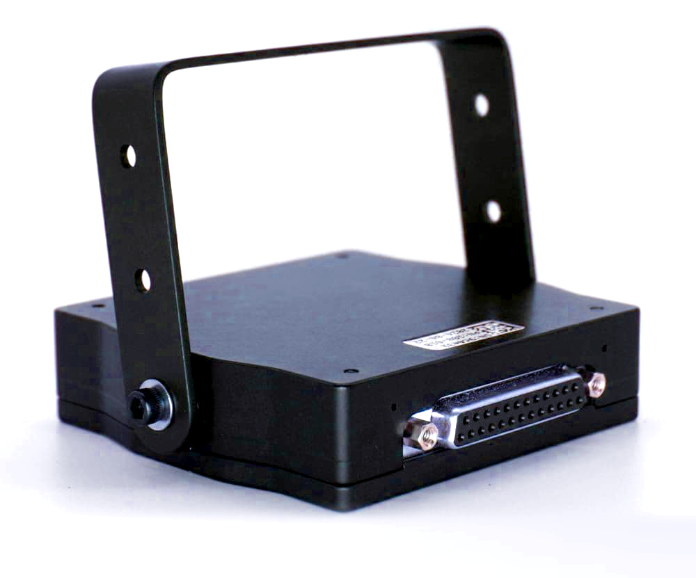
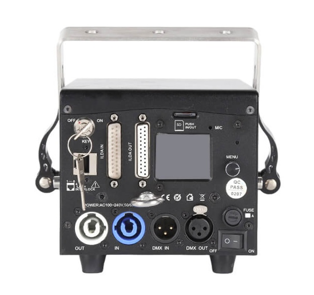
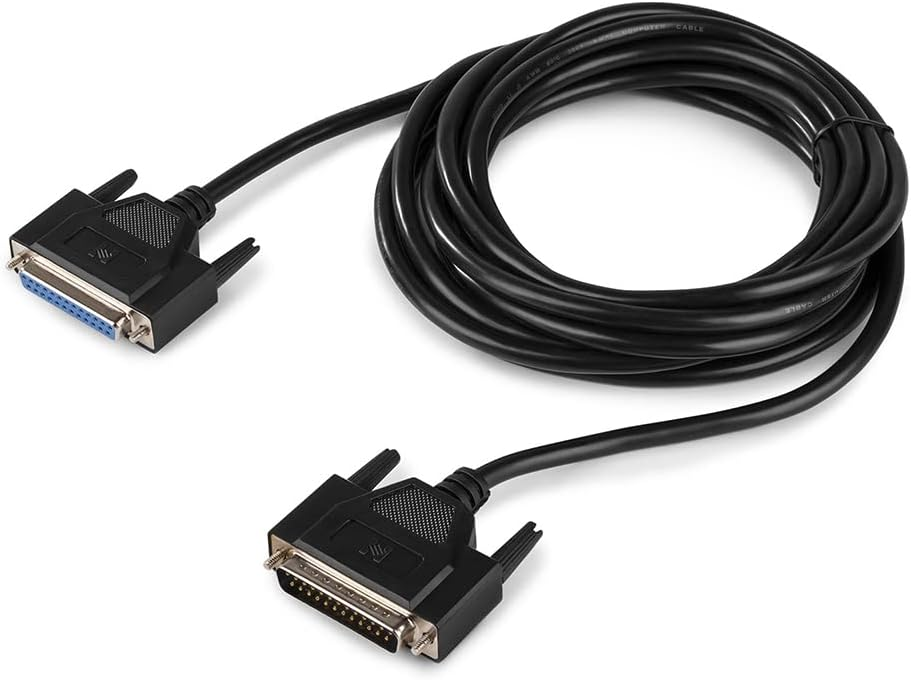

# ✅ Compatible lasers and controllers (DACs)

### Which lasers are compatible with Liberation?

If your laser has a standard ILDA input then you can use it with Liberation (along with a compatible laser controller such as the Ether Dream or Helios DAC - [see full list below](compatible-lasers-and-controllers-dacs.md#compatible-laser-controllers)).

<figure><figcaption>
The Helios DAC - the cheapest option for home use
</figcaption></figure>

You do not need an external controller or an ILDA input if :&#x20;

* Your laser has Ether Dream installed inside, or;
* You have a LaserCube from Wicked Lasers&#x20;


### What is a laser controller?

A laser controller (or DAC) is a hardware device that can take the digital data from Liberation and convert it to the analog signals that are required to control the scanners and output of your laser. (Hence DAC: Digital to Analog Converter.)

The controller connects to your computer via USB or over a standard computer network; it will either be an external device, or installed inside the laser.

If it's external, you connect it to your laser via the ILDA connection. ILDA is an industry standard that uses an old school 25 pin 'D' connector. Get yourself an ILDA cable, plug one end into the controller, and the other into the laser. &#x20;


<figure><figcaption>
The ILDA output on an external Ether Dream
</figcaption></figure>

<figure><figcaption>
The rear panel of a laser showing the various connections, including the ILDA input
</figcaption></figure>

<figure><figcaption>
A standard ILDA cable
</figcaption></figure>

### Which controller is best for me?

If you are a home user, or run small shows with 4 or fewer lasers that are close to the computer, then USB controllers like the **Helios DAC** are the **most affordable** option.&#x20;

Network DACs like the **Ether Dream** are the **best option for professional** laserists who are happy to set up a network and want to run a large number of lasers; all of the large Liberation shows so far have been run on Ether Dreams.&#x20;

If you have a **LaserCube** then you don't need a separate laser controller at all - Liberation is compatible with all LaserCubes. The earlier models connect with a USB cable, and the newer models connect over a network.&#x20;

### Compatible laser controllers

#### Ether Dream (Network)

The [Ether Dream](https://ether-dream.com) has been around for over ten years and is currently at version 4 (although Liberation also works with Ether Dream version 1, 2, and 3). They are extremely reliable.&#x20;

You connect to them over a standard network. They can be bought as standalone units, or even better, can be fitted inside lasers.&#x20;

#### Helios (USB)

[Helios](https://bitlasers.com/helios-laser-dac/) is the best option for beginners and they are cheaper than Ether Dreams, but as they connect over USB, it's not recommended for long cable runs. Also you may have USB data and driver issues once you connect to more than 4 (especially on Windows).&#x20;

But if you just want to run a couple of lasers at home, it's the cheapest and simplest option.&#x20;

#### Controllers that will be supported in the future :

* [Mercury](https://x-laser.com/pages/mercury-laser-control-system) (Built-in to X-Laser units)
* [IDN](http://www.ilda-digital.com) (an open network protocol from ILDA, can be implemented by any manufacturer)

### Cabling suggestions

For optimal performance, keep USB DACs near your computer and connect them to the lasers using longer ILDA cables. (Although watch out as ILDA cables can act as a grappling hook during de-rigging!)

If you're using Ether Dreams you can still keep them all together and connect to the lasers using long ILDA cables, or you can rig them close to the lasers, and use longer network cables.&#x20;

The ideal set up is to have Ether Dreams installed directly inside your lasers (Rob at Stanwax Laser will do this for you in the UK)

