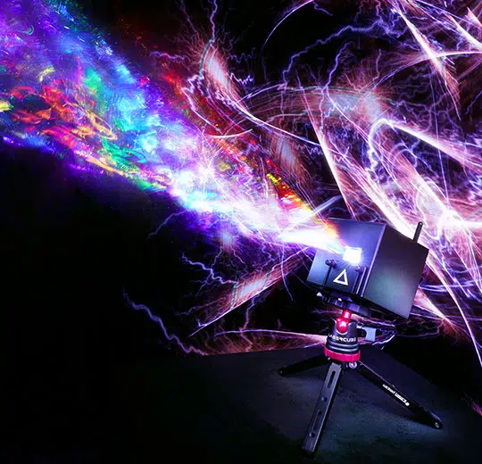

# ✅ LaserCube

<figure><figcaption>
Wicked Lasers 提供的 LaserCube 宣传图
</figcaption></figure>

Wicked Lasers 的 [LaserCube](https://www.laseros.com/lasercube/) 是一款极其紧凑的电池供电激光设备，提供多种功率配置。由于易用的手机应用，它在爱好者中很受欢迎；而较新的型号已经足够强大，可用于专业演出。&#x20;

手机应用（名为 LaserOS，也有桌面版）可免费下载，玩法很多，对大多数用户来说足够。但如果你要运行规模更大的、多激光的演出，就需要更专业、更强大的方案——这正是 Liberation 的用武之地。&#x20;

### 连接 LaserCube

早期 LaserCube 通过 USB 控制，但当前型号都内置网络控制器。这些网络控制的设备被称为 “LaserCube Wifi”。Liberation 支持两种 LaserCube，无论通过 USB 还是网络连接都可以。 

\*(LaserCube network protocol 支持从 0.7.3 版本开始)

### USB LaserCube

用 micro USB 线将 LaserCube 连接到电脑，然后在 _Controller Assignment_ 面板中查找它（见 [controller-assignment.md](../setting-up/controller-assignment.md "mention")）。如果没有自动显示，点击 _REFRESH_ 按钮。&#x20;

### 网络 LaserCube “Wifi”


虽然 “Wifi” 版设计用于无线网络，但不推荐这样使用，通常会出现掉线和卡顿。请使用 RJ45 接口把 LaserCube 接入有线网络，就像连接 Ether Dream 一样。


将 LaserCube 连接到有线网络。&#x20;

把 LaserCube 设置为 “LAN Client” 模式，并确保网络中有路由器。LaserCube 会从路由器获取 IP 地址，随后应会出现在 _Controller Assignment_ 面板中（见 [controller-assignment.md](../setting-up/controller-assignment.md "mention")）。&#x20;


你也可以在不使用路由器的情况下搭建网络，并为所有设备分配固定 IP 地址，这在活动行业非常常见。我个人更倾向于在网络中加入路由器，并推荐给不太熟悉网络的人。&#x20;

路由器会为所有设备自动分配 IP，我觉得更简单、更不容易出错。



与 Ether Dream 不同，_**LaserCubes 在遇到缓冲区欠载、丢包或其他错误/损坏数据时不会消光**_。

它们会从中断处继续输出，这在某些情况下会导致可见光束穿过不在 Zones 内的区域，更糟的是还可能穿过软件 Masks。

我已与 LaserCube 的设计/开发团队沟通，希望未来通过固件更新修复。但在此之前，你必须确保对不希望激光到达的区域进行物理遮挡。

公平地说，你可能本来也应该这样做，但我自己会用软件 Masks 来保护相机和投影仪。所以请注意，与 Ether Dream（出现任何错误或丢失数据会立即进入安全停止模式）相比，使用 LaserCube 网络协议时这样做更危险。

另外再强调一次：**务必使用有线连接 LaserCube**。Wifi 不够稳定，只会让问题更严重。

