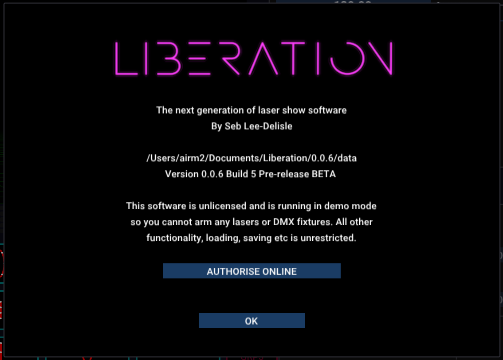
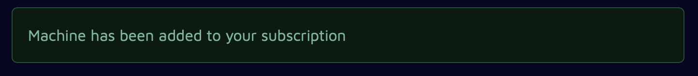
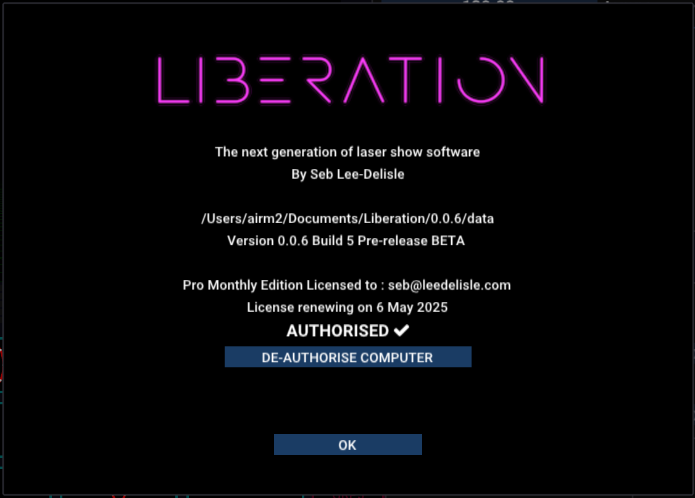

# ✅ Authorising and de-authorising

### Authorising Liberation

When you open Liberation for the first time, it'll run in _demo mode_ and you'll see the _About panel:_

<figure><figcaption></figcaption></figure>

Click on the _AUTHORISE ONLINE_ button and your web browser will open. If you are not already logged in, you will be prompted to do so now.&#x20;

The system will now automatically authorise your installation with your subscription, and you'll see this message:

<figure><figcaption></figcaption></figure>

When you return to Liberation you'll see the _About panel_ has updated (you may have to wait a few seconds).&#x20;

<figure><figcaption></figcaption></figure>


If you have already authorised the maximum number of computers for your subscription, you will need to deauthorise one of your other machines or upgrade your subscription.&#x20;



If you have multiple subscriptions, you will be prompted to choose the subscription that you want to assign the computer.&#x20;


Congratulations! Your Liberation install has now been authorised and you can output to lasers! But please read the [getting-started.md](../basics/getting-started.md "mention")and [setting-up-lasers.md](../setting-up/setting-up-lasers.md "mention") before arming your lasers.&#x20;


You can open the _About panel_ at any time via the menu _Liberation -> About Liberation_ or  _Liberation -> Authorise/Deauthorise this computer_


### De-authorising Liberation

**From within Liberation** - Open the menu _Liberation -> Authorise / De-authorise this Computer_ and click the _DEAUTHORISE COMPUTER_ button. That's it! You need to be online for this to work.

<figure><figcaption></figcaption></figure>

Alternatively you can do this from the website - Select _Your subscriptions_ from the menu, and then click _Manage Subscription_ to open your subscription page. You should see information about your subscription and a list of the computers you have authorised.

Click the _De-authorise_ link next to the machine you want to de-authorise

<figure><figcaption></figcaption></figure>

If your machine hasn't been online since your last renewal it will be deauthorised immediately. If not, then the machine is _queued_ for deauthorisation. This means that deauthorisation will automatically happen next time the machine is connected to the internet, or on your next renewal date, whichever happens first.&#x20;
