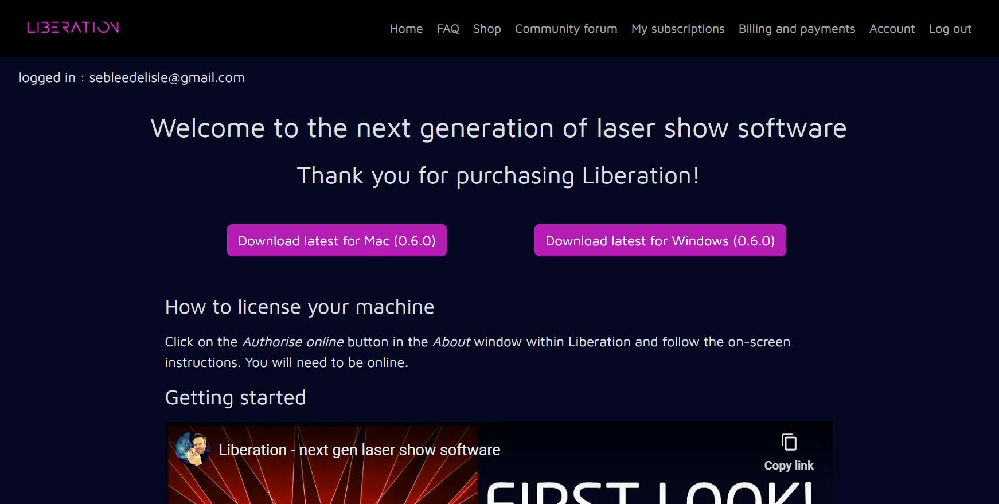

# ✅ Install for Mac

### Compatibility

MacOS version 12 (Monterey) and higher. Apple Silicon recommended, particularly if you want to run large shows.&#x20;

### Installation process

Once you have got an active subscription you will be sent a link, or you can click the _Download_ link on the [_My subscriptions_](https://liberationlaser.com/account/my-products) page.

You'll see this page :

<figure><figcaption></figcaption></figure>

Click _Download latest for Mac_ (the version numbers will change over time) and the the Liberation DMG install file will be saved into your downloads folder. Find the file, and double click to open it.&#x20;

<figure><figcaption></figcaption></figure>

Drag the Liberation icon on the left into the Applications folder on the right (you may need an administrator password). You can now find Liberation in your Applications folder, double click to open it.&#x20;
