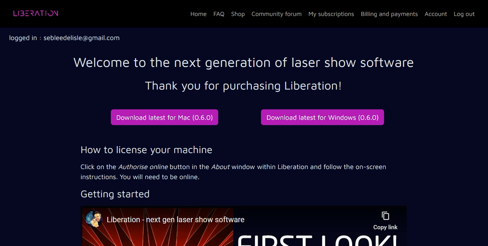
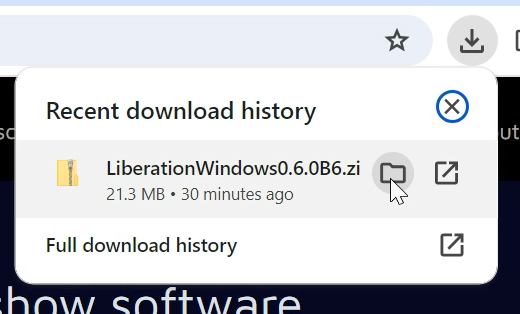
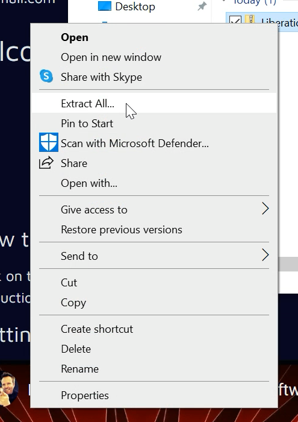
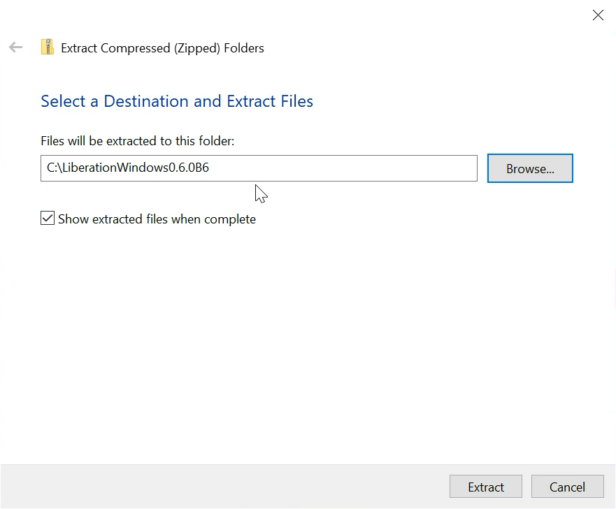
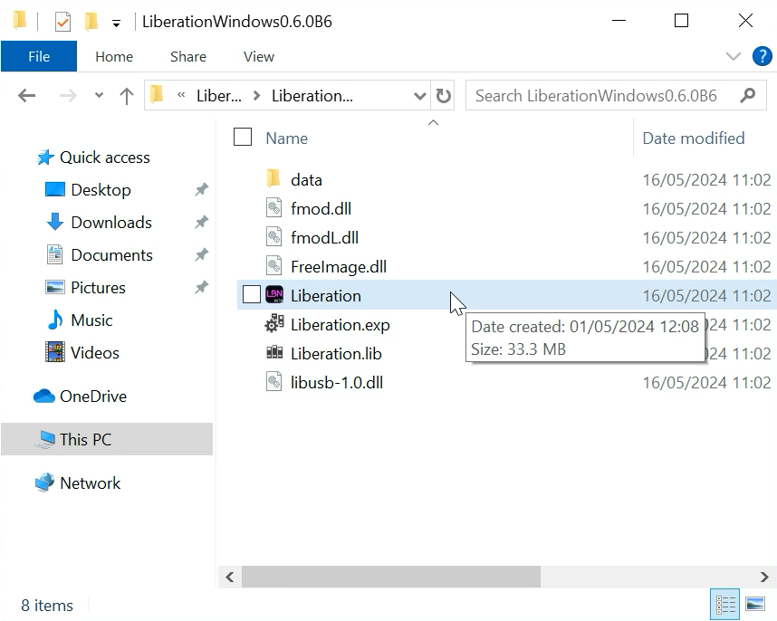
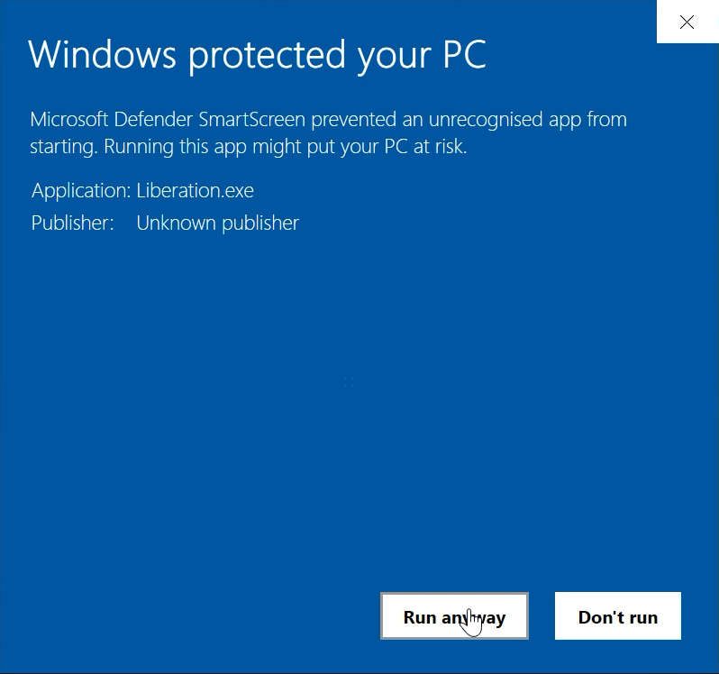

# ✅ Install for Windows

### Compatibility

Windows 10 or 11 64 bit machines. High spec machines recommended if you want to run large shows.&#x20;

### Installation process

Once you have got an active subscription you will be sent a link, or you can click the _Download_ link on the [_My subscriptions_](https://liberationlaser.com/account/my-products) page.

You'll see this page :

<figure><figcaption></figcaption></figure>

Click _Download latest for Windows_ (the version numbers may change) and you'll see the download indicator show the progress (usually in the top right, screen shot is from Chrome). When it's complete, hover over the Liberation download, and click on the folder icon that appears

<figure><figcaption></figcaption></figure>

This will open your downloads folder. Find the downloaded file (usually at the top), right click, and select "Extract all"

<figure><figcaption></figcaption></figure>

A new panel will open asking you where you would like to install Liberation - you can put it anywhere on your hard drive that you have write permissions for, but if in doubt, just put it in a folder in your C: drive.

<figure><figcaption></figcaption></figure>

After Windows has finished unzipping it will show you the install file. Double click Liberation.exe to run the app.

<figure><figcaption></figcaption></figure>

Liberation needs permission to access files and the network so Windows will probably pop up a bunch of requesters. Make sure to accept everything or Liberation may not work properly.

<figure><figcaption></figcaption></figure>

<figure><figcaption></figcaption></figure>

Liberation should now run! To output to lasers you will need to now go through the authorisation process. It should be fairly self explanatory but there will be a full guide to this coming soon.
