# ✅ Install for Windows

### Compatibility

Windows 10 or 11 64 bit machines. High spec machines recommended if you want to run large shows.  The faster your computer is, the smoother the animated laser output will be.&#x20;

### Installation process

Once you have got an active subscription you will be sent a link, or you can click the _Download_ link on the[ _Your subscriptions_](https://liberationlaser.com/account/my-products) page.

You'll see this page :

<figure>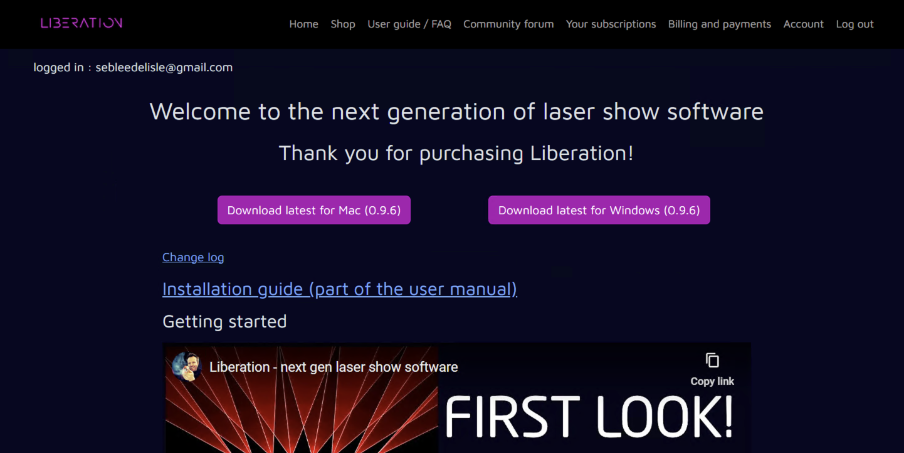<figcaption></figcaption></figure>

Click _Download latest for Windows_ (the version numbers may change) and you'll see the download indicator show the progress (usually in the top right, screen shot is from Chrome). When it's complete, open your downloads and click on the downloaded installer file

<figure>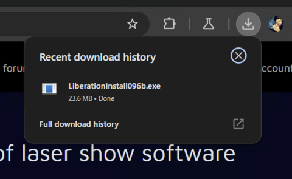<figcaption></figcaption></figure>

This will run the installer.&#x20;


In some cases you may get a warning saying WIndows protected your PC - Windows is cautious about running new software! As more people run and trust Liberation, this should go away.

But if you get this warning, click the _More info_ link, make sure the _Publisher_ is shown as _SEB.LY LIMITED_ and then _Run anyway_.&#x20;

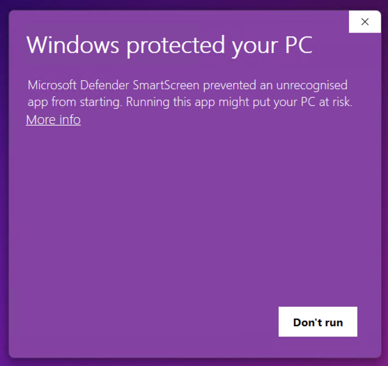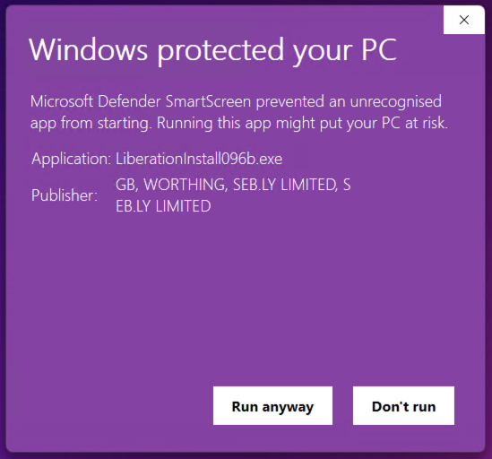


Before the installer starts you may get a warning asking if you are happy for the installer to make changes. Click _Yes_.&#x20;

<figure>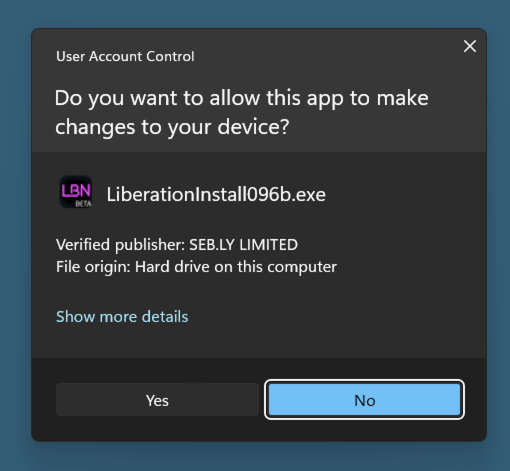<figcaption></figcaption></figure>

Now the installer can start! Click through the pages

<figure>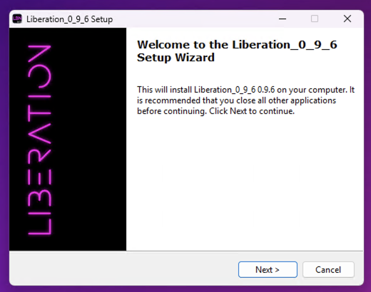<figcaption></figcaption></figure>

It's recommended to use the default install location, so just click _Next_

<figure>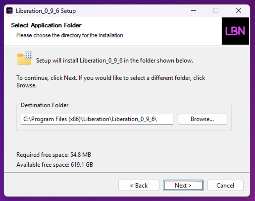<figcaption></figcaption></figure>

Next you have options for a desktop icon and start menu folder (recommended)

<figure>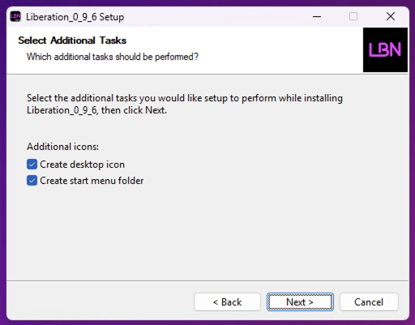<figcaption></figcaption></figure>

Wait a short while for Liberation to be installed

<figure>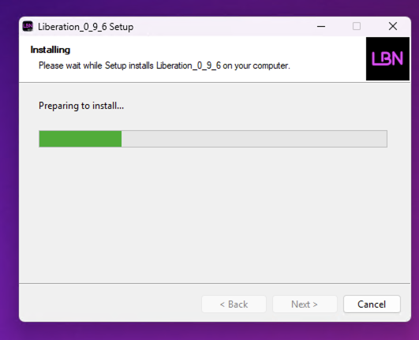<figcaption></figcaption></figure>

The installer is done! Click _Finish_ to close it and launch Liberation.

<figure>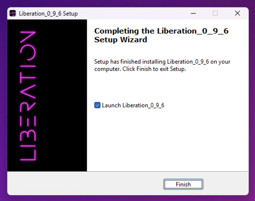<figcaption></figcaption></figure>

Liberation needs permission to access files and the network so Windows will probably pop up a bunch of requesters. Make sure to accept everything or Liberation may not work properly.

<figure>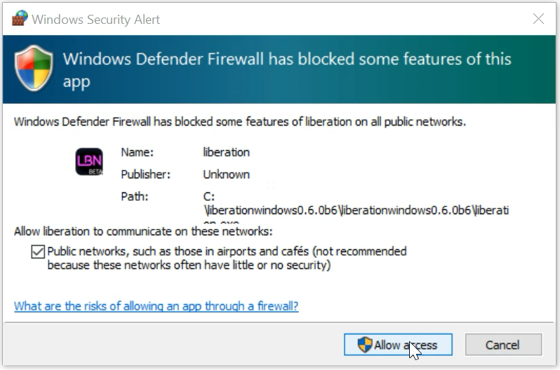<figcaption></figcaption></figure>

Liberation should now run! To output to lasers you will need to now go through the [authorisation process.](authorising-and-de-authorising.md)
