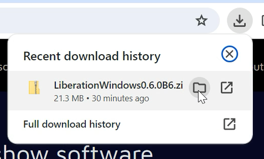
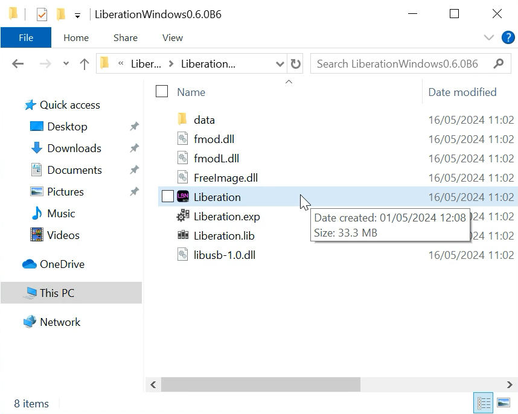
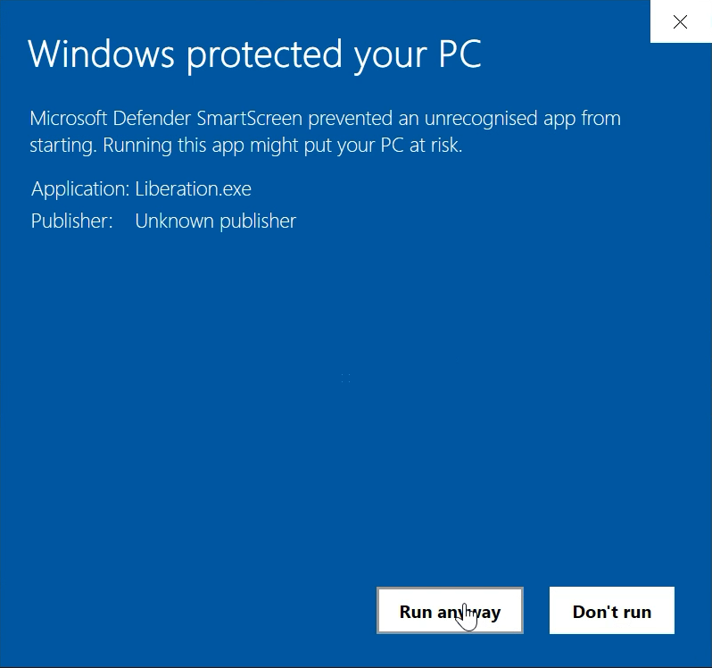
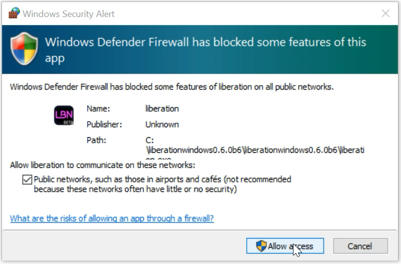

# ✅ Windows 安装（旧版，0.9 之前）

### 兼容性

支持 Windows 10 或 11（64 位）。若要运行大型演出，建议使用高配置机器。电脑越快，动画激光输出越流畅。

### 安装流程

有了有效订阅后你会收到下载链接，也可以在 [_My subscriptions_](https://liberationlaser.com/account/my-products) 页面点击 _Download_ 链接。

你会看到如下页面：

<figure><figcaption></figcaption></figure>

点击 _Download latest for Windows_（版本号可能会变化），下载进度会在下载指示器中显示（通常在右上角，截图来自 Chrome）。下载完成后，把鼠标移到 Liberation 下载项上，点击出现的文件夹图标。

<figure><figcaption></figcaption></figure>

这会打开下载文件夹。找到下载的文件（通常在顶部），右键选择 “Extract all”。

<figure><figcaption></figcaption></figure>

会打开一个新面板询问安装位置——可放在你有写入权限的任何硬盘位置；如果不确定，就放在 C: 盘的某个文件夹中。

<figure><figcaption></figcaption></figure>

Windows 解压完成后会显示安装文件。双击 Liberation.exe 运行应用。

<figure><figcaption></figcaption></figure>

Liberation 需要访问文件和网络权限，Windows 可能会弹出多次提示。请全部允许，否则 Liberation 可能无法正常运行。

<figure><figcaption></figcaption></figure>

<figure><figcaption></figcaption></figure>

Liberation 现在应该可以运行了！要输出到激光设备，还需要完成[授权流程](../authorising-and-de-authorising.md)。
