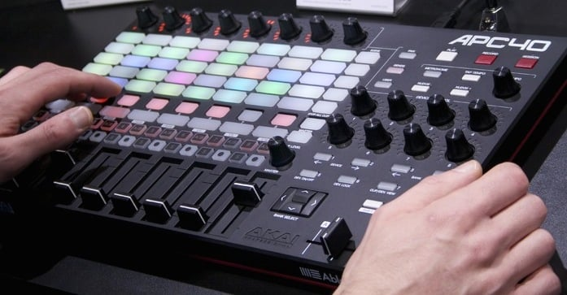

# 🟦 Live control with the APC40

<figure><figcaption></figcaption></figure>

### **APC40 controller**&#x20;

This is the default hardware controller for Liberation; it's highly recommended and it's fair to say that Liberation has been designed around this hardware from the very beginning. As soon as you plug in an APC40, Liberation automatically connects to it with no set up required.&#x20;


_Oh no! My USB plug got pulled half way through a show!_&#x20;

Don't panic - just plug it back in, Liberation will automatically reconnect, no drama.&#x20;


### APC40 Mark 1 or Mark 2?&#x20;

In short, Mark 2 is recommended as it has full colour buttons that more closely match the Liberation clip deck interface. The Mark 1 version will work in a pinch, but it will be a little more confusing as the layout is slightly different from what is on screen, and the buttons can only turn red, orange or green, so will not match the clip colours.&#x20;


The mark 1 APC40 came out in 2009(!) and some people still prefer it for it's metal body construction and its sloping robust form factor. The mark 2 came out in 2014, and although it was discontinued in 2024, it's going back into production in 2025 as it is used a lot for VJing.


For the full list of controls available on the APC40 see [apc40-reference.md](../reference/apc40-reference.md "mention")
