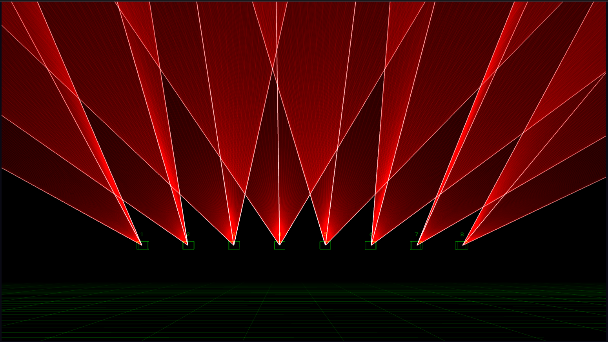

# Quick start guide

WORK IN PROGRESS

### APC40 MIDI controller

Although it is possible to control Liberation using the mouse and keyboard, to get the most out of it I highly recommend using an APC40 MIDI control interface (Mk 2 is best but Mk 1 also works). I realise that the APC40 have now been discontinued so will be adding support for other controllers in the future, but for now try to get hold of one if you can.

### Screen layout

<figure><figcaption></figcaption></figure>

#### Menu

The menu is where you will find all file import / export options, and window opening and closing. You'll also find the option to authorise the computer with your subscription here.

#### Icon bar

<figure><figcaption></figcaption></figure>

&#x20;Common tasks can be found here, such as arming/disarming all the lasers, the global brightness, test pattern, and switching between the 3D, Canvas and Output views

### Views

There are 3 main views; **3D**, **CANVAS** and **OUTPUT**.

#### 3D

<figure><figcaption></figcaption></figure>

The 3D view shows you what your lasers will look like and can be configured to match your own laser set up. Click and drag to rotate the camera, use the mouse wheel to track forward and back. You can find many other options in the "3D Visualiser settings" window.

#### Output

\[Add output views, one simple and one with many output zones and masks]

The output view is used to configure zones and masks for each laser. (I added a massive number on screen so you can easily see which laser you are on!)

#### What is a zone?

A zone is a space within a laser's output window that you can direct laser content to. The simplest type of zone is a _beam_ zone, but there are also _canvas_ zones and _DMX_ zones. For now, we'll mostly focus on beam zones, which are used to create atmospheric beam effects through the air.

#### The output view

\[Add image of numbered bar] You will see a bar at the top with a list of numbered buttons, one for each laser. Click on the numbered button to edit the laser, or cycle through each laser using the **TAB** key. Pressing the "+" button will add a new laser.

\[Add image of icon bar] Along the left is a bar with a series of icon buttons, hover over any button to get a description of what it does. Buttons here let you add lasers, beam zones, canvas zones, and masks. There are also options to set a test pattern for this laser only, along with grid settings.

The main window is a representation of the entire output of this laser, and where each zone sits within it. By default there is only one zone per laser but you can add as many zones as reasonably practical, and you will see them all in this view.

You can zoom in and out using the mouse scroll wheel, and click and drag anywhere there isn't a zone to move the view.

Click on a zone to select it and then adjust its corner points with the mouse. User the ALT key while you are dragging a corner to make it non-uniform. Right-click on the zone to see more options, including changing the type of zone.

#### Canvas

Using the Canvas system you can draw graphics across multiple lasers, and perspective-correct each section to create complex architectural mapping. Just like the Output view, you can zoom in and out with the mouse wheel and click to drag.

Content can be drawn into a _Canvas Target Area_ which defines a section of canvas. And then you can add _Canvas Zones_ to determine which section of the canvas goes to each laser.

Add a guide image to the canvas if you want a representation of the building or structure you are projecting onto.

The button icon list on the left gives you options to add a Canvas Zone, Guide Image and grid options.

You can add a representation of the canvas into the 3D view - check the _3D Visualiser Settings_ window for scale, position and rotation options.

### Clips and effects

#### Clipdeck overview

\[Image of clipdeck]

This grid is known as the _clipdeck_ and it is where all of the laser content is stored. It is designed to map directly to the 8 x 5 grid of buttons on your APC40.

**Navigating the clipdeck.**

You can scroll the clipdeck view using :

* Keyboard : ← and → keys. Add CMD/CTL to scroll one full page at a time.
* Trackpad : Swiped
* Mouse : if your mouse has a sideways scroll you can use that while hovered over the clip deck
* APC40 |scroll knob / \*\*\*\* Page left/right buttons.

\[Show miniclip visualiser]

To help you get your bearings, above the clipdeck is a small grid that represents the entire clipdeck.

#### Starting and stopping clips

Press a clip button (either on screen or with the APC40) to start a clip. Press it again to stop it. When you start a clip, all other clips of the same colour will automatically stop unless you hold _shift_.

Some clips will be in _Flash mode_ (by default, the red ones in group 3), in which case they will stop as soon as you release the clip button.

#### Assigning zones

Underneath the clip buttons, you'll see the zone buttons, beam zones 1 to 8 by default. The zone buttons light up to indicate which zones the currently selected clip is assigned to.

Two rows below the zone buttons, you'll see the X/Y flip buttons, toggle these to flip the clip in horizontally and vertically.

Note that these zone allocations and X/Y flip settings are connected to the clip itself; they are retained next time you run that clip. They are not any kind of global setting.

Right click on a clip to edit more settings for the clip.

#### Clip settings

Use the _Clip Settings_ panel to edit scaling, X/Y position, and the powerful zone delay system.

#### Global settings

Find the _Global Settings_ panel to adjust global output settings that affect all output across all zones.

### Effects

#### Applying an effect

#### Effect parameters

#### Currently selected clip

hen you start a clip, it lights up to show that it is active. It also has a white outline around it which indicates that this is the currently _selected_ clip.

### Timing

#### Tap Tempo

### Connecting to lasers

### Zoning

#### Test patterns

[Jump to the start!](https://github.com/sebleedelisle/LiberationLaser/wiki/Quick-Start#hello-world)
