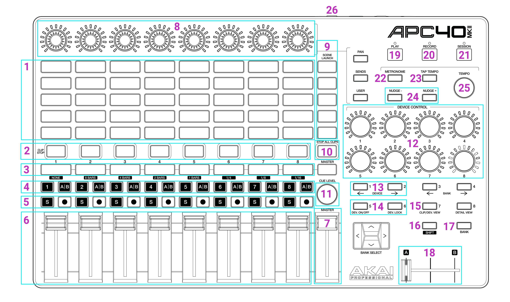

# ✅ APC40 reference

<figure><figcaption></figcaption></figure>

1. 8x5 Clipdeck
2. Zone On/Off
3. Effect Faders On/Off
4. X/Y Flip
5. Colour Effects
6. Effect Faders
7. Global Brightness
8. Effect Parameter Adjustment
9. Group Buttons
10. Stop All Clips (Press twice to immediately stop all clips without their fade settings)
11. Clipdeck Scroll
12. Clip / global parameters
13. Clip Page Left/Right
14. Zone Page Left/Right
15. Alt button (allows for clip selection)
16. Shift button (allows for multi select and other options)
17. Tempo Multplier Enable/Disable
18. Tempo Multiplier Fader (0% - 200%)
19. Play / Pause&#x20;
20. Toggle Record Timeline
21. Arm / Disarm (you must press SHIFT to arm)
22. Tempo bar reset
23. Tap Tempo
24. Nudge tempo + and -
25. Tempo Scroll
26. Foot Pedal, Tap Tempo

