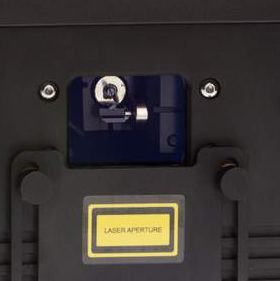

# Setting up lasers

## Before arming lasers

Please make sure that you understand the risks associated with lasers before use! Follow these instructions closely.&#x20;

**Raise the cover on your laser to completely block the laser output window (aperture) before starting.**

<figure><figcaption>
Slide the cover up to block the laser output window (aperture)
</figcaption></figure>

###

### Connecting to a laser controller (DAC)

### Arming the laser

### Setting the output zone

### Masking the laser output

### Adding software masks

###
