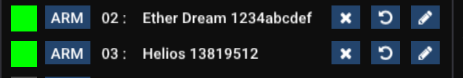

# ✅ Controller assignment

Once you have the lasers set up within Liberation, you can then assign each one to a laser controller in the real world. (See [compatible-lasers-and-controllers-dacs.md](../basics/compatible-lasers-and-controllers-dacs.md "mention") to check what hardware you can use). The controllers will either be connected via USB or over the network.&#x20;

* Open the _Controller Assignment_ window via the  _Window->Controller assignment_ menu option. (Or alternatively you can use the _ASSIGN LASER CONTROLLERS_ button in the _Laser Overview_ window.)

<figure><figcaption></figcaption></figure>

* The panel is split in two, with a list of lasers on the left as they have been set up in Liberation,  and the list of available controllers on the right. If you do not see your laser controller in the list, press the _REFRESH_ button. If you continue to have trouble check the [troubleshooting](../troubleshooting/) section.&#x20;
* To assign a controller to a laser, click and drag from the right on to an open laser slot on the left. This tells Liberation which controller it should use for which laser. (If you change your mind you can freely drag the controllers up and down from one laser to another.)&#x20;

<figure><figcaption></figcaption></figure>

* If you see a green square next to the controller, it means that Liberation has successfully connected to it.&#x20;

<figure><figcaption>
An Ether Dream and a Helios DAC assigned to lasers 2 and 3 respectively
</figcaption></figure>


Note that whenever you connect to a controller, the laser will be automatically disarmed.&#x20;


* An orange square 🟧 means that the controller is having intermittent connection issues. It's usually caused by a network issue, see  [Troubleshooting](../troubleshooting/).
* A red square 🟥 means that the controller cannot be reached, see  [Troubleshooting](../troubleshooting/)..&#x20;
* The _disconnect button_ (X) disconnects the controller but doesn't clear it from the laser assigment.  You can then use the _reconnect button_ (rewind arrow) to reconnect it or instead click the _disconnect button_ again to clear the assignment.&#x20;
* _Advanced feature :_ Open the controller analytics window by clicking the button that looks like a chart. This is an advanced feature that gives you detailed information about the data stream and can help to troubleshoot problems. &#x20;
* You can use the _rename button_ (pencil) to rename this controller to whatever you want. It makes sense to name it in a way that makes it easy to associate it with particular hardware. If it's built in to a particular laser you may want to name it accordingly, ie _LaserCube Ultra #1_ or _Triton T5 #3._ These names will be saved with your Liberation installation and will appear from now; it can be really helpful for you to quickly identify your lasers.  &#x20;


Pro tip - you can **double click** on a controller on the right to automatically assign it to the next available laser on the left. This can be a real time saver if you have lots of lasers to assign!&#x20;


You can use the _DISCONNECT ALL_ and _RECONNECT ALL_ buttons to quickly reset all the connections. This can be useful if you are having network issues.&#x20;
