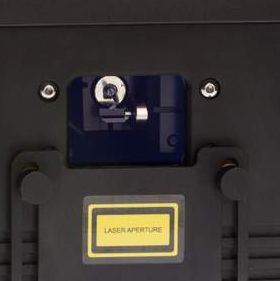

# ✅ Overview and reference guide

### Overview of the process for safely turning on lasers

This manual is not a replacement for formal laser safety training, which you will absolutely need before employing lasers in public. Some territories have additional legal requirements, but either way you should always adhere to best practices of safety and professionalism.&#x20;

PLASA have a free downloadable laser safety guide which has been generally accepted as best practice: [https://www.plasa.org/guidance-for-display-lasers/](https://www.plasa.org/guidance-for-display-lasers/)

Please make sure that you understand the safety implications associated with lasers before use!&#x20;

#### Introduction

This page is designed to give you an overview of the process of powering up lasers safely. The details of how exactly to do each step is covered later on in this section, but this page will help you to understand the big picture, and you can return to this later as a reference every time you set up lasers.&#x20;

<figure><figcaption>
A typical laser aperture cover
</figcaption></figure>

### Set up the hardware :&#x20;

1. **Close the aperture cover** on the laser&#x20;
2. **Rig the laser securely** and point it in the right direction
3. **Connect the stop button** to your laser
4. **Connect the laser controller** to your computer
5. **Power up** the laser

### Set up Liberation :

1. **Disarm all lasers** and find and connect the controller in Liberation
2. **Turn the **_**Global Brightness**_** setting down to 0** (Use the slider in the icon bar or the _Master Fader_ on the APC40)
3. **Arm the laser** - with the aperture cover still closed, ensure no clips are currently active and arm the laser  (Use the _Arm_ button in the Laser Overview window)
4. **Turn on the test pattern** (use the ☒ button in the icon bar, choose pattern 1, the green square with a cross through)
5. **Adjust the output zone** - make an estimate for the safest zone size and position (for example, this could be right up high into the ceiling but this depends on your particular environment)
6. **Ensure the laser is working** - slowly bring up the brightness until you can see light behind the aperture window. Then reduce the brightness back down to zero.&#x20;
7. **Test the stop button** to make sure that all laser output is extinguished when pressed

### Starting laser output

1. **Clear the exposure area** - make sure no one can be exposed to the laser and brief all personnel to stay out of the exposure area while the lasers are being set up. (You should also make sure that any cameras and projectors are covered or have their lens caps on!)
2. **Open the aperture cover** - while standing to the side and away from output, slide the aperture cover down. If your zones are high up, you may want to leave it partially closed.&#x20;
3. **Raise the brightness until the laser is barely visible** - make the laser only as bright as necessary to see the zone
4. **Adjust the zone(s)** - set the zone size, shape and position until it is set 3m from the floor from any publicly accessible areas, and the laser doesn't reach any other publicly accessible areas
5. **Add physical masking** - use the aperture cover and/or black foil tape to physically mask anywhere outside of the desired zone. This is critically important as any laser hardware or software can malfunction.&#x20;
6. **Add software masks** - the software masks within Liberation can be used to protect cameras and projectors, but should **never** be used in place of physical masking for protecting humans. Note that no software or hardware is infallible so make sure you understand the risks before using software masks.&#x20;


Note that this guide assumes an indoor set up. If you are working outdoors, additional steps must be taken to ensure aircraft safety, including but not limited to :&#x20;

* Getting necessary permissions from aviation authorities such as FAA or CAA&#x20;
* Liaising with nearby airports and airfields
* Checking public flight radar and also assigning a spotter to watch out for aircraft

Lasers that are well below the safety threshold can still cause catastrophic distractions for pilots.&#x20;

Make sure you have the necessary qualifications, licenses and permissions before directing any lasers into airspace.&#x20;


###
