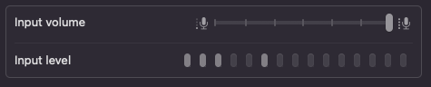
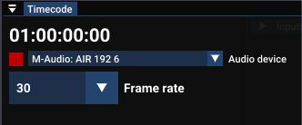
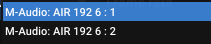
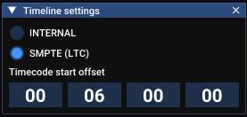

# ✅ Timecode

Liberation supports synchronisation with an external SMPTE/LTC timecode signal, commonly used in live music shows to keep lights, pyros, video and backing tracks in time.


What is SMPTE/LTC?&#x20;

SMPTE is a standard for timecode, and LTC is this timecode converted into an audio signal. If you listen to this audio, it sounds like a horrible high pitched squealing, but for computers it's high resolution timing information.&#x20;

**Nerd facts!**

Historically SMPTE has been used to keep video and audio in sync, or if syncing to analog tape, one track would have the timecode audio recorded onto it, sometimes referred to as "striping" the tape. You could use this timecode track to keep multiple tape decks in time with each other, or to keep a MIDI sequencer in time with the tape. (So you wouldn't need to record MIDI instruments on to tape, you could just have the sequencer play them live while you were mixing!)

SMPTE stands for Society of Motion Picture and Television Engineers, who defined the standard. LTC stands for _Linear TimeCode._&#x20;


You can receive an LTC timecode signal through any sound interface on your computer, but it's recommended to use a professional interface with at least one adjustable XLR input, and a monitoring capability.&#x20;

I've had good experience with the [M-Audio 192/6](https://www.m-audio.com/audio-midi-interfaces/air-192-6.html) as it has headphone monitoring, 2 XLR inputs and it doesn't need any special drivers (on MacOS at least).  If you're only ever going to use it for timecode you can get the slightly cheaper [M-Audio 192/4](https://www.m-audio.com/audio-midi-interfaces/air-192-4.html) (which only has one input and no MIDI), but honestly any half decent sound interface should work.&#x20;


LTC timecode signals are typically distributed via balanced XLR cables as they are robust enough to transmit low level audio signals across long distances. (XLR is the barrel jack connector usually used with microphones)


### Hardware connections

Plug in the timecode signal XLR cable into your sound interface and make sure you are getting a good signal. Adjust the level on the sound interface until the level is strong but not clipping. If your sound interface has a headphone jack, you can listen to the timecode and make sure it's not glitching out and doesn't have too much noise on it.&#x20;


Theoretically it is possible to receive the signal via the jack socket on your MacBook but this would require a custom cable. These jacks are typically 4 pole TRRS mini jacks, and I'm honestly not sure which of these connectors can be used for an audio input, and I'm also not sure what voltage level it can accommodate (I've read somewhere it was +/-1V but use this at your own risk!)

I think you'd be better off just getting hold of a cheap USB sound interface rather than attempting this.&#x20;


If your sound interface doesn't have any kind of input monitoring you can check in OSX system settings (under _Sound_) to make sure you are gettitng a signal. (On Windows, use the _Sound Control Panel_).&#x20;

<figure><figcaption>
MacOS shows you the input level for any sound interface in the Sound system settings panel
</figcaption></figure>

### Setting up in Liberation

1. Select your sound interface and the correct input channel in the Timecode settings Window.  &#x20;


Note that there are separate options in the drop down menu for each input channel in your sound interface



Notice the square on the left, if you are receiving a valid timecode signal, this will go green. If not it will be red.&#x20;

2. Select the correct framerate for the incoming timecode. Whoever is providing you with timecode should be able to tell you what the frame rate is. (If you get it wrong, it will still sync, but you'll notice a little "skip" every second)
3. Open the Timeline's timecode settings, using the little clock icon on the timeline bar and choose the SMPTE(LTC) option.

<figure><figcaption></figcaption></figure>

4. Adjust the start offset (in hours, minutes, seconds, frames) to match the start of the song. If you have multiple timelines, you'll need to set these options for each one separately.&#x20;


It's a common convention in the touring world to have each song start at a different hour ie 01:00:00:00 for the first song, 02:00:00:00 for the second song and so on.

Liberation will automatically switch to the timeline dependent on the timecode, so you never need to manually change timelines during a show.&#x20;


Note that unlike MIDI Clock and Ableton Link, SMPTE is an _absolute_ time system, measured in hours, minutes, seconds and frames. Liberation's core time system is based on beats and bars, so when you receive timecode, it will use the tempo set up in the timeline. You'll need to make sure that this tempo is in sync with whatever music is also synced to the timecode.&#x20;
