# ✅ 快速入门指南

## 简介

欢迎使用 **Liberation** —— 新一代激光秀软件。

Liberation 是一款功能强大、结构复杂的现代软件；它以易用性和可靠性为基础，让你可以自由表达创意。它快速、高效且流畅；按照这份_快速入门指南_操作，你很快就能开始使用！

### 管理激光

Liberation 非常灵活，即使没有连接任何真实激光设备，你也可以设置激光并进行可视化。准备好正式输出时，再将每一路输出无缝分配给激光控制器即可。


在 Liberation 中，你可以设置和可视化任意数量的激光；许可证等级（Hobbyist、Pro 等）只会限制你可以_启用输出_的激光数量。这意味着，即使使用免费许可证，你也可以设计包含 100 台激光的激光秀。只有在真正要用实际激光运行时，才需要升级许可证。


默认项目中有 8 台激光，水平排列分布，但你可以按需要自定义。刚开始熟悉软件时，最好先保留这个默认设置；之后再根据你的硬件配置进行调整。（见[设置项目](../setting-up/setting-up-your-project.md "mention")）&#x20;


重要：在启用任何激光输出之前，请确保你了解相关风险，并仔细阅读[设置激光](../setting-up/setting-up-lasers.md "mention")章节。


## 软件概览

### 安全关闭

只要你在运行激光，就必须随时准备好一个**硬件急停按钮**（见[急停与联锁](../hardware/emergency-stop-interlocks.md "mention")）。如果不是紧急情况，只是想关闭所有激光输出，可以使用 _**DISARM ALL**_ 按钮，或按 `Escape` 键（也可以按 APC40 上的 _**SESSION**_ 键）。你也可以使用屏幕上的滑块或 APC40 上的主推子来降低 Global Brightness。

### 滑块控件

Liberation 中有各种滑块和控制项。


如果需要比滑块更精确的控制，可以按住 `Cmd / Ctrl` 并点击滑块，直接输入新数值。


### 键盘快捷键

完整的键盘快捷键列表见这里：[键盘快捷键](../reference/keyboard-shortcuts.md "mention")

### 屏幕布局

<figure>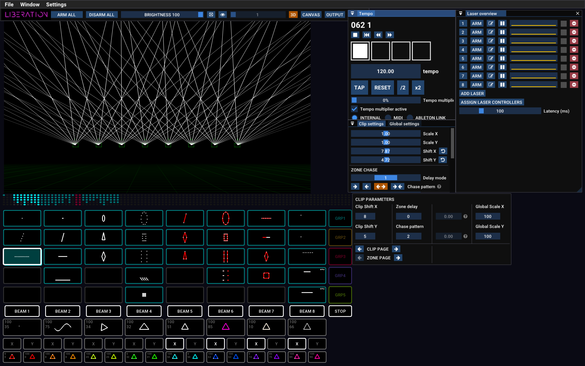<figcaption></figcaption></figure>


不确定某个按钮的作用？把鼠标悬停在按钮上即可查看说明！


#### Menu

<figure><figcaption></figcaption></figure>

Menu 中可以找到所有文件导入/导出选项，也可以打开各个面板。你还可以在这里使用订阅授权当前电脑（位于 _Liberation -> Authorise/Deauthorise this computer_）。

#### Icon bar

<figure>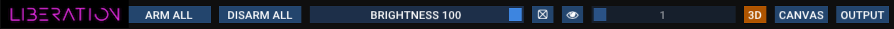<figcaption></figcaption></figure>

常用操作都可以在这里找到，例如启用/关闭所有激光输出、Global Brightness、Test Pattern，以及在 3D、Canvas 和 Output view 之间切换。

### Views

屏幕左上方的大区域可以显示 3 种主要 view 之一：**3D**、**CANVAS** 和 **OUTPUT**。使用 icon bar 上的按钮切换（也可以使用 `Tab` 键在 3D view 和 OUTPUT view 之间切换，然后继续按 Tab 依次切换每一路激光输出）。

<figure>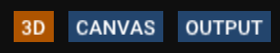<figcaption></figcaption></figure>

#### 3D View

<figure>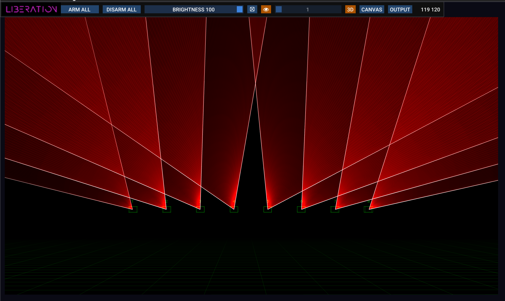<figcaption></figcaption></figure>

3D view 会显示你的激光效果外观，并且可以配置为匹配你自己的激光布置。点击并拖动可旋转摄像机，使用鼠标滚轮可前后移动视角。你可以在 _3D Visualiser settings_ 面板中找到更多选项（_View -> 3D Visualiser Settings_）。见 [3D 可视化器](../setting-up/3d-visualiser.md "mention")。

#### Output View

<figure>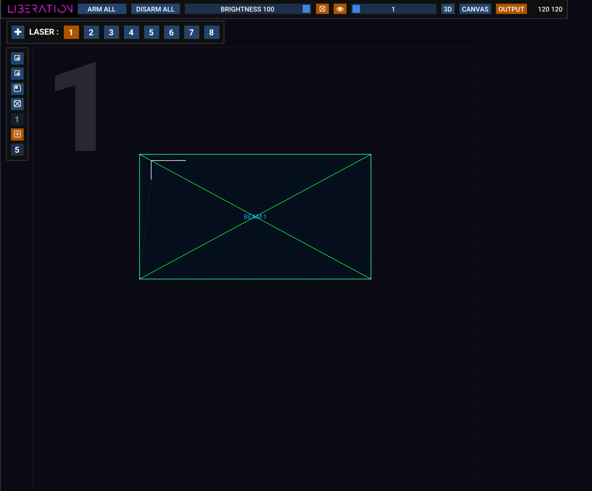<figcaption></figcaption></figure>

Output view 用于为每台激光配置 zone 和 mask。（注意左上角有一个很大的数字，方便你清楚知道当前正在编辑哪台激光！）

这个 view 表示当前激光的完整输出范围，以及每个 zone 在其中的位置。默认情况下，每台激光只有一个 zone，但你可以根据实际需要添加尽可能多的 zone，并且会在这个 view 中看到它们。


**什么是 zone？**

zone 是激光输出中的一个空间区域，你可以把激光内容指向这个区域。每台激光可以有多个 zone。最简单的 zone 类型是 _beam_ zone，另外还有 _canvas_ zone 和 _DMX_ zone。本指南主要关注 beam zone，它通常用于在空气中创建氛围光束效果。


你可以通过以下方式选择要编辑的激光：

* 顶部栏中的编号按钮
* 按下目标激光对应的数字键（_1-9 键_）
* 使用 `Tab` 键从一台依次切换到下一台

按 _+_ 按钮可向设置中添加一台新激光。（_Laser Overview_ 面板中也有一个 _ADD LASER_ 按钮）

在 _Laser Overview_ 面板中点击红色 ⊖ 按钮可从设置中删除一台激光。

你可以使用鼠标滚轮放大和缩小；在没有 zone 的任意位置点击并拖动，可以移动 view。

点击一个 zone 可选中它，然后用鼠标调整它的角点。拖动角点时按住 `Alt / Option` 键，可以进行非等比调整。右键点击 zone 可查看更多选项，包括更改 zone 类型。

左侧有一列图标按钮，把鼠标悬停在任意按钮上即可查看其功能说明。这里的按钮可用于添加 beam zone、canvas zone 和 mask。这里还提供仅针对当前激光设置 Test Pattern 的选项，以及网格和吸附设置。

更多详情见 [Output 视图](../output-view/ "mention")。

#### Canvas

Canvas 系统主要用于图形和建筑投影映射。你可以把复杂图像分配到多台激光上，并对每个部分进行透视校正。见[图形与 Canvas 系统](../graphics-and-the-canvas-system/ "mention")。

### APC40 MIDI 控制器

<figure>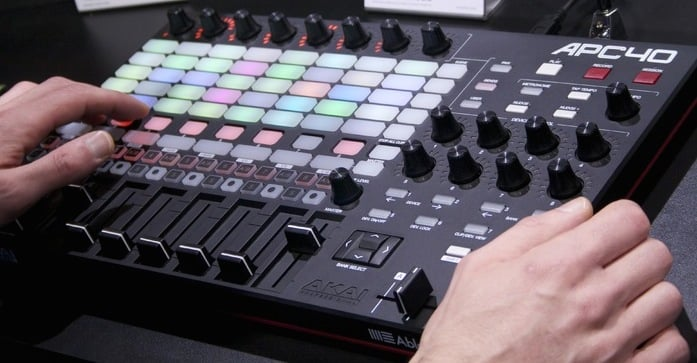<figcaption></figcaption></figure>

虽然可以用鼠标和键盘控制 Liberation，但使用 APC40 MIDI 控制界面会好得多（Mark 2 最佳，Mark 1 也可以使用）。

另见：[APC40 参考](../reference/apc40-reference.md "mention")

Liberation 也支持 APC Mini 和 MIDI Fighter Twister。对于大多数情况，APC40 Mark 2 仍然是最佳选择。&#x20;

### Clips 和效果


**什么是 Clip？**

Clip 是 Liberation 中用于承载任何激光内容的容器。Clip 可以包含光束或图形动画，通常是循环播放的。它们可以指向任何 zone（或 _Canvas target area_），并通过 Clip Deck 中的 Clip 按钮触发。


#### Clip Deck 概览

<figure>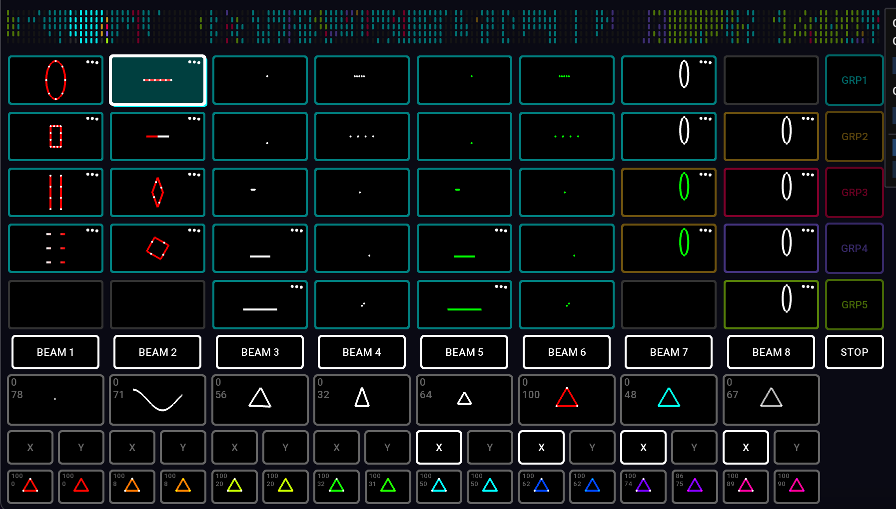<figcaption></figcaption></figure>

这个网格称为 _Clip Deck_，所有激光 Clip 都存放在这里。它的设计可以直接映射到 APC40 上 8 x 5 的按钮网格。

**浏览 Clip Deck。**

你可以通过以下方式左右滚动 Clip Deck：

* 左右方向键。加按 `Cmd / Ctrl` 可一次滚动整页。
* 触控板：滑动
* 鼠标：如果你的鼠标支持横向滚动，将鼠标悬停在 Clip Deck 上时即可使用
* APC40 滚动旋钮
* APC40 _<- DEVICE ->_ 按钮

为了帮助你定位，顶部有一个 Clip Deck 的小型可视化预览。另见 [Clips 与 Clip Deck](../clips/ "mention")

#### 启动和停止 Clips

按下一个 Clip 按钮（用鼠标或 APC40 都可以）即可启动该 Clip。再次按下可停止它。当你启动一个 Clip 时，除非按住 _shift_，否则同颜色的其他所有 Clip 会自动停止。

部分 Clip 会处于 _Flash mode_（默认情况下为红色 Clip），这种情况下，一旦松开 Clip 按钮，它就会停止。

_ STOP_ 按钮会停止所有当前正在运行的 Clip。

#### 为 Clip 设置输出 zone

在 Clip 按钮下方，你会看到 zone 按钮，默认是 beam zone 1 到 8（_BEAM 1_、_BEAM 2_ 等）。zone 按钮会亮起，表示哪些 zone 已分配给当前选中的 Clip。

<figure>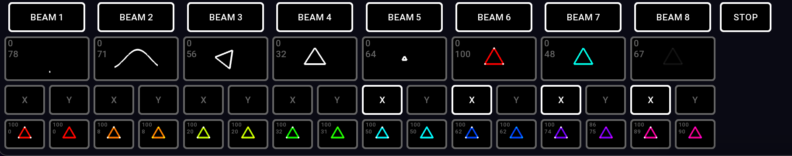<figcaption></figcaption></figure>

在 zone 按钮下方两行，你会看到 X/Y 翻转按钮，切换这些按钮可以水平或垂直翻转 Clip。


请注意，这些 zone 分配和 X/Y 翻转设置是绑定到 Clip 本身的；下次运行该 Clip 时仍会保留。它们不是全局设置。


右键点击 Clip 可编辑该 Clip 的更多设置。另见 [Clip 设置](../clips/clip-settings.md "mention")

### Groups

你会注意到每个 Clip 都有一个彩色轮廓，这个颜色表示它所在的 _group_。APC40 上的 Clip 按钮也会以这个颜色亮起。

<table data-header-hidden><thead><tr><th width="108"></th><th></th></tr></thead><tbody><tr><td>Group 1</td><td>青色</td></tr><tr><td>Group 2</td><td>橙色</td></tr><tr><td>Group 3</td><td>红色</td></tr><tr><td>Group 4</td><td>靛蓝色</td></tr><tr><td>Group 5</td><td>绿色</td></tr></tbody></table>

group 系统非常灵活，它允许你：

* 让一个 group 中的 Clip 持续运行，同时切换另一个 group 中的 Clip
* 快速为一个 group 内的所有 Clip 分配 zone 和 X/Y 翻转
* 为 Clip 设置 _Flash mode_（Group 3 默认设置为 _Flash mode_）

group 还提供淡入/淡出过渡设置，这些设置可以由其 Clip 继承，也可以被覆盖。

你可以使用右键菜单中的按钮为 Clip 分配 group；也可以使用 APC40，按住 group 按钮，并在_仍然按住它时_按下 Clip 按钮。

更改一个 group 内所有 Clip 的 zone 设置

使用 APC40 时，先按下 group 按钮，然后在_仍然按住它时_，使用 zone 和 X/Y 按钮切换该 group 内所有 Clip 的 zone 设置。

另见 [Clip 分组](../clips/groups.md "mention")

### Effects

Liberation 的效果系统是一种强大而灵活的实时改变 Clip 输出的方式。默认效果按钮 1-8 位于 zone 按钮下方。

#### 应用效果

按下效果按钮可切换效果；更推荐使用 APC40 的 1-8 号推子来淡入和淡出效果。

#### 效果参数

使用 1-8 号旋钮控制器\* 调整每个效果的 _parameter_。（也可以用鼠标右键点击来调整 level 和 parameter）。parameter 变化会根据效果的具体设置执行不同操作。默认效果见下方列表。


效果按钮上显示的小数字表示该效果的 _level_ 和 _parameter_。_level_ 由 APC40 上的推子控制，也可以在按钮上点击并拖动。parameter 由 APC40 上的旋钮调整，也可以右键点击后用鼠标调整。


_\*1-8 号旋钮控制器位于 APC40 Mk2 顶部，在 Mk1 上位于右上方。另见：_ [APC40 参考](../reference/apc40-reference.md "mention")

#### 默认效果

<figure>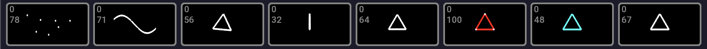<figcaption></figcaption></figure>

1. **Randomiser**：\
   对 Clip 输出施加混乱运动。parameter 调整混乱程度/速度。
2. **Sine wave**：\
   让所有内容沿移动的正弦波发生变形。parameter 调整波长。
3. **Rotation**：\
   旋转所有内容。parameter 调整旋转速度。
4. **Horizontal flip**：\
   在水平方向压缩和拉伸所有内容。parameter 调整速度。
5. **Scale**：\
   让所有内容在完整尺寸和零尺寸之间反复缩放。parameter 调整速度。
6. **Hue**：\
   改变所有内容的色相，但不改变饱和度（也就是说，白色内容仍保持白色）。parameter 调整色相。
7. **Saturation and hue**：\
   改变所有内容的色相，并将颜色完全饱和（也就是说，白色内容会变成该颜色）。parameter 调整色相。
8. **Flash**：\
   让所有内容的亮度在满亮和零亮度之间反复闪烁。parameter 调整闪烁速度。

<figure>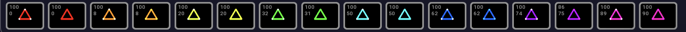<figcaption></figcaption></figure>

底部一行还有 16 个颜色效果，用于应用预设的色相和饱和度值。

请注意，这些只是默认效果，但它们几乎可以被编辑成你想要的任何效果！

#### 什么是_“当前选中的 Clip”_？

启动一个 Clip 后，它会亮起以表示正在活动。同时它周围会有白色轮廓，表示这是当前_选中_的 Clip。无论你切换 zone 按钮还是调整 Clip 设置，都会应用到_当前选中的 Clip_。


如果想选中一个 Clip 但不触发它，请在按下 Clip 按钮前先按住 `Alt / Option` 键。这是在不运行 Clip 的情况下调整其 zone 和其他设置的好方法。


### Clip Settings 面板

使用 _Clip Settings_ 面板可以编辑缩放、X/Y 位置，并访问强大的 zone 延迟系统。

<figure>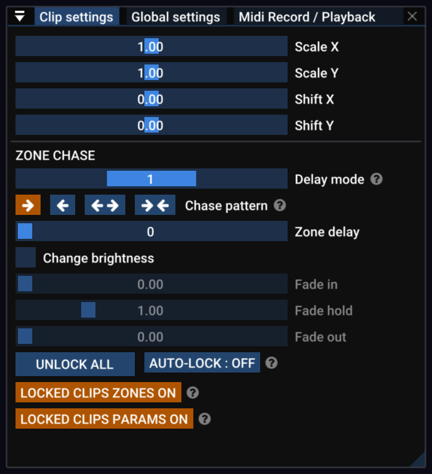<figcaption></figcaption></figure>

### Global Settings 面板

在 _Global Settings_ 面板中，可以调整影响所有 zone 中全部输出的全局输出设置。

<figure>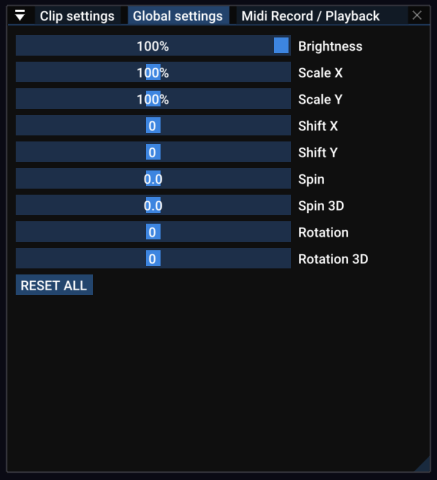<figcaption></figcaption></figure>

开启 AUTO RESET 后，只要没有 Clip 正在播放，所有 _Global settings_ 都会自动重置。&#x20;

### Timing

几乎所有激光演出都会有某种音乐音轨，因此 Liberation 的 timing 系统基于每分钟节拍数（BPM）的 tempo。在 _Tempo Panel_ 中，你可以看到时间的表示方式；每个方块代表一拍，并会按节拍闪烁。

<figure>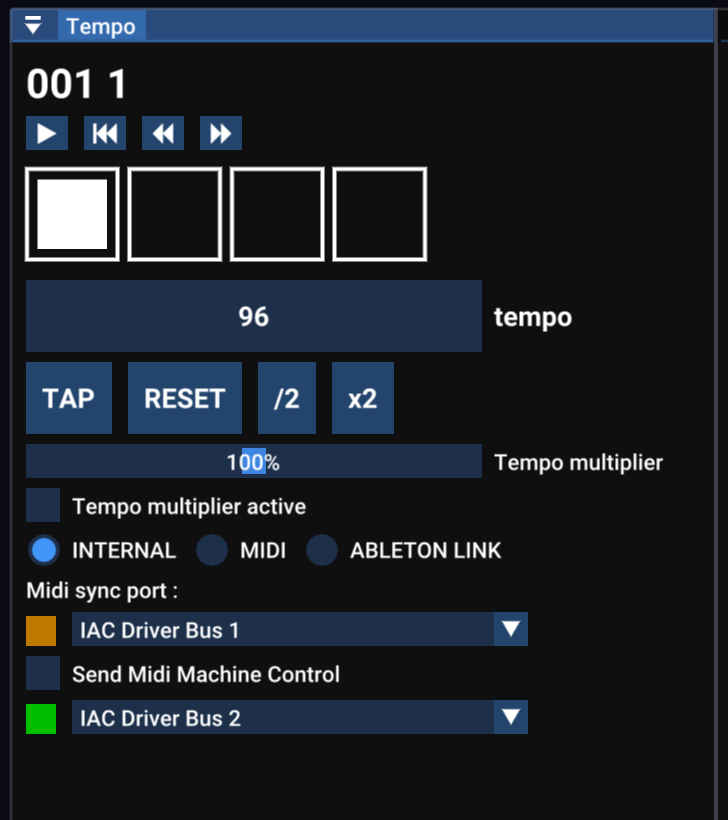<figcaption></figcaption></figure>

这里提供多种同步选项，包括 MIDI clock 和 Ableton Link。如果你知道音乐的 tempo，可以使用屏幕上的滑块或 APC40 的 Tempo 旋钮手动调整；也可以使用 _Tap Tempo_ 系统跟随音乐节拍。

#### Tap Tempo

_Tap Tempo_ 是音乐应用中常用的术语，它允许你在音乐播放时按节拍敲击来设置 tempo。你可以使用屏幕上的按钮，不过建议使用 _T_ 键或 APC40 上的 _Tap Tempo_ 按钮（如果你愿意，甚至也可以使用脚踏开关）。

按 _R_ 键或 _Metronome_ 按钮（APC40）可将 tempo 重置到小节开头。

按 _Y_ 键或转动 _Tempo_ 旋钮（APC40）可将 tempo 取整为整数。这对于电子音乐很有用，因为电子音乐通常使用整数 BPM。

### 整理 Clip Deck

要移动 Clip Deck 上的 Clip，点击并拖动到新位置即可。拖动时，可以使用光标键（或 APC40 上的滚轮/按钮）左右滚动。

拖动时按住 `Alt / Option` 键可复制。

按住 `Alt / Option` 并点击 Clip，可在不启动它的情况下选中它。

按住 `Alt / Option + Shift` 并点击 Clip 可多选；也可以在 Clip 外点击并拖动进行“套索”选择。&#x20;

点击并拖动会拖动所有已选中的 Clip。

要删除一个或多个 Clip，可以将它们拖出 Clip Deck（会出现垃圾桶图标），或使用 Clip 右键菜单中的 DELETE 按钮。

### Laser Overview 面板

<figure>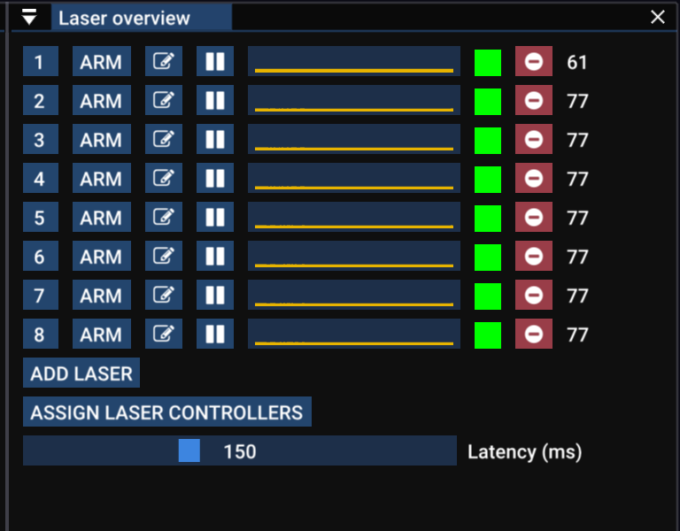<figcaption></figcaption></figure>

_Laser Overview_ 面板可以快速查看当前运行激光的状态。右侧的绿色方块表示激光控制器状态正常。如果变成橙色，表示偶尔有丢包；如果变成红色，表示已断开连接。如果是灰色，则表示根本没有连接到控制器。&#x20;

中间的图表是帧长度历史记录，右侧数字是当前帧率。内容越复杂，帧率就越低（也就是更容易闪烁）。低于大约 25fps 时，就会开始看起来有些闪烁。&#x20;

### 连接激光 — Controller Assignment 面板

点击 _Assign Laser Controllers_ 按钮可打开 _Controller Assignment_ 面板。（也可以通过菜单栏中的 _View -> Controller Assignment_ 访问此面板。）

你可以在这里选择哪些激光输出连接到哪些激光控制器。将右侧列表中的控制器拖放到左侧的槽位中。你可以重命名控制器，以匹配它们配对的激光（使用钢笔图标按钮）。

更多详情请阅读 [控制器分配](../setting-up/controller-assignment.md "mention")章节。


在启用任何激光输出之前，请务必阅读[设置激光](../setting-up/setting-up-lasers.md "mention")章节。


### Laser output 面板

<figure>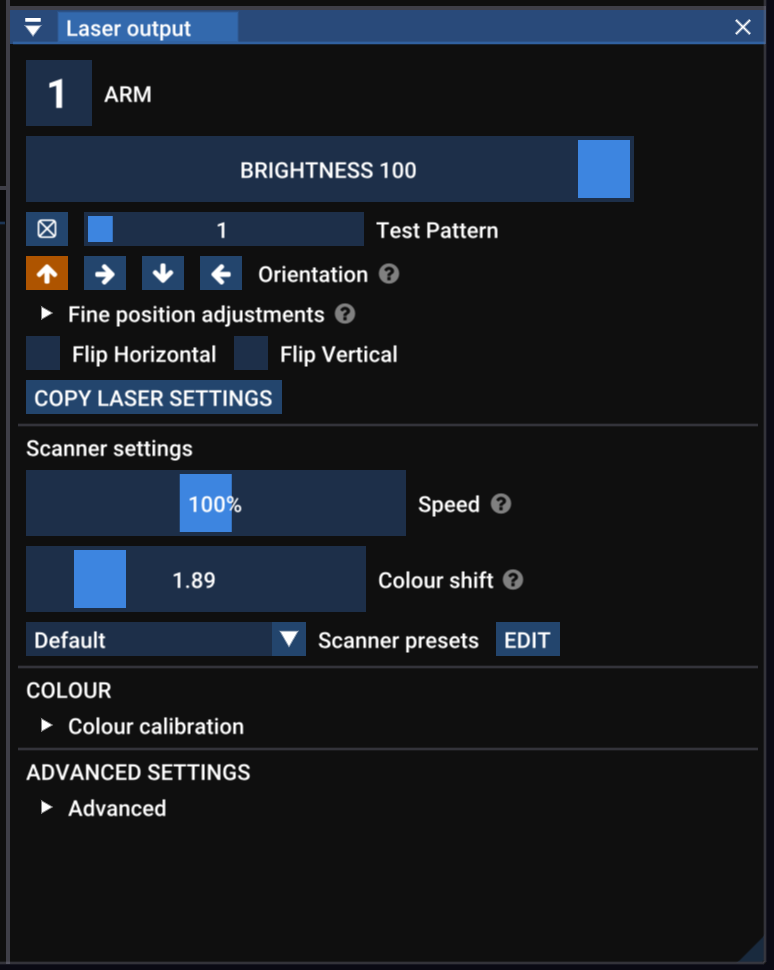<figcaption></figcaption></figure>

此面板显示_当前选中的激光_的设置（由顶部的数字表示）。可以使用 _tab_ 键、按数字键、点击 _Laser Overview_ 面板中的激光编号，或在 _output view_ 中点击激光编号来更改当前选中的激光。

* **Number button** 启用或关闭该激光输出；如果它是红色，表示该激光输出已启用。
* **Brightness** 独立于其他激光调整该激光亮度（并且会与 _global brightness_ 设置相乘；也就是说，如果两者都是 50%，你的激光最终会是 25%）。
* **Test Pattern** 仅为此激光开启测试图案（会覆盖全局 Test Pattern 设置）
* **Orientation** 校正侧挂或倒挂安装的激光。
* **Flip Horizontal and Flip Vertical** 反转激光输出。对于接线不一致的激光，用于输出校正很有用。
* **Copy Laser Settings** 打开一个面板，可将此激光的各种设置复制到其他激光。

### 扫描器设置

演出激光的工作方式，是让单束激光以极高速度移动，并通过开关光束在空气中绘制形状。你看到的线条、形状和图像，实际上是光束以快到眼睛无法跟上的速度描绘出的路径。

点流是告诉激光下一步移动到哪里、以及光束何时开启或关闭的数据。在 Liberation 中，Clip 会在发送到激光时实时转换为这种点流。

Liberation 让你可以详细控制点流的生成方式，从而为每台激光平衡平滑度、亮度和性能。


如果你习惯使用依赖预计算点流的旧式激光软件，这种方式一开始可能会感觉不同。不过，实时点生成允许同一内容针对每台激光进行不同优化。这样在使用多台扫描速度或质量不同的激光时，就不需要复制或重新构建内容，工作会更轻松。它还让 Clip 文件保持非常小，这也是为什么整个默认 Liberation Clip Deck 只有几 MB，而不是几个 GB。


基本扫描器设置包括：

* **Speed** 是扫描器速度，也就是激光移动并绘制形状的速度。这相当于传统激光软件中的点速率调整，但在 Liberation 中，你可以在_不依赖点速率_的情况下改变激光移动速度。通常不需要调整它。
* **Scanner sync**（有时称为 _blank shift_，以前称为 Colour Shift）扫描器会非常快速地移动激光，但亮度和颜色变化通常会与运动不同步。这会表现为光束和线条边缘出现轻微闪烁的光“尾巴”。使用此调整可让运动与颜色彼此同步。见 [Laser Settings](../setting-up/laser-settings.md "mention")

其他高级扫描器设置在[高级](../advanced/ "mention")章节中介绍。

### Zoning

完整的激光设置和 zoning 指南见：[设置激光](../setting-up/setting-up-lasers.md "mention")
