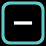

# 🟩 Creators

###  Point Creator

生成单个点/光束。&#x20;

* **Render profile** - 见 [Render profile](fundamentals/render-profile.md "mention")
* **Colour** - 点的颜色。见 [颜色设置与 HSB](fundamentals/colour-settings-and-hsb.md "mention")
* **x** 和 **y** position - 见 [坐标系统](fundamentals/co-ordinate-system.md "mention")
* _MOVE TO FRONT / MOVE TO BACK_ - 见 [填充、Masks 与深度排序](fundamentals/fills-masks-and-depth-sorting.md "mention")

###  Line Creator

生成一条线/光片。&#x20;

* **Render profile** - 见 [Render profile](fundamentals/render-profile.md "mention")
* **Size** - 线的长度
* **Colour** - 线的颜色。见 [颜色设置与 HSB](fundamentals/colour-settings-and-hsb.md "mention")
* **x** 和 **y** position - 见 [坐标系统](fundamentals/co-ordinate-system.md "mention")
* **rotation** - 线的角度（度）
* **resolution** - 见 [分辨率](fundamentals/resolution.md "mention")
* **alignment** - _LEFT / CENTRE / RIGHT -_ 决定线的起点与旋转中心
* _MOVE TO FRONT / MOVE TO BACK_ - 见 [填充、Masks 与深度排序](fundamentals/fills-masks-and-depth-sorting.md "mention")

###  Circle Creator

生成圆形/锥体。&#x20;

* **Render profile** - 见 [Render profile](fundamentals/render-profile.md "mention")
* **radius** - 圆的半径
* **Colour** - 圆的颜色。见 [颜色设置与 HSB](fundamentals/colour-settings-and-hsb.md "mention")
* **x** 和 **y** position - 见 [坐标系统](fundamentals/co-ordinate-system.md "mention")
* **resolution** - 见 [分辨率](fundamentals/resolution.md "mention")
* **Fill state** - 见 [填充、Masks 与深度排序](fundamentals/fills-masks-and-depth-sorting.md "mention")
* _MOVE TO FRONT / MOVE TO BACK_ - 见 [填充、Masks 与深度排序](fundamentals/fills-masks-and-depth-sorting.md "mention")

###  Polygon Creator

生成等边多边形：三角形、正方形、五边形等。&#x20;

* **Render profile** - 见 [Render profile](fundamentals/render-profile.md "mention")
* **size** - 从中心到角的距离
* **Colour** - 多边形颜色。见 [颜色设置与 HSB](fundamentals/colour-settings-and-hsb.md "mention")
* **x** 和 **y** position - 见 [坐标系统](fundamentals/co-ordinate-system.md "mention")
* **rotation** - 形状旋转角度（度）
* **resolution** - 见 [分辨率](fundamentals/resolution.md "mention")
* **Fill state** - 见 [填充、Masks 与深度排序](fundamentals/fills-masks-and-depth-sorting.md "mention")
* _MOVE TO FRONT / MOVE TO BACK_ - 见 [填充、Masks 与深度排序](fundamentals/fills-masks-and-depth-sorting.md "mention")

###  Shape Creator

加载 SVG 文件作为自定义形状。&#x20;


Liberation 支持 _SVGTiny_ 格式。推荐使用 InkScape，但大多数矢量软件都能导出该格式。导出前务必将文字转换为图形。Liberation 会渲染线条，并可选择将填充作为 mask。请确保线条不是黑色，否则没有颜色 modifier 时不会显示！&#x20;


* **Import SVG** - 从磁盘加载 SVG 文件。&#x20;


SVG 加载后会被转换并保存到 Clip 中，因此无需保留文件引用，除非你之后要更改 mask 设置。&#x20;


* **Use fills as masks** - 将填充形状作为 mask 处理（即填充为黑色）。如果 SVG 中有填充形状会自动开启；若没有则关闭。见 [填充、Masks 与深度排序](fundamentals/fills-masks-and-depth-sorting.md "mention")
* **Add outlines to filled shapes** - 若 SVG 中的形状没有轮廓，则无法绘制！该选项会为填充形状添加轮廓（或 _stroke_）。如果 SVG 中没有描边形状，会自动开启；若没有填充形状则关闭。&#x20;
* **Invert black lines** - 若 SVG 中所有线条都是黑色，激光看不到！此选项会将其反相为白色。若 SVG 仅包含黑色形状会自动开启；否则关闭。&#x20;
* **Render profile** - 见 [Render profile](fundamentals/render-profile.md "mention")
* **scale** - 调整 SVG 大小。加载时会自动计算以确保可见，但之后可手动修改。
* **x** 和 **y** position - 见 [坐标系统](fundamentals/co-ordinate-system.md "mention")
* **rotation** - 图像旋转角度（度）
* **resolution** - 见 [分辨率](fundamentals/resolution.md "mention")
* _MOVE TO FRONT / MOVE TO BACK_ - 见 [填充、Masks 与深度排序](fundamentals/fills-masks-and-depth-sorting.md "mention")

###  Anim Creator

使用一组 SVG 序列创建动画。&#x20;

* **Import SVG Sequence** - 选择包含全部 SVG 的文件夹，按字母数字顺序加载。&#x20;


SVG 序列加载后会被转换并保存到 Clip 中，因此无需保留文件引用，除非你之后要更改 mask 设置。&#x20;


* **Use fills as masks** - 将填充形状作为 mask 处理（即填充为黑色）。若 SVG 中有填充形状会自动开启；如果都没有则关闭。见 [填充、Masks 与深度排序](fundamentals/fills-masks-and-depth-sorting.md "mention")
* **Add outlines to filled shapes** - 若 SVG 形状没有轮廓，则无法绘制！此选项会为填充形状添加轮廓（或 _stroke_）。若 SVG 没有描边形状会自动开启；若没有填充形状则关闭。&#x20;
* **Invert black lines** - 若 SVG 中所有线条都是黑色，激光看不到！此选项会将其反相为白色。若 SVG 仅包含黑色形状会自动开启；否则关闭。&#x20;
* **Render profile** - 见 [Render profile](fundamentals/render-profile.md "mention")
* **scale** - 调整图像大小
* **x** 和 **y** position - 见 [坐标系统](fundamentals/co-ordinate-system.md "mention")
* **rotation** - 图像旋转角度（度）
* **resolution** - 见 [分辨率](fundamentals/resolution.md "mention")
* **speed** - 整段动画的时长，以小节为单位。&#x20;
* **time per frame** - 如果设置，则时长按帧计算而非整段动画。例如 _speed_ 为 ¼ 时，每帧为 1 拍。&#x20;
* **animation direction** -&#x20;
  * _FORWARDS_ - 正向播放并循环回开头
  * _BACKWARDS_ - 反向播放并循环回结尾
  * _PINGPONG_ - 正向播放后反向播放循环
  * _MANUAL_ - 当前帧由 _position manual_ 设置
* **position manual** - 设置当前帧，0% 为第一帧，100% 为最后一帧。可手动设置或用外部 oscillator 驱动。&#x20;
* _MOVE TO FRONT / MOVE TO BACK_ - 见 [填充、Masks 与深度排序](fundamentals/fills-masks-and-depth-sorting.md "mention")

###  Text Creator

使用 TrueType 或 OpenType 字体创建文本。&#x20;

* **Text** - 输入文本内容
* **Font** - 选择字体


要添加更多字体到 Liberation，请将 .ttf 或 .otf 文件复制到 data/resources/fonts 文件夹。


* **Render profile** - 见 [Render profile](fundamentals/render-profile.md "mention")
* **horizontal alignment** - 选择 _LEFT_、_CENTRE_ 或 _RIGHT_ 作为文本对齐方式
* **Fill state** - 见 [填充、Masks 与深度排序](fundamentals/fills-masks-and-depth-sorting.md "mention")
* **size** - 文字大小
* **colour -** 见 [颜色设置与 HSB](fundamentals/colour-settings-and-hsb.md "mention")
* **x** 和 **y** position - 见 [坐标系统](fundamentals/co-ordinate-system.md "mention")
* **rotation** - 图像旋转角度（度）
* **resolution** - 见 [分辨率](fundamentals/resolution.md "mention")
* **reveal** - 逐字显示文本。0% 到 50% 时文本从左到右逐渐出现；50% 到 100% 时从左到右逐渐消失。可连接 oscillator 进行动画。&#x20;
* **reveal by word** - 开启后，_reveal_ 按词而不是按字符生效。&#x20;
* **countdown** - 一个（临时实现的）倒计时系统。每 2 拍变化一次，所以若想按秒，需要设置为 120bpm。&#x20;
* **countdown start** - 倒计时起始数字
* _MOVE TO FRONT / MOVE TO BACK_ - 见 [填充、Masks 与深度排序](fundamentals/fills-masks-and-depth-sorting.md "mention")
