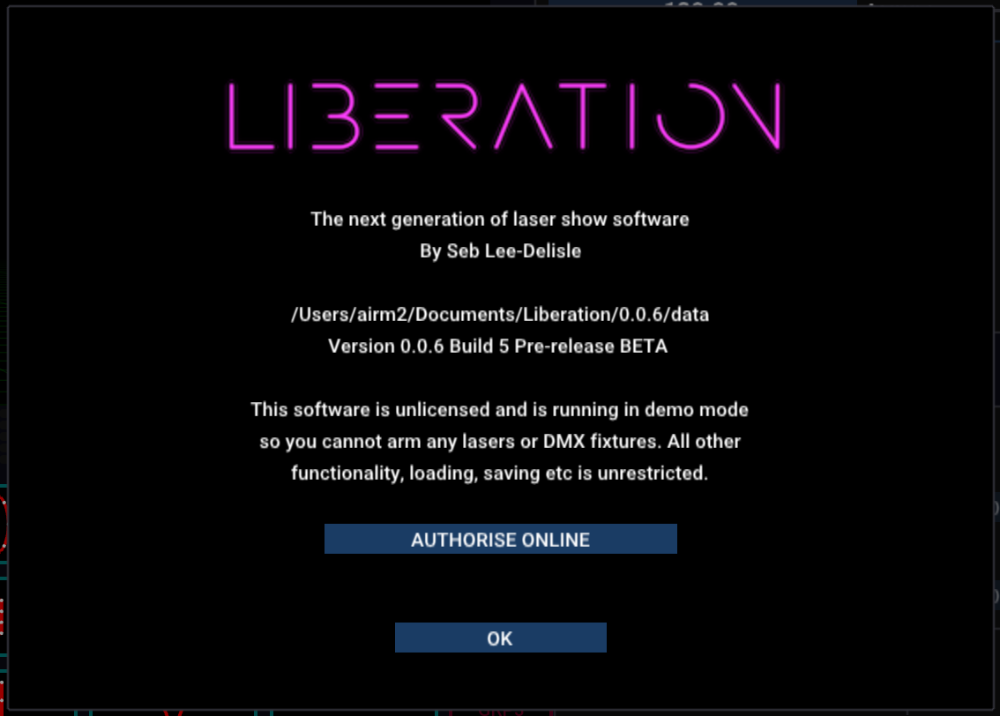

---
metaLinks:
  alternates:
    - >-
      https://app.gitbook.com/s/MdbbIbIwHdJwkEREnJyv/installation/authorising-and-de-authorising
---

# ✅ 授权与取消授权

### 授权 Liberation

首次打开 Liberation 时会以 _free mode_ 运行，你会看到 _About panel_：

<figure><figcaption></figcaption></figure>

点击 _AUTHORISE ONLINE_ 按钮，浏览器会打开。如果你尚未登录，会提示你先登录。&#x20;

系统现在会自动使用你的许可证为此安装完成授权，并显示确认消息。

返回 Liberation 后，你会看到 _About panel_ 已更新（可能需要等待几秒）。&#x20;

<figure><figcaption></figcaption></figure>


如果你的许可证已达到可授权电脑的上限，需要先取消其他电脑的授权，或升级许可证。&#x20;



如果你有多个许可证，系统会提示你选择要分配给这台电脑的许可证。&#x20;


恭喜！你的 Liberation 安装已授权，现在可以输出到激光设备了。但在 arm 激光之前，请先阅读 [快速入门指南](../getting-started.md "mention") 和 [激光设置流程概览](../setting-up/setting-up-lasers.md "mention")。&#x20;


你可以随时通过菜单 _Liberation -> About Liberation_ 或 _Liberation -> Authorise/Deauthorise this computer_ 打开 _About panel_。


### 取消 Liberation 授权

**在 Liberation 内操作**：打开菜单 _Liberation -> Authorise / De-authorise this Computer_，点击 _DEAUTHORISE COMPUTER_ 按钮即可。此操作需要联网。

<figure><figcaption></figcaption></figure>

也可以在网站上操作。在菜单中选择 _Your licences_，然后针对相应的许可证点击 _MANAGE_。如果你的账户只有一个许可证，_Your licences_ 会直接进入该许可证页面。你会看到许可证信息和已授权的电脑列表。

<figure><figcaption></figcaption></figure>

点击要取消授权的电脑旁边的 _De-authorise_ 链接。

如果你的电脑自上次许可证刷新后一直没有联网，它会立即被取消授权。否则，该电脑会进入取消授权的_队列_。这意味着下次该电脑连接互联网时，或到达下一次许可证刷新日期时（以先发生者为准），取消授权会自动完成。
