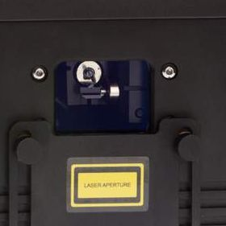

# ✅ 激光设置流程概览

### 安全开启激光的流程概览

本手册不能替代正式的激光安全培训。在公共场合使用激光之前，你一定需要接受相关培训。部分地区还有额外的法律要求；无论如何，你都应始终遵循安全与专业操作的最佳实践。

PLASA 提供了一份可免费下载的激光安全指南，通常被视为最佳实践：[https://www.plasa.org/guidance-for-display-lasers/](https://www.plasa.org/guidance-for-display-lasers/)

使用前，请务必确认你了解与激光相关的安全影响！

#### 简介

本页旨在为你概览安全启动激光的流程。每个步骤的具体操作细节会在本章节后续内容中介绍，但本页可以帮助你先理解整体流程。之后每次设置激光时，也可以回到这里作为参考。

<figure><figcaption>
典型的激光出光口盖板
</figcaption></figure>

### 设置硬件：

1. **关闭激光上的出光口盖板**
2. **牢固安装激光设备**，并将其指向正确方向
3. **将急停按钮连接到激光设备**
4. **将激光控制器连接到计算机**
5. **给激光设备通电**

### 设置 Liberation：

1. **解除所有激光的启用状态**，并在 Liberation 中查找并连接控制器
2. **将&#x20;**_**Global Brightness**_**&#x20;设置调到 0**（使用图标栏中的滑块，或 APC40 上的 _Master Fader_）
3. **启用激光**——在出光口盖板仍保持关闭的情况下，确认当前没有任何 Clip 处于活动状态，然后启用激光（使用 _Laser Overview_ 面板中的 _Arm_ 按钮）
4. **打开测试图案**（使用图标栏中的 ☒ 按钮，选择图案 1，即带有十字的绿色方框）
5. **调整输出 zone**——估算最安全的 zone 大小和位置（例如，可以将其设置得很高并打到天花板上，但这取决于你的具体环境）
6. **确认激光正常工作**——缓慢提高亮度，直到能在出光口窗口后看到光线。然后将亮度重新降回零。
7. **测试急停按钮**，确保按下后所有激光输出都会熄灭

### 开始激光输出

1. **清空照射区域**——确保没有人会暴露在激光下，并告知所有人员在激光设置期间远离照射区域。（你还应确保所有相机和投影机都已遮盖，或已盖上镜头盖！）
2. **打开出光口盖板**——站在侧面并避开输出方向，将出光口盖板向下滑开。如果你的 zone 位于较高位置，可以考虑让盖板保持部分关闭。
3. **提高亮度，直到激光刚刚可见**——只把激光调到足以看清 zone 的亮度
4. **调整 zone**——设置 zone 的大小、形状和位置，确保它距离任何公众可进入区域的地面至少 3 米，并且激光不会照射到其他公众可进入区域
5. **添加物理遮挡**——使用出光口盖板和/或黑色铝箔胶带，对目标 zone 之外的任何区域进行物理遮挡。这一点至关重要，因为任何激光硬件或软件都有可能发生故障。
6. **添加软件 mask**——Liberation 中的软件 mask 可用于保护相机和投影机，但**绝不能**代替用于保护人员的物理遮挡。请注意，没有任何软件或硬件是绝对可靠的，因此在使用软件 mask 之前，请确保你了解相关风险。


请注意，本指南假定为室内设置。如果你在户外作业，必须采取额外步骤以确保航空器安全，包括但不限于：

* 从 FAA 或 CAA 等航空管理机构获取必要许可
* 与附近机场和机场场地进行沟通协调
* 查看公共飞行雷达，并安排观察员留意航空器

即使激光功率远低于安全阈值，也仍可能对飞行员造成灾难性的干扰。

在将任何激光射向空域之前，请确保你具备必要的资质、执照和许可。

